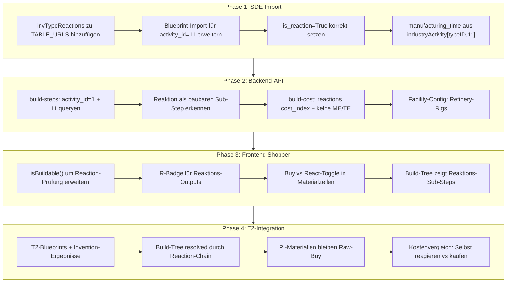
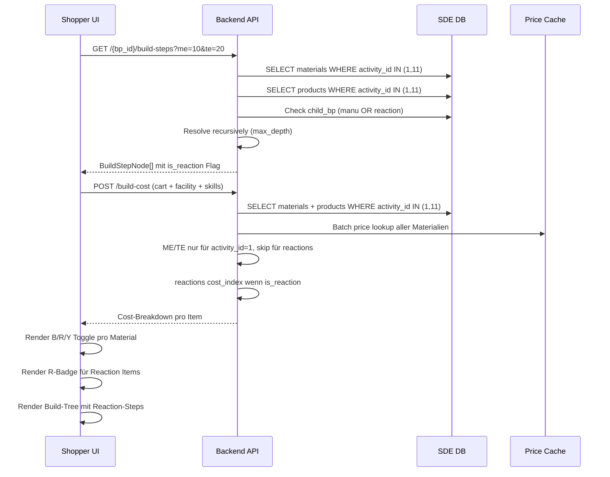

# T2 Production & Reactions — Architecture Plan

> Status: **✅ Freigegeben (pragmatischer Ansatz)**
> Entscheidung: Nur die fehlenden CSVs nachziehen (`invTypeReactions`), T2-Problem lösen, später erweitern. Kein Komplett-Dump.

## 1. Problemanalyse

### 1.1 Aktuelle Lücken

| Bereich | Status | Beschreibung |
|---------|--------|--------------|
| SDE-Import Reactions | 🔴 Fehlt | `invTypeReactions` nicht in `TABLE_URLS`, `activity_id=11` wird nie als Blueprint importiert |
| SDE-Import Blueprints | 🟡 Halb | `sde_pg_importer.py:385` hardcodiert `activity_id=1` + `is_reaction=False` |
| Build-Tree | 🔴 Nur Manu | Alle SQL-Queries in `resolve_step()` hardcodieren `activity_id=1` |
| Build-Cost | 🔴 Nur Manu | `/api/build-cost` hardcodiert `activity_id=1` in Material-Query |
| Cost-Index | 🟢 Fertig | `cost_indices.py` liefert bereits `reactions`-Index pro System |
| Invention-API | 🟢 Fertig | `/api/blueprints/{t1_bp_id}/invention-options` existiert |
| Frontend `isBuildable()` | 🟡 Lücken | Prüft nur `category_id` (Mineral/Asteroid/Ice/Biochemicals), kein R-Badge |

### 1.2 Was bereits in der DB existiert

Die CSVs `industryActivityMaterials`, `industryActivityProducts`, `industryActivitySkills` und `industryActivity` werden **alle** heruntergeladen und enthalten Daten für **sämtliche** `activity_id`s — inklusive `activity_id=11` (Reactions).

Was fehlt:
1. **`SDEBlueprint`-Records** für `activity_id=11` — werden aktuell nur für `activity_id=1` angelegt
2. **`invTypeReactions`**-Tabelle — wird nicht heruntergeladen (enthält das Mapping Reaction-Input → Reaction-Output)
3. **`is_reaction=True`** — wird nie gesetzt

**Konsequenz:** Die Material-/Produkt-/Skill-Daten für `activity_id=11` sind in der DB, aber **orphan** — sie haben kein parent-Blueprint, auf das sie verweisen.

---

## 2. Gesamtarchitektur



---

## 3. Phase 1: SDE-Import erweitern

### 3.1 `invTypeReactions` zu TABLE_URLS hinzufügen

**Datei:** [`backend/app/services/sde_pg_importer.py:56-73`](backend/app/services/sde_pg_importer.py:56)

```python
TABLE_URLS = {
    # ... bestehende Einträge ...
    "invTypeReactions": f"{FUZZWORK_BASE}/invTypeReactions.csv",
}
```

**Format von `invTypeReactions.csv` (Fuzzwork):**
```
reactionTypeID,inputTypeID,quantity,input
```
- `reactionTypeID` = der Reaction-Blueprint (type_id)
- `inputTypeID` = Input-Material
- `quantity` = benötigte Menge
- `input` = 1 für Input, 0 für Output

> **Hinweis:** Die Fuzzwork-CSV enthält sowohl Inputs (`input=1`) als auch Outputs (`input=0`). Wir nutzen sie primär zur **Validierung/Identifikation** von Reaktionen. Die eigentlichen Material-/Produktdaten kommen wie bisher aus `industryActivityMaterials / Products`.

### 3.2 Blueprint-Import für Reactions erweitern

**Datei:** [`backend/app/services/sde_pg_importer.py:375-394`](backend/app/services/sde_pg_importer.py:375)

Aktuell:
```python
activity_id=1,  # industryBlueprints only contains manufacturing
is_reaction=False,
```

Geändert zu:
```python
# Jede Blueprint-Zeile aus industryBlueprints.csv hat NUR activity_id=1 (Manufacturing).
# Reactions haben in industryBlueprints.csv KEINE eigene Zeile — sie werden stattdessen
# über invTypeReactions.csv + industryActivityProducts.csv (activity_id=11) identifiziert.
#
# Vorgehen:
# 1. Alle type_ids sammeln, die in industryActivityProducts mit activity_id=11 vorkommen
# 2. Für jede diese type_ids einen SDEBlueprint-Eintrag mit activity_id=11 anlegen
# 3. is_reaction=True, manufacturing_time aus activity_times[(type_id, 11)]

# Erst die bestehenden Manufacturing-Blueprints importieren (activity_id=1)
for row in bp_raw:
    # ... wie bisher, activity_id=1, is_reaction=False ...
    
# DANN Reactions-Blueprints importieren (activity_id=11)
reaction_type_ids = set()
for row in bp_products_raw:
    _t = _parse_int(row[0])
    _a = _parse_int(row[1])
    if _t and _a == 11:
        reaction_type_ids.add(_t)

for type_id in reaction_type_ids:
    bp = SDEBlueprint(
        type_id=type_id,
        product_type_id=None,  # wird aus industryActivityProducts activity_id=11 resolved
        product_name=None,
        activity_id=11,
        max_production_limit=None,  # Reactions haben kein maxProductionLimit
        manufacturing_time=activity_times.get((type_id, 11)),
        tech_level=None,
        is_reaction=True,
    )
    await db_session.merge(bp)
    stats["blueprints"] += 1
```

### 3.3 Material/Product/Skill — keine Änderung nötig

Die DELETE+INSERT-Logik für `SDEBlueprintMaterial`, `SDEBlueprintProduct` und `SDEBlueprintSkill` importiert **bereits alle** `activity_id`s inkl. 11. Die Daten sind da — sie hatten nur kein parent-Blueprint.

Nachdem wir in Schritt 3.2 die `SDEBlueprint`-Records für `activity_id=11` anlegen, sind die Materialien/Produkte/Skills automatisch verknüpfbar.

### 3.4 `product_type_id` für Reactions resolven

Analog zu Manufacturing: Aus `industryActivityProducts` (activity_id=11) den `product_type_id` für jeden Reaction-Blueprint in `SDEBlueprint.product_type_id` setzen.

---

## 4. Phase 2: Backend-API erweitern

### 4.1 Build-Tree: Beide activity_ids unterstützen

**Datei:** [`backend/app/routers/blueprints.py:1648-1925`](backend/app/routers/blueprints.py:1648)

**Kernproblem:** Alle SQL-Queries in `resolve_step()` hardcodieren `activity_id=1`.

**Lösung:** Die `resolve_step()`-Funktion muss für JEDES Material prüfen, ob es **entweder** ein Manufacturing-Output (activity_id=1) **oder** ein Reaction-Output (activity_id=11) ist.

```python
# Statt:
# JOIN sde_blueprints sb ON sb.type_id = sbm.type_id AND sb.activity_id = 1
# JOIN sde_blueprint_products sbp ON sbp.type_id = sbm.type_id AND sbp.activity_id = 1

# Neu: UNION oder OR-Logik für activity_id IN (1, 11)
```

**Details:**

1. **Material-Query** (Zeile 1692-1714): `activity_id IN (1, 11)` statt `activity_id = 1`
2. **Sub-Step-Erkennung** (Zeile 1798-1814): `sb2.activity_id IN (1, 11)` statt `= 1`
3. **Response-Modell** `BuildStepNode` (Zeile 1620-1632): Neues Feld `is_reaction: bool = False`
4. **`manufacturing_time`**: Für Reactions aus `activity_times[(type_id, 11)]` — exists already

**ME/TE-Handling:**
- Wenn `is_reaction=True`: Keine ME/TE-Anwendung auf Materialmengen
- Reactions haben FESTE Input-Mengen, die nicht durch ME/TE reduziert werden
- Im Frontend: ME/TE-Slider für Reaction-Steps deaktivieren/anzeigen, dass sie ignoriert werden

### 4.2 Build-Cost: Reactions Cost-Index

**Datei:** [`backend/app/routers/blueprints.py:1221-1614`](backend/app/routers/blueprints.py:1221)

**Änderungen:**

1. **Material-Query** (Zeile 1252-1270): `activity_id IN (1, 11)` statt nur `= 1`
2. **Cost-Index-Selektion**: Wenn das Blueprint `is_reaction=True` ist:
   - `system_cost_index` aus `reactions`-Index verwenden (statt `manufacturing`)
   - Keine ME/TE-Reduktion der Materialmengen
3. **Facility-Konfiguration**: Neuer Config-Eintrag für `facility_type: "refinery"` (vs `"npc_station"`)
   - Refinery-Rigs: `t1_reaction`, `t2_reaction` mit 1%/2% Materialbonus statt Manu-Rigs
4. **EIV-Formel**: Bleibt gleich — EIV = runs × base_quantity × adjusted_price

### 4.3 Cost-Index-Endpunkt: Reactions-spezifische Abfrage

**Datei:** [`backend/app/routers/cost_indices.py:144-209`](backend/app/routers/cost_indices.py:144)

Der bestehende Endpunkt `GET /api/industry/system-cost-index` gibt nur `manufacturing`-Index zurück. Erweiterung:

```python
# Neuer Query-Parameter: activity = "manufacturing" | "reactions"
async def get_system_cost_index(
    system_name: str = Query(...),
    activity: str = Query("manufacturing", regex="^(manufacturing|reactions)$"),
    ...
):
    # Im ESI-Response nach dem passenden activity-Namen suchen
    for idx in indices:
        if idx.get("activity") == activity:
            return { "cost_index": idx.get("cost_index"), ... }
```

### 4.4 `POST /api/build-cost` — Reactions-Handling

Im `BuildCostRequest` (Zeile 1210-1218):
- `BuildCostRequest` hat bereits `use_buy_prices: bool`
- Neues Option: `use_reaction_prices: bool` (für Reaktions-Inputs separate Preise)

Im Response (Zeile 1564-1593):
- Neues Feld `is_reaction: bool`
- `applied_me: None` (wenn reaction)
- `applied_te: None` (wenn reaction)
- `cost_index_used: "manufacturing" | "reactions"`
- `build_time_seconds`: aus `manufacturing_time` (activity_id=11)

---

## 5. Phase 3: Frontend Shopper

### 5.1 `isBuildable()` erweitern

**Datei:** [`backend/app/templates/static/js/bp-browser.js:7199`](backend/app/templates/static/js/bp-browser.js:7199)

Aktuell:
```javascript
var _RAW_BUY_CATEGORIES = [4, 42, 43, 53]; // Mineral, Asteroid, Ice, Biochemicals

function isBuildable(m) {
    if (!m) return false;
    if (_RAW_BUY_CATEGORIES.indexOf(m.category_id) !== -1) return false;
    return true;
}
```

Problem: Diese Logik sagt, dass ALLES außer den 4 Raw-Kategorien baubar ist. Das ist falsch für viele Items (z.B. T2-Komponenten, die keinem Blueprint zugeordnet sind).

**Lösung:** `isBuildable()` muss asynchron oder über API prüfen, ob ein `material_type_id` einen Eintrag in `sde_blueprints` hat (mit `activity_id=1` ODER `activity_id=11`).

**Option A (Backend-Flag):** Der Backend-Response von `/build-cost` und `/build-steps` enthält bereits ein `is_buildable`-Flag pro Material. Der Frontend-Code nutzt das Backend-Flag statt client-seitiger `category_id`-Logik.

**Option B (Batch-API):** Neuer Endpoint `GET /api/blueprints/check-buildable?type_ids=1,2,3,...` der zurückgibt, welche type_ids einen Blueprint-Eintrag haben.

**Empfohlen: Option A — einfachster Weg**

```python
# Backend: Im Material-Response pro Eintrag
mat_entry["is_buildable"] = bool(child_info)  # existiert bereits teilweise
```

```javascript
// Frontend: isBuildable() nutzt Backend-Flag
function isBuildable(m) {
    if (!m) return false;
    // Backend sagt uns, ob baubar
    if (m.is_buildable !== undefined) return m.is_buildable;
    // Fallback auf alte category_id-Logik
    if (_RAW_BUY_CATEGORIES.indexOf(m.category_id) !== -1) return false;
    return true;
}
```

### 5.2 R-Badge für Reaktions-Outputs

**Datei:** [`backend/app/templates/static/js/bp-browser.js:7205`](backend/app/templates/static/js/bp-browser.js:7205)

```javascript
function matCategoryBadge(categoryId, isReaction) {
    if (isReaction) return '<span class="badge bg-danger" title="Reaction">R</span>';
    switch (categoryId) {
        case 4:  return '<span class="badge bg-warning text-dark" title="Mineral/Material">M</span>';
        case 43: return '<span class="badge bg-primary" title="Planetary Commodity">P</span>';
        default: return '';
    }
}
```

Dazu muss das Backend pro Material ein `is_reaction: bool` im Response setzen.

### 5.3 Buy vs React-Toggle

**Aktuell:** Materialzeilen haben B (Build) / Y (Buy) Toggle (Zeile 3820-3829).

**Erweiterung:** Für Reaction-Outputs:
- **B** → "React" (Bedeutung: selbst reagieren, statt kaufen)
- **Y** → "Buy" (kaufen)
- Button-Text: "R" statt "B" für Reaction-Items
- Tooltip: "Selbst reagieren (Reaction Blueprint)"

```javascript
// In der Order-Material-Render-Schleife (Zeile ~3819)
var _btnBuildLabel = m.is_reaction ? 'R' : 'B';
var _btnBuildTitle = m.is_reaction ? 'Selbst reagieren' : 'Selbst bauen';
html += '<button class="btn btn-sm bp-btn-toggle ' + ... +
    ' title="' + _btnBuildTitle + '">' + _btnBuildLabel + '</button>';
```

### 5.4 Build-Tree zeigt Reaktions-Sub-Steps

**Aktuell:** Der Frontend-Build-Tree (Zeile 3877-3892) zeigt die vom Backend gelieferten Sub-Steps an. Das Backend muss nur korrekt liefern → der Frontend-Code kann so bleiben, wie er ist.

**Frontend-Erweiterung:** Im `_renderBuildStepsTreeForOrder()`:
- Reaction-Sub-Steps mit "🧪 R"-Präfix markieren
- Bauzeit für Reactions anzeigen (aus `manufacturing_time`)
- ME/TE-Information ausblenden/als "N/A" markieren

### 5.5 `isBuildable()` und Sub-Step-Expansion im Order

**Aktuell** (Zeile 3751-3758): Sub-Step wird aus `_buildStepsData.steps[0].sub_steps` gesucht.

Wenn das Backend `is_reaction=True` für Reaction-Sub-Steps setzt, muss der Frontend-Code:
1. Materialien mit `is_reaction=True` als "aufklappbar" markieren (Chevron anzeigen)
2. Die Sub-Step-Material-Liste (Zeile 3834-3849) anzeigen — existiert bereits

---

## 6. Phase 4: T2-Integration

### 6.1 T2 Blueprint Flow im Shopper

```
T2 Blueprint (z.B. 100mm Reinforced Steel Plates II)
  │
  ├── Material: Plates (T1 Komponente) → baubar via Manu-BP
  │     └── Sub-Step: T1 Plates BP → Rohstoffe (Mineralien)
  │
  ├── Material: Carbon Polymers (Reaction-Output) → baubar via Reaction-BP
  │     └── Sub-Step: Carbon Polymers Reaction → Rohstoffe
  │           ├── Oxygen (Buy)
  │           ├── Nitrogen (Buy)  
  │           └── PI: Platinum (Buy, category_id=43)
  │
  ├── Material: Mechanitronic Parts (T2 Komponente) → baubar via Manu-BP
  │     └── Sub-Step: Trippel-Layer-Komplex... (Reaction-Chain)
  │
  └── Material: Isogen (Mineral, Buy)
```

### 6.2 Build-Tree: Rekursion durch Reaction-Chain

**Backend** (`resolve_step()` in `blueprints.py`):

```python
# Für jedes Material prüfen:
# 1. Ist es Output eines Manufacturing-BP (activity_id=1)?
# 2. Ist es Output eines Reaction-BP (activity_id=11)?
# Beide Fälle als Sub-Step resolven, aber mit is_reaction=True/False unterscheiden.

# Aktuelle Logik (Zeile 1798):
manu_sql = text("""
    SELECT sbp.product_type_id, sbp.type_id AS child_bp_type_id, ...
    FROM sde_blueprint_products sbp
    JOIN sde_blueprints sb2 ON sb2.type_id = sbp.type_id AND sb2.activity_id IN (1, 11)
    WHERE sbp.activity_id IN (1, 11)
      AND sbp.product_type_id = ANY(:mat_ids)
""")
```

### 6.3 PI-Materialien (category_id=43)

PI-Materialien bleiben **Raw Buy** — sie haben keine Blueprint-Einträge. Das ist korrekt.

**Aber:** PI-Materialien sind Inputs für viele Reactions (z.B. Platin → Fullerenes). Der Build-Tree zeigt sie als **nicht weiter aufklappbare Blätter** an — das ist korrekt.

**Frontend:** P-Badge existiert bereits (`matCategoryBadge(43)` → `<span class="badge bg-primary">P</span>`). Keine Änderung nötig.

### 6.4 Kostenvergleich: Selbst reagieren vs kaufen

**Backend:** Der `/build-cost`-Endpoint muss auch für Reaction-Blueprints aufrufbar sein.

**Frontend:** 
- In der Order-Material-Tabelle: Für Reaction-Materialien "React/Reaction Cost" statt "Build Cost" anzeigen
- Als Preisquelle: Reaction-Inputs (die Buy-Kosten der Inputs) vs Market-Preis des Reaction-Outputs

---

## 7. Datenbank-Änderungen

### 7.1 Bestehende Tabellen — keine Schema-Änderung

| Tabelle | Status | Grund |
|---------|--------|-------|
| `sde_blueprints` | ✅ Unverändert | `activity_id` PK + `is_reaction` existieren bereits |
| `sde_blueprint_materials` | ✅ Unverändert | `activity_id` existiert, Daten für 11 sind bereits da |
| `sde_blueprint_products` | ✅ Unverändert | `activity_id` existiert, Daten für 11 sind bereits da |
| `sde_blueprint_skills` | ✅ Unverändert | `activity_id` existiert, Daten für 11 sind bereits da |

### 7.2 Keine Migration nötig

Da keine Schema-Änderungen anfallen, reicht ein **Re-Import der SDE-Daten** (`docker exec eve-backend python -m app.services.sde_pg_importer`).

---

## 8. Detaillierte Todo-Liste

### Phase 1: SDE-Import

| # | Aufgabe | Datei(en) | Aufwand |
|---|---------|-----------|---------|
| 1.1 | `invTypeReactions` zu `TABLE_URLS` hinzufügen | `sde_pg_importer.py:56` | Klein |
| 1.2 | `import_sde_pg()`: Nach Manufacturing-Import, Reaction-IDs aus `industryActivityProducts` mit `activity_id=11` sammeln | `sde_pg_importer.py:375` | Mittel |
| 1.3 | Für jede Reaction-ID einen `SDEBlueprint`-Record mit `activity_id=11`, `is_reaction=True`, `manufacturing_time` anlegen | `sde_pg_importer.py:375` | Mittel |
| 1.4 | `product_type_id` für Reactions aus `industryActivityProducts` resolven | `sde_pg_importer.py` (nach 1.3) | Klein |
| 1.5 | `invTypeReactions` importieren (optional — für Validierung) | `sde_pg_importer.py` | Mittel |

### Phase 2: Backend-API

| # | Aufgabe | Datei(en) | Aufwand |
|---|---------|-----------|---------|
| 2.1 | `resolve_step()` in `get_build_steps`: activity_id IN (1, 11) für Material-Query | `blueprints.py:1692-1714` | Mittel |
| 2.2 | Sub-Step-Erkennung: activity_id IN (1, 11) für Manufacturing/Reaction-Erkennung | `blueprints.py:1798-1814` | Mittel |
| 2.3 | `BuildStepNode` um `is_reaction: bool` erweitern | `blueprints.py:1620` | Klein |
| 2.4 | ME/TE-Skipping für Reaction-Steps in `resolve_step()` | `blueprints.py:1763-1768` | Klein |
| 2.5 | `POST /api/build-cost`: activity_id IN (1, 11) für Material-Query | `blueprints.py:1252-1270` | Mittel |
| 2.6 | Reactions Cost-Index-Selektion im Build-Cost | `blueprints.py:1501` | Mittel |
| 2.7 | `GET /api/industry/system-cost-index`: Query-Parameter `activity` | `cost_indices.py:144` | Klein |
| 2.8 | Facility-Config um Refinery-Rigs erweitern | `blueprints.py:1188-1198` | Klein |
| 2.9 | `is_buildable`-Flag pro Material im Response setzen | `blueprints.py:1333-1342` | Klein |

### Phase 3: Frontend Shopper

| # | Aufgabe | Datei(en) | Aufwand |
|---|---------|-----------|---------|
| 3.1 | `isBuildable()`: Backend-Flag `m.is_buildable` vorrangig nutzen | `bp-browser.js:7199` | Klein |
| 3.2 | `matCategoryBadge()`: R-Badge für `is_reaction=True` | `bp-browser.js:7205` | Klein |
| 3.3 | Order Material-Toggle: "R"-Button für Reactions | `bp-browser.js:3819-3829` | Klein |
| 3.4 | Build-Tree-Rendering: Reaction-Steps markieren (🧪 R) | `bp-browser.js` (Tree-Render) | Mittel |
| 3.5 | `_renderBuildStepsTreeForOrder()`: ME/TE für Reactions ausblenden | `bp-browser.js` | Klein |

### Phase 4: Tests & Deployment

| # | Aufgabe | Aufwand |
|---|---------|---------|
| 4.1 | SDE-Re-Import durchführen (`docker exec eve-backend ...`) | Nach Phase 1 |
| 4.2 | Verifikation: `SELECT COUNT(*) FROM sde_blueprints WHERE activity_id=11` > 0 | Klein |
| 4.3 | Verifikation: `SELECT COUNT(*) FROM sde_blueprint_materials WHERE activity_id=11` > 0 | Klein |
| 4.4 | Docker-Compose-Build + Deployment | Mittel |
| 4.5 | Manueller Test: T2-Blueprint im Shopper mit Reaction-Chain | Mittel |

---

## 9. Mögliche Risiken & Entscheidungen

### 9.1 Risiko: `invTypeReactions`-CSV-Format

Das genaue Format der Fuzzwork-`invTypeReactions.csv` MUSS vor dem Import verifiziert werden. CCP hat das SDE-Format 2025 umgestellt.

**Fallback:** Wenn `invTypeReactions` fehlt oder anders formatiert ist, können wir Reactions auch allein aus `industryActivityProducts` (activity_id=11) identifizieren.

### 9.2 Entscheidung: Reaction Blueprint vs Reaction Formula

In EVE gibt es:
- **Reaction Formulas** (z.B. "Fullerite Reaction Formula") — das sind die eigentlichen "Blueprints" mit `activity_id=11`
- **Reaction Items** (z.B. "Complex Reactor Array") — das sind die Strukturen, in denen reagiert wird

Wir brauchen NUR die **Reaction Formulas** — sie haben Einträge in `industryActivityProducts` mit `activity_id=11`.

### 9.3 Risiko: Performance des Build-Tree

T2-Blueprints mit tiefen Reaction-Chains (z.B. T2-Ammo mit 4+ Reaktions-Stufen) können den Build-Tree exponentiell wachsen lassen.

**Lösung:** Das bestehende `max_depth`-Limit (default 5) belassen. Für tiefe Chains den aggregierten Material-Report nutzen.

### 9.4 Entscheidung: Reaction-Job-Cost

Reaction-Job-Cost-Formel (laut EVE-Wiki):
```
Job Cost = EIV × (Reactions Cost Index) × (1 - Structure Role Bonus) + Facility Tax + SCC Surcharge
```

Identisch zur Manufacturing-Formel, nur mit `reactions` statt `manufacturing` Cost Index. Die bestehende Kostenformel in [`blueprints.py:1536-1540`](blueprints.py:1536) muss nur den Index austauschen.

---

## 10. Nächste Schritte

1. [ ] **Phase 1.1-1.4** umsetzen (SDE-Import Reactions)
2. [ ] SDE-Re-Import durchführen + verifizieren
3. [ ] **Phase 2.1-2.9** umsetzen (Backend-API)
4. [ ] **Phase 3.1-3.5** umsetzen (Frontend Shopper)
5. [ ] Docker-Compose-Build + Deployment
6. [ ] End-to-End-Test mit bekanntem T2-Blueprint

---

## 11. Mermaid — Data Flow


