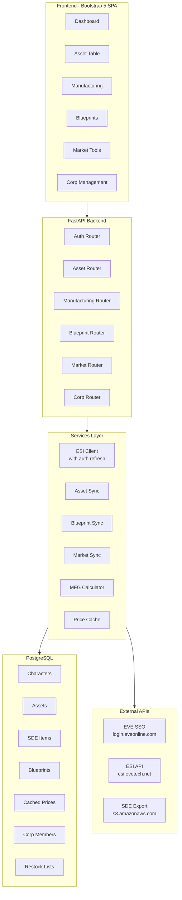
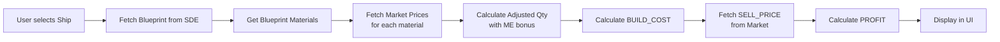
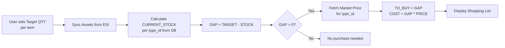

# EVE Industrial Tool - Architectural Plan v2.0

## Current State Analysis

### What already works
| Feature | Status |
|---------|--------|
| EVE SSO Login (Multi-Character) | ✅ |
| Character Asset Sync (paginated) | ✅ Fixed |
| Corp Asset Sync (via Director char) | ✅ Backend exists |
| SDE Import (50.235 Items) | ✅ |
| Docker Deployment (eve.sumeragy.de:8082) | ✅ |
| Asset Table with Filters | ✅ |
| Background Sync with Status Polling | ✅ |

### Existing Backend Foundation
- [`Asset`](smarthome/eve-industrial-tool/backend/app/models/asset.py:8) model: already has `corporation_id`, `is_corp_asset`, `division_id/name`, `is_blueprint`, `blueprint_me/te/runs`
- [`Character`](smarthome/eve-industrial-tool/backend/app/models/character.py:8) model: already has `corporation_id/name`, `has_corp_roles`, `scopes`
- [`SDEItem`](smarthome/eve-industrial-tool/backend/app/models/sde_item.py:7) model: has `is_ship`, `is_module`, `is_blueprint`, `is_material`, `group_id/name`, `category_id/name`
- [`ESIClient`](smarthome/eve-industrial-tool/backend/app/services/esi_client.py:25): has corp assets, blueprint endpoints, corp divisions
- [`Auth scopes`](smarthome/eve-industrial-tool/backend/app/routers/auth.py:34): already includes corp read scopes
- [`sync_corporation_assets()`](smarthome/eve-industrial-tool/backend/app/services/asset_sync.py:168): fully implemented with division mapping

### Excel Workbook Structure (SquadB v1.6)
The Excel has 18 sheets; below is the mapping to our web-tool phases:

---

## Phase 1 - 🔴 Corporation Integration (Co-CEO Priority)

### What exists already
- Corp asset sync works via `POST /api/assets/sync/{char_id}?sync_corp=true`
- Division names are fetched from ESI automatically
- Corp assets stored with `is_corp_asset=True`, `corporation_id`, `division_id`

### What needs to be built

#### 1A. Corp Role Checking
- After SSO login, check if character has `Director` role via ESI
- Store `has_corp_roles` flag on Character model
- Show/hide Corp features in UI based on roles
- **ESI endpoint**: `/characters/{character_id}/roles/`
- **Scopes needed**: `esi-characters.read_corporation_roles.v1` ✅ already in config

#### 1B. Corp Member Tracker (Excel Sheet 5)
- **New model**: `CorpMember`
  - `corporation_id`, `character_id`, `character_name`
  - `location_id`, `location_name`, `ship_type_id`
  - `last_login` (timestamp), `is_online` (boolean)
- **ESI endpoint**: `/corporations/{corporation_id}/members/` + `/corporations/{corporation_id}/members/online/` + `/corporations/{corporation_id}/members/outstanding_invoices/`
- **Scope**: `esi-corporations.read_corporation_membership.v1`
- **Sync**: Background task, cached in DB
- **UI**: Table with name, location, ship, last login status

#### 1C. Corp Hangar Overview (Excel Sheet 1B)
- Build a "Corp Hangar View" in the existing asset table
- Group assets by division (hangar), then by type
- Show item count, total volume, approximate value per hangar
- **No new ESI calls** — uses already-synced data

#### 1D. Corp Restock Calculator (Excel Sheet 1B logic)
- **New model**: `RestockList`
  - `id`, `corporation_id`, `name` (e.g. "Mineral Stock", "Moon Goop")
  - `is_active`
- **New model**: `RestockListItem`
  - `restock_list_id`, `type_id`, `target_quantity`
  - `current_stock` (calculated from assets), `gap`, `to_buy`, `estimated_cost`
- **Logic**: GAP = TARGET_QTY - CURRENT_STOCK. If GAP > 0, TO_BUY = GAP
- **Market prices**: Cache ESI market orders for price calculation
- **UI**: Configurable shopping list with "Copy to clipboard" buy order text

---

## Phase 2 - 🟠 Manufacturing (Ship/Structure Building)

### 2A. Industry Job Tracking (Excel Sheet 6 foundation)
- **New model**: `IndustryJob`
  - `job_id`, `character_id`, `corporation_id`
  - `blueprint_type_id`, `product_type_id`
  - `runs`, `status` (active/delivered/cancelled)
  - `start_date`, `end_date`, `installer_name`
- **ESI endpoints**: 
  - `/characters/{character_id}/industry/jobs/`
  - `/corporations/{corporation_id}/industry/jobs/`
- **Scope**: `esi-industry.read_character_jobs.v1` ✅ + `esi-industry.read_corporation_jobs.v1` ✅

### 2B. Ship/Structure Build Calculator (Excel Sheet 6 - Dave's Garage)
- **New model**: `Blueprint`
  - `type_id`, `name`, `group_id`, `category_id`
  - `product_type_id`, `product_name`
  - `me_bonus`, `te_bonus` (Material/Time Efficiency)
  - `runs_remaining`
  - `is_bpo`, `is_bpc`
- **New model**: `BlueprintMaterial`
  - `blueprint_type_id`, `material_type_id`, `material_name`
  - `quantity` (base), `quantity_with_me` (ME-adjusted)
- **ESI endpoints**: `/universe/types/{type_id}/` (for blueprint activities/materials)
- **Or SDE-based**: Parse blueprint materials from SDE `fsd/blueprints.yaml`
- **BOM Calculator Logic**:
  - User selects ship/structure → system fetches BOM from DB
  - Adjust material quantities for ME level: `adjusted_qty = ceil(base_qty * (1 - me_bonus))`
  - Fetch current market prices for each material
  - Calculate: `BUILD_COST = SUM(adjusted_qty * material_price)`
  - Calculate: `PROFIT = SELL_PRICE - BUILD_COST`
  - Show: Profit margin, ROI percentage, break-even price
- **UI**: 
  - Ship/Structure selector with search
  - BOM table with material name, qty, price, subtotal
  - Profit summary box (Build Cost, Sell Price, Profit/Loss)

### 2C. Manufacturing Cost Indices
- Fetch solar system cost indices via ESI
- `/industry/systems/{system_id}/cost_indices/`
- Apply to build cost calculation
- Show optimal system for manufacturing

---

## Phase 3 - 🟡 Blueprint Management (Excel Sheets 4, 4.corp, 4.1)

### 3A. Blueprint Sync
- Already partially in ESI client: `get_character_blueprints()`, `get_corporation_blueprints()`
- **New sync service**: `blueprint_sync.py`
  - Sync character BPOs with ME/PE/runs
  - Sync corporation BPOs
  - Store in Asset model (already has blueprint fields) OR new Blueprint model
- **UI**: Blueprint tab showing BPOs with ME/PE levels, grouped by category

### 3B. BPC Tracker (Excel Sheet 4.1)
- Track Blueprint Copies (limited runs)
- Show remaining runs, copy count per type
- Flag when runs are low (< threshold)

### 3C. T2 Invention Calculator
- **New model**: `T2Invention`
  - `bpc_type_id`, `t2_product_type_id`, `decryptor_type_id`
  - `base_chance`, `adjusted_chance` (with skills/decryptor)
  - `runs_per_success`, `materials_per_run`
- **Logic**: 
  - `SUCCESS_CHANCE = BASE_CHANCE * (1 + SKILL_BONUS) * DECRYPTOR_MODIFIER`
  - `COST_PER_ATTEMPT = BPC_COST + DECRYPTOR_COST + DATACORE_COST * 2`
  - `COST_PER_SUCCESS = COST_PER_ATTEMPT / SUCCESS_CHANCE`
  - `PROFIT_PER_SUCCESS = T2_SELL_PRICE - T2_BUILD_COST - COST_PER_SUCCESS`
- **UI**: Invention calculator form with skill inputs, success probability display

---

## Phase 4 - 🟢 Market & Restock (Excel Sheets 2, 3, 1A)

### 4A. Market Order Sync
- **New model**: `MarketOrder`
  - `order_id`, `type_id`, `is_buy_order`
  - `price`, `volume_remaining`, `volume_total`
  - `location_id`, `system_id`, `region_id`
  - `range`, `duration`, `issued`
- **ESI endpoint**: `/markets/{region_id}/orders/`
- **Caching**: Store prices in DB, refresh every 5-15 minutes
- **Key regions**: The Forge (Jita), Heimatar, Domain, etc.
- **Scope**: No auth needed (public market data)

### 4B. Price Cache Service
- **New service**: `market_service.py`
  - Background task to fetch + cache market prices
  - Store min sell, max buy for each type_id
  - Expose via `/api/market/prices/{type_id}`
- **New model**: `CachedPrice`
  - `type_id`, `sell_price_min`, `buy_price_max`
  - `volume`, `updated_at`

### 4C. Character Restock Automator (Excel Sheet 1A)
- Same logic as Corp Restock but for personal hangars
- Configurable target quantities per item
- GAP analysis with market price calculation
- UI: Shopping list with "open in EVE" clipboard support

### 4D. Selling Tool (Excel Sheet 3)
- Match personal inventory against market prices
- Show items that are "underpriced" compared to market average
- Suggested sell price with configurable markdown %
- `PROPOSED_PRICE = CURRENT_SALES_PRICE * (1 - MARKDOWN_PERCENT)`

---

## Phase 5 - ⚪ Reference & Polish

### 5A. Item ID Grabber (Excel ID GRABBER)
- Simple search UI for item names → EVE type_id
- Uses existing SDE data

### 5B. Type ID Browser (Excel typeids)
- Browse all item types with search/filter
- Show category, group, volume, mass, tech level

### 5C. UI Navigation Redesign
- Current: Single page with asset table
- Target: Multi-tab layout with sidebar navigation
  - Dashboard | Assets | Manufacturing | Blueprints | Market | Corp

### 5D. Dark Theme Polish
- Improve Bootstrap 5 dark theme consistency
- Add loading states, error handling
- Mobile-responsive tables

---

## Architecture Diagram

---

## New ESI Scopes Required

| Scope | Purpose | Phase |
|-------|---------|-------|
| `esi-corporations.read_corporation_membership.v1` | Corp member tracking | Phase 1 |
| `esi-universe.read_structures.v1` | Structure names | Phase 1 |
| `esi-markets.read_character_orders.v1` | Personal market orders | Phase 4 |
| `esi-markets.structure_markets.v1` | Market orders in structures | Phase 4 |

---

## Data Flow for Key Features

### Ship Building Calculator Data Flow

### Restock Automator Data Flow

---

## Implementation Order

| Step | Task | Dependencies | Effort |
|------|------|-------------|--------|
| 1 | Corp role checking + UI visibility | None | Small |
| 2 | Corp member tracker | ESI client | Medium |
| 3 | Corp hangar overview UI | Assets data | Small |
| 4 | Corp restock calculator | Market prices | Medium |
| 5 | Blueprint sync + BP table UI | ESI client | Medium |
| 6 | Ship build calculator + BOM from SDE | Blueprint materials | Large |
| 7 | Market price cache service | None | Medium |
| 8 | Industry job tracking | ESI client | Medium |
| 9 | Character restock + selling tool | Market prices | Medium |
| 10 | T2 invention calculator | Blueprint data | Medium |
| 11 | Item browser + polish | SDE data | Small |
