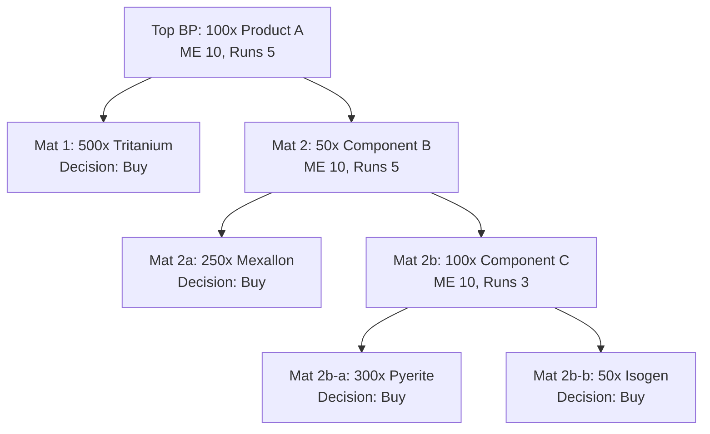
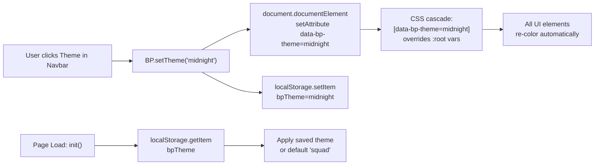

# Blueprint Shopper — Bugfix & Feature Plan

## Architecture Overview

```
┌─────────────────────────────────────────────────────┐
│  blueprints.html (Jinja2 Template, 1487 lines)     │
│  ┌─────────────────────────────────────────────────┐│
│  │  bp-browser.js (IIFE, 5615 lines)               ││
│  │  window.BP = { ... all functions ... }          ││
│  └─────────────────────────────────────────────────┘│
│  ┌─────────────────────────────────────────────────┐│
│  │  style.css (2704 lines)                         ││
│  └─────────────────────────────────────────────────┘│
└──────────────────────┬──────────────────────────────┘
                       │ HTTP (FastAPI)
┌──────────────────────┴──────────────────────────────┐
│  blueprints.py (2164 lines)                        │
│  - /api/blueprints/build-cost (POST)               │
│  - /api/blueprints/{id}/build-steps (GET)          │
│  - /api/blueprints/{id}/detail (GET)               │
│  - /api/blueprints/batch-prices (GET)              │
│  - /api/blueprints/user-price (PUT)                │
├─────────────────────────────────────────────────────┤
│  market.py (205 lines)                             │
│  - /api/market/refresh (POST)                      │
│  - /api/market/prices (GET)                        │
├─────────────────────────────────────────────────────┤
│  sync_all.py (128 lines)                           │
│  - /api/sync/all (POST)                            │
│  - /api/sync/all/status (GET)                      │
├─────────────────────────────────────────────────────┤
│  main.py (191 lines)                               │
│  - _startup_price_refresh() on lifespan             │
└─────────────────────────────────────────────────────┘
```

## Data Flow

```
[Page Load] → init() → triggerMarketPriceRefresh() → POST /api/market/refresh
              → loadLocations() → GET /api/blueprints/locations
              → loadCharacters() → loadCart() → loadOrders() → renderCart()

[Add to Cart] → addToCart() → saveCart() → renderCart()
[Send to Order] → showStationSelector() → confirmStationSelector()
                → _proceedCreateOrder() → _fetchBuildCostsForOrder()
                → POST /api/blueprints/build-cost
[Order View] → renderOrderDetail() → renderOrderAggregatedMaterials()
             → renderOrderSummary() → renderPriceOverrides()
```

---

## Recommended Implementation Order

### Phase 1: High-Impact Bug Fixes (Core Stability)

#### Task 1.1: Investigate 3x Mineral Values (DB Duplication)
- **Files:** [`blueprints.py`](../smarthome/eve-industrial-tool/backend/app/routers/blueprints.py), [`blueprint_sync.py`](../smarthome/eve-industrial-tool/backend/services/blueprint_sync.py)
- **Issue:** Materials appear 3x in build cost calculations, suspected DB duplication on each pull
- **Check:** Whether `sde_blueprint_materials` is being re-inserted instead of upserted during sync
- **Fix:** Add `ON CONFLICT DO NOTHING` or truncate-reload pattern in sync logic

#### Task 1.2: Fix Price Refresh Reliability
- **Files:** [`main.py`](../smarthome/eve-industrial-tool/backend/app/main.py) (line 30-51), [`market.py`](../smarthome/eve-industrial-tool/backend/app/routers/market.py) (line 82-95), [`bp-browser.js`](../smarthome/eve-industrial-tool/backend/app/templates/static/js/bp-browser.js) (line 445-468)
- **Issue:** `triggerMarketPriceRefresh()` hits `/api/market/refresh` which requires no auth — but the ESI call may silently fail. Also the 30min localStorage cache prevents re-fetch.
- **Check:** Add logging to `refresh_all_prices` in `market_service.py`
- **Fix:** Reduce cache TTL or add manual "Refresh Prices" button in UI

#### Task 1.3: System Cost Index Integration
- **Files:** [`blueprints.py`](../smarthome/eve-industrial-tool/backend/app/routers/blueprints.py) (lines 1436-1474), [`cost_indices.py`](../smarthome/eve-industrial-tool/backend/app/routers/cost_indices.py), [`bp-browser.js`](../smarthome/eve-industrial-tool/backend/app/templates/static/js/bp-browser.js) (line 4126-4152 `lookupSystemCostIndex`)
- **Issue:** System cost index is manually entered in config (flat %), not fetched from ESI/DB. EVE has per-system cost indices that significantly affect build costs.
- **Fix:** Add backend endpoint to fetch current system cost indices from ESI. Auto-fill the field in the facility config. Use real system cost index in formula: `facility_cost = material_cost × system_index × time_mult × rig_mult × tax_rate`

---

### Phase 2: Order UI Overhaul (Usability)

#### Task 2.1: Order Detail — Visual Hierarchy & Formatting
- **Files:** [`bp-browser.js`](../smarthome/eve-industrial-tool/backend/app/templates/static/js/bp-browser.js) (lines 2484-2630), [`style.css`](../smarthome/eve-industrial-tool/backend/app/templates/static/css/style.css), [`blueprints.html`](../smarthome/eve-industrial-tool/backend/app/templates/blueprints.html) (lines 836-910)
- **Issues:** 
  - Order items are plain text with minimal formatting
  - No colored indicators for Build vs Buy
  - Hard to distinguish between products and materials
  - Summary rows lack visual weight
- **Fix:**
  - Add colored badges/cards for each order item (product name prominent)
  - Use distinct colors for Build (green) vs Buy (blue) materials
  - Add ISK formatting with proper colors (gold for costs, green for savings)
  - Make the summary sticky-footer more polished with icons

#### Task 2.2: Summary Panel Improvements
- **Files:** [`blueprints.html`](../smarthome/eve-industrial-tool/backend/app/templates/blueprints.html) (lines 883-909), [`bp-browser.js`](../smarthome/eve-industrial-tool/backend/app/templates/static/js/bp-browser.js) (lines 2796-2905), [`style.css`](../smarthome/eve-industrial-tool/backend/app/templates/static/css/style.css)
- **Issues:**
  - Summary rows are basic `<div>` without icons
  - Market Value and Savings rows are dynamically inserted (fragile)
  - No visual separator between build/buy breakdown
- **Fix:**
  - Pre-render all summary rows in HTML (no dynamic creation)
  - Add Bootstrap icons to each row
  - Add proper color coding (gold for costs, green for savings, red for losses)
  - Add per-item cost breakdown popover

#### Task 2.3: Add ME/PE Adjustment UI in Orders
- **Files:** [`bp-browser.js`](../smarthome/eve-industrial-tool/backend/app/templates/static/js/bp-browser.js) (around line 2525), [`blueprints.html`](../smarthome/eve-industrial-tool/backend/app/templates/blueprints.html)
- **Issue:** Once a blueprint is added to an order, ME/PE values cannot be changed
- **Fix:** Add inline ME/PE editing on each order item row. On change, re-fetch build costs via `POST /api/blueprints/build-cost`

#### Task 2.4: Display Build Time
- **Files:** [`blueprints.py`](../smarthome/eve-industrial-tool/backend/app/routers/blueprints.py) (lines 1221, 1266, 1492-1509), [`bp-browser.js`](../smarthome/eve-industrial-tool/backend/app/templates/static/js/bp-browser.js) (render functions)
- **Issue:** `manufacturing_time` is queried from SDE but never returned or displayed
- **Fix:** Add `manufacturing_time` and `build_time` to the build-cost response. Display formatted time (e.g., "2h 34m") in the order detail and summary. Calculate total build time across runs.

---

### Phase 3: Build Steps Tree (Intermediate Products)

#### Task 3.1: Backend — Add Per-Step ME Support
- **Files:** [`blueprints.py`](../smarthome/eve-industrial-tool/backend/app/routers/blueprints.py) (lines 1561-1817, `get_build_steps`)
- **Issue:** `resolve_step()` uses the same `me` parameter for all sub-steps. For products with intermediate steps, each step needs its own ME/PE.
- **Fix:** Extend `BuildStepNode` model to accept per-step ME/PE. Extend `resolve_step()` to accept optional per-step config. When building steps for an order, pass the per-step values from the order item.

#### Task 3.2: Frontend — Staggered/Expandable Build Steps View
- **Files:** [`bp-browser.js`](../smarthome/eve-industrial-tool/backend/app/templates/static/js/bp-browser.js) (new rendering function), [`blueprints.html`](../smarthome/eve-industrial-tool/backend/app/templates/blueprints.html) (new container)
- **Issue:** Users can't see which products have intermediate manufacturing steps
- **Fix:**
  - Add a new subsection in the order item row: "Build Steps" toggle
  - On expand, fetch `/api/blueprints/{id}/build-steps?runs=N&me=X` recursively
  - Render as nested indented list with distinct border colors per depth level
  - Each step shows: product name, runs needed, ME, materials at that level

#### Task 3.3: Per-Step Cost Breakdown
- **Files:** [`blueprints.py`](../smarthome/eve-industrial-tool/backend/app/routers/blueprints.py), [`bp-browser.js`](../smarthome/eve-industrial-tool/backend/app/templates/static/js/bp-browser.js)
- **Issue:** Build costs are only calculated for the top-level blueprint, not per intermediate step
- **Fix:** Extend build-cost endpoint to accept per-step ME/PE config. Calculate cost per intermediate step and return nested cost breakdown.

---

### Phase 4: Theme System & UI Polish

#### Task 4.1: CSS Custom Properties Theme System
- **Files:** [`style.css`](../smarthome/eve-industrial-tool/backend/app/templates/static/css/style.css) (lines 1-21), [`blueprints.html`](../smarthome/eve-industrial-tool/backend/app/templates/blueprints.html) (line 2)
- **Issue:** Currently `data-bs-theme="dark"` on `<html>` with hardcoded CSS vars. No theme switching.
- **Fix:**
  - Define 5+ theme data sets using `[data-bp-theme="..."]` selectors
  - Themes: `squad` (current dark), `midnight` (darker), `dust` (warm), `ice` (light), `amber` (high-contrast)
  - Each theme overrides `--squad-*` CSS variables with different values
  - Store preference in `localStorage`

```css
[data-bp-theme="squad"] { --squad-bg: #050510; --squad-orange: #e8883a; ... }
[data-bp-theme="midnight"] { --squad-bg: #000005; --squad-orange: #4a90d9; ... }
[data-bp-theme="ice"] { --squad-bg: #f0f0f5; --squad-orange: #d4742c; --squad-text: #222; ... }
```

#### Task 4.2: Theme Selector UI
- **Files:** [`blueprints.html`](../smarthome/eve-industrial-tool/backend/app/templates/blueprints.html) (navbar), [`bp-browser.js`](../smarthome/eve-industrial-tool/backend/app/templates/static/js/bp-browser.js)
- **Fix:** Add a theme dropdown in the navbar. On selection, update `data-bp-theme` attribute on `<html>` and save to localStorage. Load on `init()`.

#### Task 4.3: General Color/Readability Improvements
- **Files:** [`style.css`](../smarthome/eve-industrial-tool/backend/app/templates/static/css/style.css) (blueprint-specific sections), [`blueprints.html`](../smarthome/eve-industrial-tool/backend/app/templates/blueprints.html)
- **Issues:**
  - Small font sizes (0.6rem-0.78rem) in many places
  - Low contrast between text and background
  - Inconsistent color usage
- **Fix:** 
  - Increase minimum font size to 0.72rem
  - Add subtle background stripes to alternating rows in order detail
  - Use consistent color scheme: Green = Build/Success, Blue = Buy/Info, Orange = Warnings, Gold = ISK values
  - Add hover effects on all clickable rows

---

## Mermaid Diagram: Build Steps Tree Visualization



## Mermaid Diagram: Theme System Architecture



---

## File Impact Summary

| File | Tasks | Estimated Change |
|------|-------|-----------------|
| `blueprints.py` (backend) | 1.1, 1.3, 2.4, 3.1, 3.3 | +100 lines |
| `market.py` (backend) | 1.2 | +10 lines |
| `cost_indices.py` (backend) | 1.3 | +50 lines (new endpoint) |
| `main.py` (backend) | 1.2 | +15 lines |
| `blueprint_sync.py` (backend) | 1.1 | +20 lines |
| `bp-browser.js` (frontend) | 1.2, 1.3, 2.1, 2.2, 2.3, 2.4, 3.2, 3.3, 4.2 | +400 lines |
| `blueprints.html` (template) | 2.1, 2.2, 2.3, 2.4, 3.2, 4.2 | +80 lines |
| `style.css` (styles) | 2.1, 2.2, 4.1, 4.3 | +200 lines |

---

## Implementation Dependencies

```
Phase 1 (Bug Fixes) ─── No external dependencies
    │
    ▼
Phase 2 (Order UI) ─── Depends on Phase 1 (prices must work)
    │
    ▼
Phase 3 (Build Steps) ─── Depends on Phase 2 (order UI provides container)
    │
    ▼
Phase 4 (Theme/Polish) ─── Can be done in parallel with Phase 2/3
```

Each phase can be developed, tested, and deployed independently. Tasks within each phase should be done sequentially.
