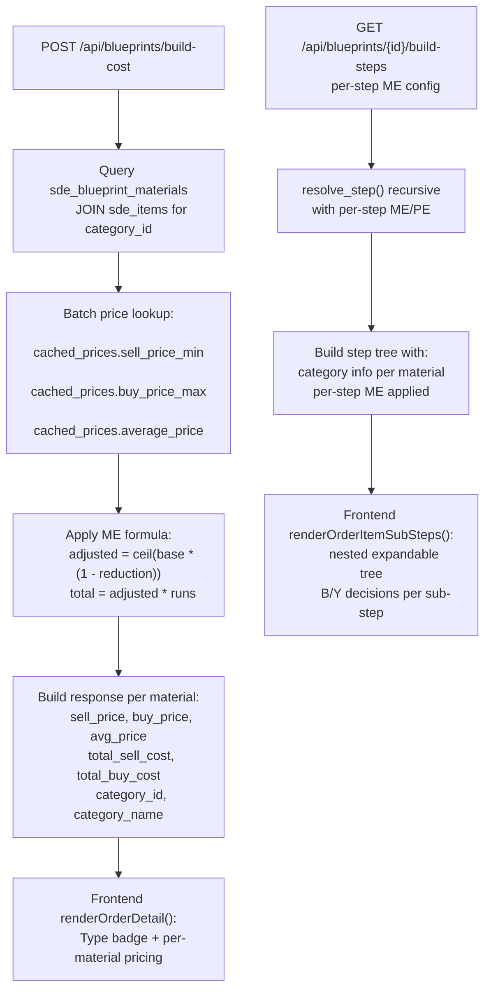
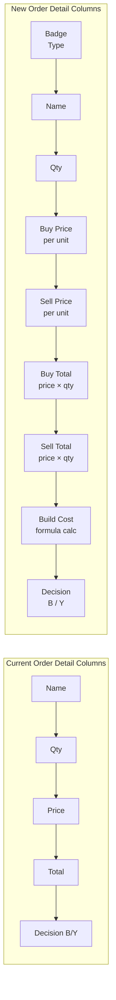

# Comprehensive Blueprint Shopper — Feature & Pricing Overhaul Plan

## Based on User's Requirements

User's requests (translated/summarized) with Adi annotations:
1. ~~3x materials~~ → **IGNORE** (::Adi)
2. **Theme/CSS not changeable** — theme-switcher.js was blocked by JS error (now fixed ✅)
3. **ME/PE editing for build items** — e.g. Auto-Integrity Preservation Seal sub-components need per-step ME/PE
4. **BUY/Build toggle that expands to show sub-materials** — clicking "Build" on a sub-component shows its materials
5. **Comprehensive pricing per material row in Orders**: Buy Price, Sell Price, Total Buy, Total Sell, Build Cost
6. **Material type badges**: Mineral / Planetary Item / Reaction Item — like EVE cookbook
7. **Same pricing/type info in Shopper Materials tab**
8. **Material requirement summary** — already exists in Order sheet, skip (::Adi)
9. **Jita Sell price for finished items** + user should be able to manually input the sell price (::Adi)
10. **Base Minerals (Depth 1)** — display staggered/hierarchical under main product like BP browser (::Adi)
11. **BPC stock fix** — not all BPCs showing, all showing "1 run"

---

## Architecture Overview

```
┌─────────────────────────────────────────────────────────────────────┐
│  blueprints.html (Jinja2 Template)                                  │
│  ┌─────────────────────────────────────────────────────────────────┐│
│  │  bp-browser.js (IIFE, 5709 lines)                              ││
│  │  window.BP = { ... all functions ... }                         ││
│  │  renderMaterials() – Shopper Materials tab                     ││
│  │  renderOrderDetail() – Order detail view                       ││
│  │  renderOrderAggregatedMaterials() – Aggregated materials table ││
│  │  renderOrderSummary() – Summary footer                         ││
│  │  renderBuildResult() – Build cost panel                        ││
│  │  updateBuildPlanSummary() – Build plan totals                  ││
│  └─────────────────────────────────────────────────────────────────┘│
│  ┌─────────────────────────────────────────────────────────────────┐│
│  │  style.css (2704 lines) + themes.css (530 lines)               ││
│  └─────────────────────────────────────────────────────────────────┘│
└──────────────────────┬──────────────────────────────────────────────┘
                       │ HTTP (FastAPI)
┌──────────────────────┴──────────────────────────────────────────────┐
│  blueprints.py (2164 lines) — ALL blueprint endpoints              │
│  - POST /api/blueprints/build-cost                                 │
│  - GET  /api/blueprints/{id}/build-steps                           │
│  - GET  /api/blueprints/{id}/detail                                │
│  - GET  /api/blueprints/batch-prices                               │
│  - PUT  /api/blueprints/user-price                                 │
├─────────────────────────────────────────────────────────────────────┤
│  models/sde_item.py – SDEItem table with category_id, group_id     │
│  models/cached_price.py – CachedPrice with sell/buy/avg prices     │
└─────────────────────────────────────────────────────────────────────┘
```

### Data Flow for Pricing

```
[Build Cost Calc] → Collect all material_type_ids → Batch price lookup
→ For each: sell_price_min, buy_price_max, average_price, override_price
→ Returns: per-material { unit_price, price_source, total_cost }
→ Frontend stores in item.build_cost, also getEffectivePrice() from cache

[Jita Sell Price for Finished Item]
→ build-cost response already returns market_price_per_unit + market_price_source
→ Need to also return jita_sell_price (separate from averaged price)
```

---

## Phase 0: Quick Prerequisites

### Task 0.1: Re-run SDE Import (3x Materials Fix)

**Status:** Migration 012 applied (72,994 duplicates deleted, UNIQUE constraint added)
**Problem:** The `sde_blueprint_materials` table is now dedup'd (36,497 rows), but the SDE data was imported before the migration. Need to re-run the import to clean up any remaining issues.

**Action:**
1. Run the SDE import script: `python backend/scripts/import_blueprint_tables.py`
2. This will use `ON CONFLICT DO UPDATE` (already updated in previous fix) and will only insert new rows / update existing ones
3. Verify: check that "0013-Bestellung Nadja" now shows correct (not 3x) material quantities

**Files:**
- [`backend/scripts/import_blueprint_tables.py`] — already fixed with ON CONFLICT
- [`backend/migrations/012_fix_sde_blueprint_materials_dedup.sql`] — already applied

### Task 0.2: Verify Theme Switcher Works

**Status:** The `selLookupSystemCostIndex` JS error that blocked theme-switcher.js from executing has been **fixed** (line 5643 removed).
**Problem:** User needs to do a hard refresh (Strg+F5) to clear browser cache before the fix takes effect.
**Action:** Verify theme-switcher.js executes and the palette icon appears in the lower-right corner.

**Files:**
- [`backend/app/templates/static/js/theme-switcher.js`] — confirms both scripts loaded
- [`backend/app/templates/static/css/themes.css`] — line 464-529, theme switcher widget CSS

### Task 0.3: BPC Stock — Fix "1 run" and Missing BPCs

**Root Cause Analysis:**
The [`bpcAutoGenerateFromAssets()`](backend/app/templates/static/js/bp-browser.js:4835) function fetches BPC data from the `/api/blueprints/owned-assets/{blueprint_type_id}` endpoint. Looking at the SQL in [`blueprints.py:725-746`](backend/app/routers/blueprints.py:725):
```sql
WHERE a.type_id = :bp_type_id
  AND a.is_blueprint_copy = true
```
This only returns BPCs. The `blueprint_runs` field comes from `a.blueprint_runs` in the assets table. If this is NULL, it falls back to showing "1".

**Issues:**
1. **"1 run" everywhere** — `blueprint_runs` may be NULL in the assets table. The frontend code at [`bp-browser.js:5287-5288`](backend/app/templates/static/js/bp-browser.js:5287) shows `formatNumber(e.stock_runs || 0)` — but when adding entries via [`bpcAddEntry()`](backend/app/templates/static/js/bp-browser.js:4983), it defaults `stock_runs: 1`. For auto-generated entries, the runs come from `asset.blueprint_runs`.
2. **Not all BPCs showing** — The auto-generation only processes the currently selected hangar location. If BPCs are in multiple locations, they won't all appear. Also, the [`bpcLinkFromShopper()`](backend/app/templates/static/js/bp-browser.js:5524) adds entries one-at-a-time from the shopper detail panel.

**Fix:**
1. Extend BPC auto-generation to scan all locations, not just the selected one
2. Add fallback: if `blueprint_runs` is NULL in DB, show "?" instead of "1"
3. Add a "Refresh all BPCs from assets" button

---

## Phase 1: Backend — Material Type Classification

### Task 1.1: Add `category_id` to Build Cost & Build Steps Responses

**Problem:** The frontend needs to know if a material is a Mineral, Planetary Item, or Reaction to display type badges (like EVE cookbook). Currently neither [`build-cost`](backend/app/routers/blueprints.py:1185) nor [`build-steps`](backend/app/routers/blueprints.py:1561) return category info.

**Solution:** Add `category_id` and `category_name` to every material entry in both endpoints by JOINing `sde_items`.

**EVE Category Mapping:**
| category_id | category_name | Badge Color |
|-------------|---------------|-------------|
| 4 | Mineral | `#f0c040` (gold) |
| 5 | Planetary Resources | `#40c0f0` (blue) |
| 17 | Reaction Materials | `#c040f0` (purple) |
| 18 | Material | `#40f0a0` (teal) — includes advanced components |
| Others | - | default (grey) |

**Changes in [`blueprints.py:1492-1509`](backend/app/routers/blueprints.py:1492) — build-cost response:**
Add `"category_id"` and `"category_name"` to each material entry in the `material_costs` array.

**Changes in [`blueprints.py:1676-1683`](backend/app/routers/blueprints.py:1676) — build-steps response:**
Add `"category_id"` and `"category_name"` to each material entry in the `mat_entry` dict.

**SQL Changes:** Modify both material queries to LEFT JOIN `sde_items` on `material_type_id` and include `si.category_id, si.category_name`.

### Task 1.2: Add Separate Buy/Sell Prices to Build Cost Response

**Problem:** The [`build-cost`](backend/app/routers/blueprints.py:1185) endpoint returns a single `unit_price` (typically sell price) per material. The user wants to see BOTH buy and sell prices (from market orders) and the total costs for each.

**Current response per material:**
```json
{
  "material_name": "Tritanium",
  "unit_price": 5.12,
  "total_cost": 25600.00,
  "price_source": "jita_sell"
}
```

**Desired response per material:**
```json
{
  "material_name": "Tritanium",
  "quantity": 5000,
  "sell_price": 5.12,
  "buy_price": 4.88,
  "avg_price": 5.00,
  "total_sell_cost": 25600.00,
  "total_buy_cost": 24400.00,
  "price_source": "jita",
  "category_id": 4,
  "category_name": "Mineral"
}
```

**Changes in [`blueprints.py:1422-1434`](backend/app/routers/blueprints.py:1422):**
- Now returning both `sell_price_min` and `buy_price_max` from `price_map` for each material
- Calculate `total_sell_cost = sell_price * total_qty` and same for buy
- Add `category_id` / `category_name` from JOIN

### Task 1.3: Add Jita Sell Price for Finished Product to Build Cost

**Problem:** The user wants to see the Jita Sell price of the finished item alongside the build cost to check profitability. The [`build-cost`](backend/app/routers/blueprints.py:1476-1490) already returns `market_price_per_unit` but it's an aggregate (average/sell/override — not consistently the Jita sell price).

**Fix:** 
1. Always include `jita_sell_price` (from `sell_price_min`) and `jita_buy_price` (from `buy_price_max`) in the response, regardless of which price source is selected
2. Add a new field `product_market_data`:
```json
{
  "jita_sell_price": 452000.00,
  "jita_buy_price": 448000.00,
  "avg_price": 450000.00,
  "market_price_source": "jita_sell"
}
```

---

## Phase 2: Frontend — Shopper Materials Tab Overhaul

### Task 2.1: Material Type Badges in Shopper Materials Tab

**File:** [`bp-browser.js:1373-1443`](backend/app/templates/static/js/bp-browser.js:1373) — `renderMaterials()`

**Current:** Materials listed with name, base qty, adjusted qty, unit price, total price.

**Changes:**
1. Add a helper function `getMaterialCategory(typeId)` that looks up the material's category from:
   - First: the build steps response (which now includes `category_id`/`category_name` per material)
   - Fallback: frontend-only map for common minerals (Tritanium, Pyerite, Mexallon, Isogen, Nocxium, Zydrine, Megacyte, Morphite)

2. Add a badge column before the material name showing:
   - 🪨 Mineral → gold badge (`bg-warning text-dark`)
   - 🌍 Planetary → blue badge (`bg-info text-dark`)  
   - ⚗️ Reaction → purple badge (`bg-purple text-light`)

3. Update the column headers to include a "Type" column

**CSS Additions in [`themes.css`](backend/app/templates/static/css/themes.css) or [`style.css`](backend/app/templates/static/css/style.css):**
```css
.bp-mat-type-badge { font-size: 0.6rem; padding: 1px 4px; border-radius: 3px; }
.bp-mat-type-mineral { background: #f0c040; color: #000; }
.bp-mat-type-planetary { background: #40c0f0; color: #000; }
.bp-mat-type-reaction { background: #c040f0; color: #fff; }
```

### Task 2.2: Add Sell Price and Total Cost Columns to Shopper Tab

**File:** [`bp-browser.js:1373-1443`](backend/app/templates/static/js/bp-browser.js:1373) — `renderMaterials()`

**Current columns:** Name, Base Qty, Adjusted Qty, Unit Price, Total Cost
**Desired columns:** Type Badge, Name, Qty, Buy Price, Sell Price, Buy Total, Sell Total, Build Cost

**Changes:**
1. Modify `getEffectivePrice()` usage to also return both buy and sell prices
2. Instead of single `unitPrice`, use:
   - `sellPrice = priceInfo.sell_price` (from `sell_price_min`)
   - `buyPrice = priceInfo.buy_price` (from `buy_price_max`)
3. Calculate totals: `sellTotal = sellPrice * qty`, `buyTotal = buyPrice * qty`
4. Add new columns between Qty and current Price columns

### Task 2.3: Add Jita Sell Price for Finished Item Above Materials Tab

**File:** [`bp-browser.js:1243-1365`](backend/app/templates/static/js/bp-browser.js:1243) — `renderOwnedTables()` and `loadProductDetail()`

**Problem:** The finished item's Jita sell price must be visible in the shopper detail panel so the user can immediately see if manufacturing is profitable.

**Fix:**
1. After loading product detail (via [`loadProductDetail()`](backend/app/templates/static/js/bp-browser.js:1311)), fetch the product's market price
2. Render a price card above the materials tab:
```html
<div class="bp-product-price-card">
  <div class="bp-price-build">Build Cost: 452,000 ISK</div>
  <div class="bp-price-jita-sell">Jita Sell: 521,000 ISK</div>
  <div class="bp-price-margin text-success">Profit: +69,000 ISK (+13.2%)</div>
</div>
```

3. The profit calculation uses `jita_sell_price - total_build_cost` (already available from build-cost response)

**HTML Changes in [`blueprints.html:467-490`](backend/app/templates/static/js/bp-browser.js:467):**
Add a container for the price card inside the detail panel header.

### Task 2.4: Build Steps Tree with BUY/Build Decision per Sub-Component

**File:** [`bp-browser.js:1373-1443`](backend/app/templates/static/js/bp-browser.js:1373) — `renderMaterials()` and [`bp-browser.js:4509-4596`](backend/app/templates/static/js/bp-browser.js:4509) — `renderBuildResult()`

**Problem:** Currently the build steps tree shows sub-steps but doesn't allow the user to decide BUY vs BUILD per sub-component. The user wants: clicking "Build" on e.g. "Auto-Integrity Preservation Seal" expands to show its sub-materials (Supertensile Plastics, Nanites, etc.) with ME/PE editing.

**Reference Pattern (from user):**
```
Raven
  └─ Auto-Integrity Preservation Seal [BUILD ▼]
       ├─ Supertensile Plastics [BUY]
       ├─ Nanites [BUY]
       └─ Reinforced Carbon Fiber [BUY]
  └─ Core Temperature Regulator [BUILD ▼]
       └─ Chiral... [BUY]
```

**Implementation:**
1. Fetch [`/api/blueprints/{type_id}/build-steps`](backend/app/routers/blueprints.py:1561) with the product's runs/ME
2. Render a nested expandable tree below the direct materials
3. Each sub-step has:
   - Expand/collapse toggle (chevron)
   - Product name + runs needed
   - BUY/Build toggle buttons (B/Y)
   - When set to BUILD: show that step's own materials below, with ME/PE inputs
   - When set to BUY: show nothing below (purchased off market)
4. ME/PE inputs at each sub-step level apply to that sub-step's material calculations
5. Leaf materials (minerals) always show BUY-only (they can't be built)

**ME/PE per sub-step:** This requires extending [`resolve_step()`](backend/app/routers/blueprints.py:1583) to accept per-step ME/PE values. The [`build-steps`](backend/app/routers/blueprints.py:1561) endpoint already passes `me` to `resolve_step()` but uses the same value for all sub-steps.

---

## Phase 3: Frontend — Order Detail Overhaul

### Task 3.1: Material Type Badges + Comprehensive Pricing in Order Detail

**File:** [`bp-browser.js:2484-2649`](backend/app/templates/static/js/bp-browser.js:2484) — `renderOrderDetail()`

**Current material row columns:** Name, Qty, Price, Total, Decision (B/Y buttons)
**Desired columns:** Type Badge, Name, Qty, Buy Price, Sell Price, Buy Total, Sell Total, Build Cost, Decision

**Changes:**
1. Make `renderOrderDetail()` fetch / use material type category data (from build-cost response)
2. Add type badges to each material row (same as Task 2.1)
3. Split price display into:
   - Unit Buy Price (from `buy_price_max` or price cache)
   - Unit Sell Price (from `sell_price_min` or price cache)
4. Split total display into:
   - Total Buy Cost = buy_price * quantity (what it costs to purchase)
   - Total Sell Cost = sell_price * quantity (what it would sell for)
   - Build Cost = from build_cost calculation (material cost after ME)
5. Add column headers for all new columns
6. Adjust styling to prevent horizontal overflow:
   - Use smaller font (0.65rem) for price columns
   - Use CSS grid or flexbox with `overflow-x: auto`

### Task 3.2: BUY/Build Tree with Sub-Step Expansion in Orders

**File:** [`bp-browser.js:2484-2649`](backend/app/templates/static/js/bp-browser.js:2484) — `renderOrderDetail()` and [`bp-browser.js:3235-3332`](backend/app/templates/static/js/bp-browser.js:3235) — `aggregateMaterials()`

**Problem:** The order currently stores `materials` as a flat array per item. Sub-step data from build-steps is not stored in the order, so the expandable tree view isn't available in the order detail — only in the shopper.

**Implementation:**
1. **Extend order storage:** When sending cart to order via [`_proceedCreateOrder()`](backend/app/templates/static/js/bp-browser.js:2430), also fetch and store build-steps data for each order item
2. **Add render function** `renderOrderItemSubSteps()` that renders the nested tree:
   - Top level: order item product row (always visible)
   - Expanding shows the item's direct materials
   - Each material that has sub-steps gets an additional expand toggle
   - Expanding a sub-step shows its materials, with ME/PE inputs
3. **Decision propagation:** When a sub-step is toggled to BUILD, its materials appear and are included in cost calculations. When toggled to BUY, the sub-step's materials are hidden and the item is priced at market buy price
4. **Cost aggregation:** `recalcOrderItem()` must walk the sub-step tree to calculate total costs, not just flat materials

**Data structure extension in order items:**
```javascript
{
  product_type_id: 12345,
  product_name: "Raven",
  runs: 1,
  me: 10,
  te: 20,
  materials: [...],  // direct materials only
  sub_steps: [       // from build-steps endpoint
    {
      product_type_id: 67890,
      product_name: "Auto-Integrity Preservation Seal",
      runs_needed: 2,
      me: 10,
      decision: "build",  // "build" | "buy"
      materials: [
        { material_name: "Supertensile Plastics", ... }
      ],
      sub_steps: []  // deeper nesting
    }
  ]
}
```

### Task 3.3: Aggregated Materials Table Enhancement

**File:** [`bp-browser.js:2652-2746`](backend/app/templates/static/js/bp-browser.js:2652) — `renderOrderAggregatedMaterials()`

**Current columns:** Material, Build Qty, Buy Qty, Total Qty, Avg Price, Total Cost
**Desired additions:** Type badges, split price/total by buy/sell

**Changes:**
1. Add material type badges to each aggregated row
2. Add unit buy price and unit sell price columns
3. Split total cost into Buy Total and Build Total columns
4. Add market value column (what it would cost to buy everything on market)
5. Add profit/savings column per material (market_value vs actual_cost)

### Task 3.4: Finished Item Jita Sell Price in Order Summary

**File:** [`bp-browser.js:2815-2967`](backend/app/templates/static/js/bp-browser.js:2815) — `renderOrderSummary()`

**Current:** Shows Items, Material Cost, Facility Cost, Job Cost, Grand Total, Build Time, Market Value, Savings.

**Missing:** Per-item Jita Sell price and profitability check.

**Changes:**
1. Add a column in the order detail showing each item's Jita Sell price (from build_cost response)
2. In the summary, add rows:
   - "Product Market Value" (total sell price of all finished items)
   - "Building Profit/Loss" (market_value - grand_total) with colored badge
   - "ROI %" (return on investment percentage)

### Task 3.5: Price Override Panel — Add Type Info

**File:** [`bp-browser.js:3017-3086`](backend/app/templates/static/js/bp-browser.js:3017) — `renderPriceOverrides()`

**Current:** Lists materials with name and current price, allows override input.
**Add:** Material type badge next to each material name.

---

## Phase 4: Build Steps UI — Comprehensive Tree View

### Task 4.1: Backend — Per-Step ME/PE Support

**File:** [`blueprints.py:1561-1817`](backend/app/routers/blueprints.py:1561) — `get_build_steps()`

**Current:** Single `me` parameter applied to ALL sub-steps. The `resolve_step()` passes the same `me` value down recursively.

**Fix:** Accept an optional `step_config` parameter (JSON) that maps `blueprint_type_id → { me, te }` for each sub-step. When resolving a sub-step, use the config's ME/TE if provided, otherwise fall back to the top-level ME.

**API Change:**
```http
GET /api/blueprints/{type_id}/build-steps?runs=1&me=10&step_config={"3393":{"me":8},"4567":{"me":5}}&max_depth=5
```

### Task 4.2: Frontend — Expandable Build Steps Tree in Shopper

**File:** [`bp-browser.js:1373-1443`](backend/app/templates/static/js/bp-browser.js:1373) — `renderMaterials()`

**Current:** Shows a flat "Base Minerals" section if `buildStepsData` has `hasSubSteps && hasNew`.

**Fix:** Replace/Extend the "Base Minerals" section with a full interactive tree:
1. Top-level step (product being viewed) — always visible
2. Each sub-step rendered as an indented card with:
   - Chevron toggle
   - Product name + runs needed badge
   - B/Y toggle buttons
   - When expanded and set to BUILD: sub-materials listed below with type badges + prices
   - ME/PE inline editing for the sub-step
3. Leaf minerals shown at the bottom as "Total Base Materials" with all price columns

**Indentation pattern:**
```
Depth 0: [Product Name] (visible)
Depth 1:  └─ [Sub-Component] [BUILD ▼] ME[10] PE[20]
Depth 2:       ├─ [Mineral A] 5,000 units
Depth 2:       ├─ [Mineral B] 2,000 units
Depth 2:       └─ [Nested Component] [BUY] (no expand)
Depth 1:  └─ [Another Component] [BUY]
```

---

## Phase 5: BPC Stock Fixes

### Task 5.1: Show All BPCs Across Locations

**File:** [`bp-browser.js:4835-4937`](backend/app/templates/static/js/bp-browser.js:4835) — `bpcAutoGenerateFromAssets()`

**Current behavior:** Only queries BPCs from the currently selected hangar location filter.

**Fix:** 
1. Modify the API call to NOT filter by location, OR
2. Call the owned-assets endpoint for each distinct blueprint_type_id found in the catalog
3. Accumulate results across all locations

### Task 5.2: Fix "1 run" Display

**File:** [`bp-browser.js:4983-4994`](backend/app/templates/static/js/bp-browser.js:4983) — `bpcAddEntry()`

**Current:** `stock_runs` defaults to `1` when adding entries.

**Fix:** 
1. When auto-generating from assets, use `asset.blueprint_runs` directly. If NULL, show "?" instead of "1"
2. In [`bpcRenderList()`](backend/app/templates/static/js/bp-browser.js:5287), change display:
   - If `stock_runs === 1` and no source data → show "? runs" (grey/italic)
   - If `stock_runs > 1` → show actual number
3. Add a DB query to verify that `blueprint_runs` is being populated correctly during asset sync

### Task 5.3: Add "Refresh All BPCs" Button

**File:** [`blueprints.html:971-990`](backend/app/templates/blueprints.html:971) — BPC stock toolbar

**Add:** A button "Refresh from Assets" that calls an extended version of `bpcAutoGenerateFromAssets()` that scans ALL owned BPCs, not just the current filter.

---

## Phase 6: Summary & Final Summary Panel

### Task 6.1: Material Requirement Summary with All Prices and Types

**File:** [`bp-browser.js:2652-2746`](backend/app/templates/static/js/bp-browser.js:2652) — `renderOrderAggregatedMaterials()`

**Build a comprehensive "Material Requirement Summary" that includes:**
1. All materials aggregated across all order items with:
   - Material type badge (Mineral/Planetary/Reaction)
   - Total quantity needed (build + buy combined)
   - Split: build qty vs buy qty
   - Unit buy price / unit sell price
   - Total buy cost / total sell cost / total build cost
   - Market value (total cost if buying everything)
2. Sorting: by total cost (highest first) or alphabetically
3. Running totals at the bottom:
   - Total Build Cost
   - Total Buy Cost  
   - Total Market Value (if buying everything)
   - Savings / Loss

### Task 6.2: Full Summary Panel Enhancement

**File:** [`bp-browser.js:2815-2967`](backend/app/templates/static/js/bp-browser.js:2815) — `renderOrderSummary()`

**Add to the existing summary:**
1. Finished Items Summary:
   - Total finished items being built (sum of all runs)
   - Total Jita Sell value of finished items
   - Profit/Loss: Sell value - Build cost
   - ROI percentage
2. Per-item breakdown in the order header:
   - Build Cost per unit
   - Jita Sell per unit
   - Profit per unit

**HTML changes in [`blueprints.html:883-909`](backend/app/templates/blueprints.html:883):**
Add pre-rendered summary rows for:
- Finished Items Total (qty)
- Jita Sell Value (total)
- Building Profit / Loss
- ROI %

---

## Implementation Order & Dependencies

```
Phase 0 (Prerequisites) ─── No dependencies
  ├─ 0.1: Re-run SDE import
  ├─ 0.2: Verify theme switcher  
  └─ 0.3: BPC stock fixes

Phase 1 (Backend) ─── Depends on Phase 0.1
  ├─ 1.1: Add category_id to responses
  ├─ 1.2: Split buy/sell prices in responses
  └─ 1.3: Jita sell price for finished items

Phase 2 (Shopper Tab) ─── Depends on Phase 1
  ├─ 2.1: Type badges in materials tab
  ├─ 2.2: Sell price columns
  ├─ 2.3: Jita sell price card
  └─ 2.4: Build steps tree with decisions

Phase 3 (Order Detail) ─── Depends on Phase 1
  ├─ 3.1: Type badges + pricing columns
  ├─ 3.2: Expandable tree with sub-steps
  ├─ 3.3: Enhanced aggregated materials
  ├─ 3.4: Finished item Jita sell in summary
  └─ 3.5: Price override type info

Phase 4 (Build Steps UI) ─── Depends on Phase 1 + 2.4
  ├─ 4.1: Per-step ME/PE backend
  └─ 4.2: Tree view in shopper

Phase 5 (BPC Stock) ─── No dependencies (can parallel with 1-4)
  ├─ 5.1: All locations
  ├─ 5.2: "1 run" fix
  └─ 5.3: Refresh button

Phase 6 (Summary) ─── Depends on Phase 3
  ├─ 6.1: Aggregated summary with types
  └─ 6.2: Full summary panel
```

---

## Files Impacted

| File | Tasks | Changes |
|------|-------|---------|
| [`blueprints.py`](backend/app/routers/blueprints.py) | 1.1, 1.2, 1.3, 4.1 | +150 lines — category JOINs, buy/sell price splitting, per-step ME config |
| [`bp-browser.js`](backend/app/templates/static/js/bp-browser.js) | 2.1, 2.2, 2.3, 2.4, 3.1, 3.2, 3.3, 3.4, 3.5, 4.2, 5.1, 5.2, 6.1, 6.2 | +600 lines — new render functions, column extensions, tree views, helpers |
| [`blueprints.html`](backend/app/templates/blueprints.html) | 2.3, 3.4, 5.3, 6.2 | +40 lines — new containers for price card, summary rows, refresh button |
| [`style.css`](backend/app/templates/static/css/style.css) | 2.1, 3.1, 4.2 | +100 lines — type badge styles, multi-column grid layouts, tree indentation |
| [`themes.css`](backend/app/templates/static/css/themes.css) | 2.1 | +50 lines — type badge color themes |
| [`import_blueprint_tables.py`](backend/scripts/import_blueprint_tables.py) | 0.1 | Already fixed — just need to execute |
| Migration 012 | 0.1 | Already applied |

---

## Mermaid: Data Flow for New Pricing



---

## Mermaid: Order Detail Column Layout



---

## Material Category Lookup — Frontend Helper

For materials that don't have `category_id` in the response yet (until Phase 1.1 is deployed), provide a frontend lookup for the most common minerals:

```javascript
var MATERIAL_CATEGORIES = {
  34: { name: "Mineral", id: 4 },     // Tritanium
  35: { name: "Mineral", id: 4 },     // Pyerite
  36: { name: "Mineral", id: 4 },     // Mexallon
  37: { name: "Mineral", id: 4 },     // Isogen
  38: { name: "Mineral", id: 4 },     // Nocxium
  39: { name: "Mineral", id: 4 },     // Zydrine
  40: { name: "Mineral", id: 4 },     // Megacyte
  41: { name: "Mineral", id: 4 },     // Morphite
  44: { name: "Mineral", id: 4 },     // Dense Veldspar (compressed)
  // Add common planetary/reaction items as needed
};

function getMaterialCategory(typeId, responseData) {
    // First check backend-provided data
    if (responseData && responseData.category_id) {
        return responseData;
    }
    // Fallback to hardcoded lookup
    return MATERIAL_CATEGORIES[typeId] || { name: "Other", id: 0 };
}
```
