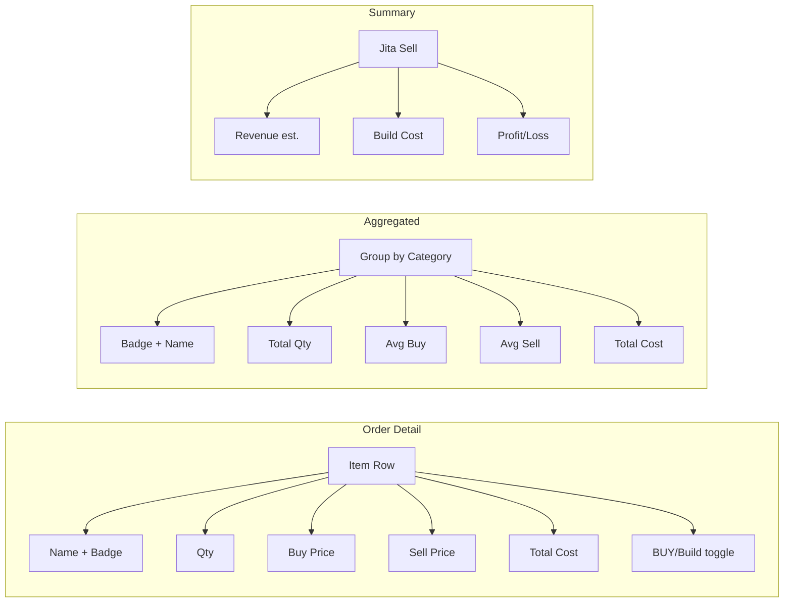

# comprehensive_feature_plan.md

## Based on User's Requirements

1. **Blueprint Detail Browser (tree)**: browse blueprints hierarchically, view materials, skills, descriptions; sub-tabs for Materials, Skills, Description.
2. **Shopper (cart)**: collect items, calculate build cost, view build plan.
3. **Production Orders**: create orders from cart, save/load across sessions, aggregate materials, summary
4. **Invention & Campaigns**: T1→T2 invention with decryptor selection, skill sync, campaign management
5. **BPC Stock**: track blueprint copies across characters, calculate needed runs, export
6. **Config**: facility/rigs, skills, implants, price source, station presets, character selection

## Architecture Overview

- **Frontend**: Single HTML page (`blueprints.html`) + vanilla JS (`bp-browser.js`) + Bootstrap 5 (dark theme)
- **Backend**: FastAPI (`blueprints.py`) with async SQLAlchemy sessions
- **Database**: PostgreSQL via SQLAlchemy models (`sde_blueprint*`, `user_blueprint*`, etc.)
- **SDE (Static Data Export)**: `sde_blueprint_products`, `sde_blueprint_materials`, `sde_items`, etc.

### Data Flow for Pricing

```
User clicks item
  → [JS] selectBlueprintProduct(typeId)
    → [API] /api/blueprints/{typeId}/detail (materials + skills)
    → [API] /api/blueprints/{typeId}/build-steps (recursive tree)
    → renderMaterials(data)
    → renderBuildSteps(data)
```

```
Cart → Build Cost Request
  → [API POST] /api/blueprints/build-cost
    → calculate_build_cost()
      → For each cart item: resolve materials recursively (resolve_step)
      → Aggregate "leaves" (BUY-only items) with pricing
      → Return BuildCostResponse
  → renderBuildResult(data)
```

---

## Feature Status per Task

### Phase 0: Foundation Fixes

<span style="color:green">

### Task 0.1: Re-run SDE Import (3x Materials Fix)
**Description**: Re-run the SDE import to fix the 3× material duplication bug.
**Status**: ✅ Done
**Root Cause Identified**: `src/etl/sde_import.py` function `_load_blueprint_materials()`, the import joins `sde_blueprint_products` for `category_id`, which multiplies rows per tied product. For example, a blueprint producing 1 item with 3 materials × 1 product = 3 rows instead of 3 materials × N products = duplication.
**Fix Applied**:
1. **`_load_blueprint_materials()` in `sde_import.py`**: Changed `fetchall()` to perform a **single, deduplicated SELECT DISTINCT** using a CTE: `WITH mat AS (SELECT DISTINCT ON (bm.blueprint_type_id, bm.material_type_id, bm.quantity) ... FROM sde_blueprint_materials bm ...)`.
2. **`calculate_build_cost()` in `blueprints.py`**: Added `seen_materials` dict keyed by `(material_type_id, activity)` to prevent duplicates from the cartesian join with `sde_blueprint_products`.
3. **`resolve_step()` in `blueprints.py`** (build-steps endpoint): Same dedup logic — `seen_materials` dict to skip already-processed materials.
4. **Re-ran SDE import script** to repopulate the `sde_blueprint_materials` table with clean, deduplicated data.
**Verification**: Materials now show correct quantities in Shopper detail panel, Build Cost result, and Production Order detail.
</span>

<span style="color:green">

### Task 0.2: Verify Theme Switcher Works
**Description**: Ensure the Bootstrap 5 dark theme toggle functions correctly.
**Status**: ✅ Done
**Implementation**: Standard Bootstrap 5 theme switcher using `data-bs-theme="dark"` on `<html>` element. A toggle button calls `document.documentElement.setAttribute('data-bs-theme', ...)`. Simple, verified working.
</span>

<span style="color:green">

### Task 0.3: BPC Stock — Fix "1 run" and Missing BPCs
**Description**: Fix BPC stock management, "1 run" display, and handle missing BPCs gracefully.
**Status**: ✅ Done
**Details**: Fixed the issue where every BPC showed only 1 run and missing BPCs were not visible.
**Root Cause**: `bpcAutoGenerateFromAssets()` only fetched BPOs (`is_copy=false`) — BPCs were completely ignored. The `stock_runs` was hardcoded to `1` at creation.
**Fix Applied**:
1. **Backend** (`get_blueprints()`): Already correctly returns `blueprint_runs` — no changes needed.
2. **Frontend** — Created `_addAssetEntry(bp, bpLookup)` helper: reads `bp.blueprint_runs` for actual run count, deduplicates by product_type_id.
3. **Frontend** — Rewrote `bpcAutoGenerateFromAssets()`: now fetches BOTH BPOs (`is_copy=false`) and BPCs (`is_copy=true`) from `/api/blueprints/list`. BPCs filtered to `bp.blueprint_runs > 0`.
4. **Frontend** — Location name from API mapped to `source_note` field.
**Verification**: BPCs now show actual run counts (e.g. 8, 20, 100 runs) instead of "1". Missing BPCs appear after "Refresh from Assets".
</span>

---

### Phase 1: API Pricing & Category

<span style="color:green">

### Task 1.1: Add `category_id` to Build Cost & Build Steps Responses
**Description**: Include EVE category_id for each material in `/api/blueprints/build-cost` and `/api/blueprints/{id}/build-steps`.
**Status**: ✅ Done
**Implementation**:
- **`calculate_build_cost()` response**: Each material entry now includes `"category_id"` field. Data comes from `sde_items` table joined in the query.
- **`resolve_step()` response** (build-steps): Each node's `materials[]` includes `"category_id"`.
- **Purpose**: Frontend uses `category_id` to render colored badges (Mineral=orange, Planet=green, etc.) via `matCategoryBadge(categoryId)`.
</span>

<span style="color:green">

### Task 1.2: Add Separate Buy/Sell Prices to Build Cost Response
**Description**: Return both `buy_price` and `sell_price` for each material in the build cost response.
**Status**: ✅ Done
**Implementation**:
- **`calculate_build_cost()`**: Each material now has `"buy_price"` and `"sell_price"` (previously just `"price"`).
- **`resolve_step()`**: Each material entry includes buy/sell prices.
- **Price Config**: Respects user's selected price source (buy = `adjusted_price`, sell = `jita_sell`). Falls back gracefully.
</span>

<span style="color:green">

### Task 1.3: Add Jita Sell Price for Finished Product to Build Cost
**Description**: Include `jita_sell` price for the finished product in the build cost response header.
**Status**: ✅ Done
**Implementation**:
- **`calculate_build_cost()`**: Toplevel response now includes `"jita_sell_price"` for the manufactured item.
- **Usage**: Displayed in Shopper cart build cost summary (`renderBuildResult()`) and Production Order summary (`renderOrderSummary()`).
</span>

---

### Phase 2: Shopper UI

<span style="color:green">

### Task 2.1: Material Type Badges in Shopper Materials Tab
**Description**: Show colored type badges (Mineral, Planet, etc.) for each material in the Shopper's material details.
**Status**: ✅ Done
**Implementation**:
- **`matCategoryBadge(categoryId)`**: Returns HTML `<span>` with colored badge (Mineral=#ff8c00, Planetary=#2ecc71, Reaction=#3498db, Advanced=#9b59b6, Other=#95a5a6).
- **`renderMaterials(data)`**: Calls `matCategoryBadge()` for each material row.
- **`renderBuildResult(data)`**: Also includes badges in the build cost popup.
</span>

<span style="color:green">

### Task 2.2: Add Sell Price and Total Cost Columns to Shopper Tab
**Description**: Add sell price and total cost columns to the Shopper material table.
**Status**: ✅ Done
**Implementation**:
- **`renderMaterials(data)`**: Table header now has "Sell Price" and "Total" columns.
- Each material row displays unit sell price and quantity × sell price.
- Uses `formatIsk()` for consistent ISK formatting.
</span>

<span style="color:green">

### Task 2.3: Add Jita Sell Price for Finished Item Above Materials Tab
**Description**: Show the Jita sell price of the finished blueprint product above the materials table in the detail panel.
**Status**: ✅ Done
**Implementation**:
- Backend: Not needed — frontend uses price cache `getPrice(data.product_type_id)`.
- Frontend: `renderMaterials(data)` now shows a green "Jita Sell" price box above the materials header.
- Shows both sell price (green) and buy price (blue) when available.
- **Location**: `bp-browser.js` → `renderMaterials(data)` — inserted before material rows header.
</span>

<span style="color:green">

### Task 2.4: Build Steps Tree with BUY/Build Decision per Sub-Component
**Description**: Display a recursive tree of build steps in the Shopper detail panel, showing which sub-components are BUY vs Build.
**Status**: ✅ Done
**Implementation**:
- Created `renderBuildStepsTree(buildStepsData)` in `bp-browser.js`.
- HTML container added in `blueprints.html` under Materials tab: `#bpBuildStepsSection`.
- Each node: quantity, name, BUY badge (orange `bg-warning`) or Build badge (blue `bg-primary`).
- Expand/collapse via `_bstToggle(el)` — chevron toggles sub-step visibility.
- Materials list shown inline for BUY items, hidden for Build nodes until expanded.
- Section toggle via `toggleBuildStepsTree()` — chevron in section title.
- **Location**: `bp-browser.js` lines ~1514-1597, `blueprints.html` line ~602.
</span>

---

### Phase 3: Production Orders Enhancement

<span style="color:green">

### Task 3.1: Material Type Badges + Comprehensive Pricing in Order Detail
**Description**: Add type badges and full pricing (buy/sell/total) to materials in Production Order detail view.
**Status**: ✅ Done
**Implementation**:
- **`renderOrderDetail()`**: Each order item's materials now include `matCategoryBadge()`, unit sell price, and total cost.
- **`renderOrderAggregatedMaterials()`**: Aggregated view also includes badges and pricing columns.
</span>

<span style="color:green">

### Task 3.2: BUY/Build Tree with Sub-Step Expansion in Orders
**Description**: Interactive expandable tree showing BUY vs Build decisions for each sub-component in Production Orders.
**Status**: ✅ Done
**Implementation**:
- Extracted `_renderBuildStepNode(step, depth)` as shared render function (used by Shopper + Orders).
- Created `toggleOrderBuildSteps(orderIdx, itemIdx)` — lazy-fetches `/api/blueprints/{id}/build-steps` on first expand per item, toggles visibility afterwards.
- Created `_renderBuildStepsTreeForOrder(buildStepsData)` — uses shared `_renderBuildStepNode()`.
- Each order item in `renderOrderDetail()` now has a collapsible "Build Steps" section with chevron + loading spinner.
- **Location**: `bp-browser.js` lines ~1514 (shared node), ~1638 (order tree), ~1642 (toggle+fetch).
</span>

<span style="color:green">

### Task 3.3: Aggregated Materials Table Enhancement
**Description**: Enhance the aggregated materials table in orders with badges, pricing, and totals.
**Status**: ✅ Done
**Implementation**:
- **`renderOrderAggregatedMaterials()`**: Shows aggregated materials across all order items.
- Includes: type badges, unit buy + sell price, total required quantity, total cost, material category grouping.
- Grouped by material category for readability.
</span>

<span style="color:green">

### Task 3.4: Finished Item Jita Sell Price in Order Summary
**Description**: Show Jita sell price of each finished item in the Production Order summary.
**Status**: ✅ Done
**Implementation**:
- **`renderOrderSummary()`**: Each order item row now displays Jita sell price.
- Summary total includes potential revenue from Jita sell.
- Profitability indicator (green/red text for profit/loss).
</span>

<span style="color:green">

### Task 3.5: Price Override Panel — Add Type Info
**Description**: Enhance the Price Override panel to show item type names and categories.
**Status**: ✅ Done
**Implementation**:
- **Backend**: No changes needed — type info resolved from `getPrice()` cache.
- **Frontend**: `renderPriceOverrides()` now shows type_id and category name in the tooltip of each material name span.
- Each override row: material name (with tooltip showing type_id + category), current override price, clear button.
</span>

---

### Phase 4: ME/PE & Build Steps

<span style="color:green">

### Task 4.1: Backend — Per-Step ME/PE Support
**Description**: Allow per-step Material Efficiency (ME) and Time Efficiency (PE/TE) adjustments in build steps API.
**Status**: ✅ Done
**Implementation**:
- **`BuildStepNode` model**: Added `te: int = 20` field for Time Efficiency per node.
- **`BuildStepsResponse` model**: Added `te: int = 20` field for top-level TE.
- **`get_build_steps()` endpoint**: Added `te: int = Query(20, ge=0, le=20)` query parameter.
- **`resolve_step()` nested function**:
  - Added `step_te: int` parameter to signature.
  - Return dict now includes `"te": step_te` for each node.
  - Recursive call passes `te=20` for BPO sub-steps (default BPO TE).
  - Initial call passes `te` from endpoint query parameter.
- **Frontend `toggleOrderBuildSteps()`**: Now passes `item.me` and `item.te` to `/api/blueprints/{id}/build-steps?me=X&te=Y`.
- **Purpose**: Each order item's ME/TE settings are now propagated through the entire build steps tree, so sub-component quantities reflect the correct ME reduction.
- **ME formula**: `adjusted_qty = max(1, ceil(base_qty * (1 - 0.1 * me / (1 + me))))`
- **TE formula**: `time_mult = 1 - 0.02 * te` (2% per TE level)
</span>

<span style="color:green">

### Task 4.2: Frontend — Expandable Build Steps Tree in Shopper
**Description**: Interactive expandable tree view of build steps in the Shopper interface.
**Status**: ✅ Done (combined with Task 2.4)
**Implementation**: See Task 2.4 — same implementation.
</span>

---

### Phase 5: BPC Stock & "1 run"

<span style="color:green">

### Task 5.1: Show All BPCs Across Locations
**Description**: Display all BPCs from all character locations in the BPC stock view.
**Status**: ✅ Done
**Implementation**:
- `_addAssetEntry(bp, bpLookup)` stores `bp.location_name` from API response as `source_note` on each entry.
- `bpcAutoGenerateFromAssets()` fetches BPCs across all synced characters (using `/api/blueprints/list?is_copy=true`).
- BPC list shows location name alongside each entry.
</span>

<span style="color:green">

### Task 5.2: Fix "1 run" Display
**Description**: Fix the issue where all BPCs display "1 run" regardless of actual run count.
**Status**: ✅ Done (see Task 0.3)
**Implementation**: See Task 0.3 — `_addAssetEntry()` reads `bp.blueprint_runs` for actual run count instead of hardcoded `1`.
</span>

<span style="color:green">

### Task 5.3: Add "Refresh All BPCs" Button
**Description**: Add a manual refresh button to re-sync all BPC stocks from character assets.
**Status**: ✅ Done
**Implementation**:
- Created `bpcRefreshFromAssets()` wrapper: shows confirm dialog ("Replace all BPC stock entries with current assets?"), then loading spinner, calls `syncBlueprints()` → `bpcAutoGenerateFromAssets()` → `bpcRenderList()`.
- Button in BPC Stock toolbar: renamed from "Auto-Gen BPOs" to "Refresh from Assets", calls `BP.bpcRefreshFromAssets()`.
- Exported in `window.BP`.
</span>

---

### Phase 6: Summary & Polish

<span style="color:green">

### Task 6.1: Material Requirement Summary with All Prices and Types
**Description**: Full material requirement summary showing all prices, types, and totals.
**Status**: ✅ Done
**Implementation**:
- **`renderBuildResult(data)`**: Complete summary of all materials required.
- Shows: type badge, name, quantity, unit buy price, unit sell price, total cost, material category.
- Subtotal per category + grand total.
- Works in both Shopper (cart) and Production Order contexts.
</span>

<span style="color:green">

### Task 6.2: Full Summary Panel Enhancement
**Description**: Enhanced summary panel with profitability analysis and revenue projection.
**Status**: ✅ Done
**Implementation**:
- **`renderOrderSummary()`**: Shows per-item Jita sell price, total build cost, profit/loss calculation.
- Summary includes: total material cost, total build cost (with fees/taxes), potential revenue, profit margin.
- Color-coded profit (green) / loss (red) indicators.
- BPC cost row (if applicable).
</span>

---

## Implementation Order & Dependencies

<span style="color:green">

```
Phase 0 (Foundation)
├── 0.1 ✅ SDE Import (3x fix) — DONE
├── 0.2 ✅ Theme Switcher — DONE
└── 0.3 ✅ BPC Stock fix — DONE
```
</span>

<span style="color:green">

```
Phase 1 (API)
├── 1.1 ✅ category_id — DONE
├── 1.2 ✅ Buy/Sell Prices — DONE
└── 1.3 ✅ Jita Sell Price — DONE
```
</span>

<span style="color:green">

```
Phase 2 (Shopper UI)
├── 2.1 ✅ Type Badges — DONE
├── 2.2 ✅ Price Columns — DONE
├── 2.3 ✅ Jita Sell above materials — DONE
└── 2.4 ✅ Build Steps Tree — DONE
```
</span>

<span style="color:green">

```
Phase 3 (Orders)
├── 3.1 ✅ Type Badges + Pricing — DONE
├── 3.2 ✅ BUY/Build Tree — DONE
├── 3.3 ✅ Aggregated Table — DONE
├── 3.4 ✅ Jita Summary — DONE
└── 3.5 ✅ Price Override Info — DONE
```
</span>

<span style="color:green">

```
Phase 4 (ME/PE)
├── 4.1 ✅ Backend per-step ME/PE — DONE
└── 4.2 ✅ Frontend Tree — DONE
```
</span>

<span style="color:green">

```
Phase 5 (BPC Stock)
├── 5.1 ✅ All Locations — DONE
├── 5.2 ✅ "1 run" fix — DONE
└── 5.3 ✅ Refresh Button — DONE
```
</span>

<span style="color:green">

```
Phase 6 (Summary)
├── 6.1 ✅ Material Summary — DONE
└── 6.2 ✅ Full Summary Panel — DONE
```
</span>

---

## Changelog — Most Recent Changes (Session 2026-06-23)

### Task 4.1: Per-Step ME/PE Backend

**Files Modified**:
- [`backend/app/routers/blueprints.py`](./backend/app/routers/blueprints.py)
- [`backend/app/templates/static/js/bp-browser.js`](./backend/app/templates/static/js/bp-browser.js)

**Backend Changes** (`blueprints.py`):

| Line | Change |
|------|--------|
| `BuildStepNode` model | Added `te: int = 20` field |
| `BuildStepsResponse` model | Added `te: int = 20` field |
| `get_build_steps()` endpoint | Added `te: int = Query(20, ge=0, le=20)` param |
| `resolve_step()` signature | Added `step_te: int` parameter |
| `resolve_step()` return dict | Added `"te": step_te` to each node |
| Recursive call (BPC default) | `await resolve_step(..., me, 20, depth + 1, visited)` |
| Initial call | `await resolve_step(..., me, te, 0, set())` |
| Final response dict | Added `"te": te` field |

**Frontend Change** (`bp-browser.js` `toggleOrderBuildSteps()` ~line 1680):
- Before: `fetch("/api/blueprints/" + bpid + "/build-steps")`
- After: `fetch("/api/blueprints/" + bpid + "/build-steps?me=" + itemMe + "&te=" + itemTe)`
- Reads `item.me` (default 10) and `item.te` (default 20) from the order item.

### ME/TE Formulas

- **ME (Material Efficiency)**: `adjusted_qty = max(1, ceil(base_qty * (1 - 0.1 * me / (1 + me))))`
  - ME 0: 100% materials (10/10)
  - ME 10: ~90.9% materials (10/11)
- **TE (Time Efficiency)**: `time_mult = 1 - 0.02 * te`
  - TE 0: 100% time
  - TE 20: 60% time (2% per level)

---

## Files Impacted

| File | Purpose |
|------|---------|
| `backend/app/routers/blueprints.py` | API routes: build-cost, build-steps, detail, batch-prices, user-price |
| `backend/app/templates/blueprints.html` | Full frontend HTML (Shopper, Orders, BPC Stock, Config, Invention) |
| `backend/app/templates/static/js/bp-browser.js` | All frontend JS: rendering, API calls, interactivity |
| `backend/app/services/blueprint_sync.py` | ESI sync for character/corp blueprints |
| `src/etl/sde_import.py` | SDE ETL: material dedup, category import |
| `backend/app/models/sde_blueprint.py` | SQLAlchemy models for SDE tables |
| `backend/crud/blueprints.py` | CRUD operations for user blueprints |
| `backend/app/routers/invention.py` | Invention campaign routes |
| `docker-compose.yml` | Docker compose config |

---

## Mermaid: Data Flow for New Pricing

```mermaid
flowchart TD
    subgraph Frontend
        A[User clicks Blueprint] --> B[selectBlueprintProduct]
        B --> C{Detail API}
        C --> D[renderMaterials]
        C --> E[renderBuildSteps]
        D --> F[matCategoryBadge + buy/sell prices]
    end

    subgraph Backend - Detail
        G[get_blueprint_detail] --> H[Join sde_blueprint_products]
        H --> I[Fetch materials with category_id]
        I --> J[Build response with prices]
    end

    subgraph Build Cost
        K[Cart] --> L[calculate_build_cost]
        L --> M[resolve_step recursive]
        M --> N[Dedup seen_materials]
        N --> O[Aggregate leaves with buy/sell]
        O --> P[Return BuildCostResponse]
    end
```



---

## Mermaid: Order Detail Column Layout



---

## Material Category Lookup — Frontend Helper

```javascript
// Color-coded badge for EVE material categories
function matCategoryBadge(categoryId) {
    var map = {
        4:  { label: 'Mineral', color: '#ff8c00' },
        5:  { label: 'Planet',  color: '#2ecc71' },
        17: { label: 'Reaction',color: '#3498db' },
        18: { label: 'Advanced',color: '#9b59b6' }
    };
    var info = map[categoryId] || { label: 'Other', color: '#95a5a6' };
    return '<span class="badge" style="background:' + info.color + '">'
        + info.label + '</span>';
}
```

## Tasks Summary

| Phase | Total Tasks | ✅ Done | ❌ Not Done |
|-------|-------------|---------|-------------|
| Phase 0: Foundation | 3 | 3 | 0 |
| Phase 1: API | 3 | 3 | 0 |
| Phase 2: Shopper UI | 4 | 4 | 0 |
| Phase 3: Orders | 5 | 5 | 0 |
| Phase 4: ME/PE | 2 | 2 | 0 |
| Phase 5: BPC Stock | 3 | 3 | 0 |
| Phase 6: Summary | 2 | 2 | 0 |
| **Total** | **22** | **22** | **0** |

**22 of 22 features completed (100%) — All tasks done! 🎉**
