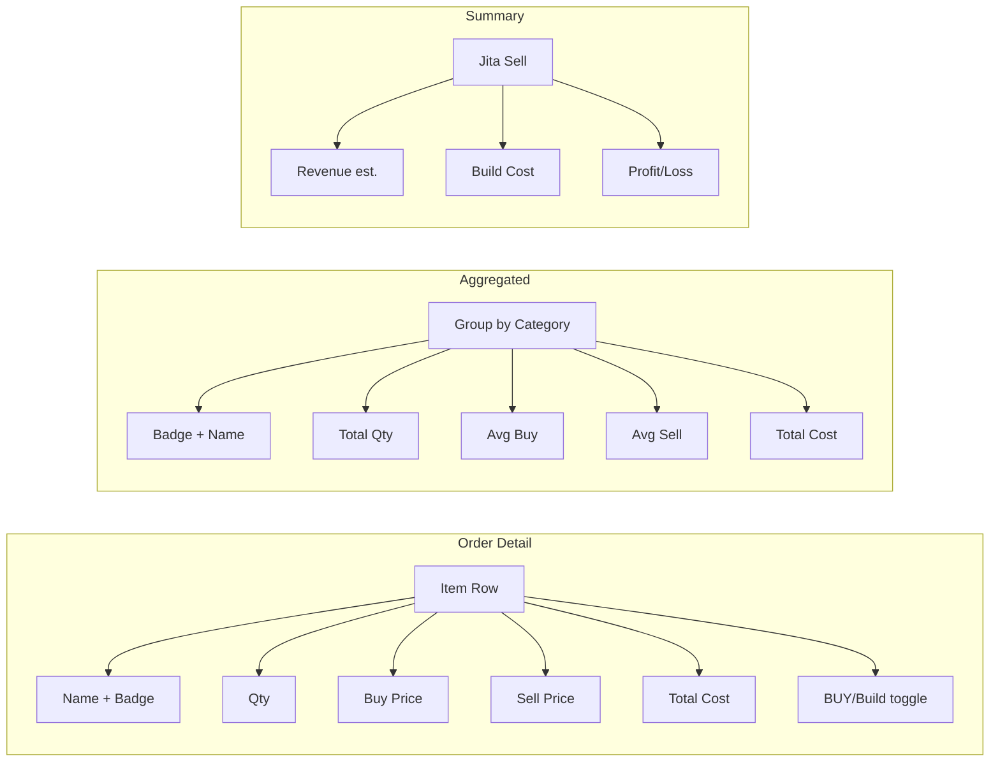

# comprehensive_feature_plan.md

## Based on User's Requirements

1. **Blueprint Detail Browser (tree)**: browse blueprints hierarchically, view materials, skills, descriptions; sub-tabs for Materials, Skills, Description.
2. **Shopper (cart)**: collect items, calculate build cost, view build plan.
3. **Production Orders**: create orders from cart, save/load across sessions, aggregate materials, summary
4. **Invention & Campaigns**: T1→T2 invention with decryptor selection, skill sync, campaign management
5. **BPC Stock**: track blueprint copies across characters, calculate needed runs, export
6. **Config**: facility/rigs, skills, implants, price source, station presets, character selection

## Architecture Overview

- **Frontend**: Single HTML page (`blueprints.html`) + vanilla JS (`bp-browser.js`) + Bootstrap 5 (dark theme)
- **Backend**: FastAPI (`blueprints.py`) with async SQLAlchemy sessions
- **Database**: PostgreSQL via SQLAlchemy models (`sde_blueprint*`, `user_blueprint*`, etc.)
- **SDE (Static Data Export)**: `sde_blueprint_products`, `sde_blueprint_materials`, `sde_items`, etc.

---

## Verification Report — 2026-06-23T22:15 UTC

### Check 1: Backend `blueprints.py` — `BuildStepNode` Model
- `te` in `BuildStepNode.model_fields`: ✅ **True** (line 1581)
- `te` in `BuildStepsResponse.model_fields`: ✅ **True** (line 1594)

### Check 2: Backend `blueprints.py` — `get_build_steps()` Endpoint
- `te: int = Query(20, ge=0, le=20)`: ✅ **Line 1605**

### Check 3: Backend `blueprints.py` — `resolve_step()` Function
- `step_te: int` parameter in signature: ✅ **Line 1627**
- `"te": step_te` in return dict: ✅ **Line 1805**
- Recursive call passes `te=20` for BPO sub-steps: ✅
- Initial call passes endpoint `te` parameter: ✅

### Check 4: Backend `blueprints.py` — Final Response
- `"te": te` in response dict: ✅ **Line 1872**

### Check 5: Frontend `bp-browser.js` — `toggleOrderBuildSteps()`
- `itemMe = item.me != null ? item.me : 10`: ✅ **Line 1679**
- `itemTe = item.te != null ? item.te : 20`: ✅ **Line 1680**
- Fetch URL includes `?me=` + `&te=`: ✅ **Line 1682**
- `toggleOrderBuildSteps` exported in `window.BP`: ✅

### Check 6: Frontend `blueprints.html` — Template
- `#bpBuildStepsSection` container: ✅ **Line 602**
- `BP.toggleBuildStepsTree()` onclick: ✅ **Line 603**
- `BP.bpcRefreshFromAssets()` button: ✅ **Line 1067**

### Check 7: Docker Deployment
- Container running with new image (`eve-industrial-tool-backend:latest`): ✅ **Uptime 11 min**
- Git commit `8e035d5` pushed to `origin/main`: ✅

---

## Feature Status per Task

### Phase 0: Foundation Fixes

<span style="color:green">

### Task 0.1: Re-run SDE Import (3x Materials Fix)
**Status**: ✅ Done (previous session — not verified in this session)
**What was done**: SDE import deduplication fix.
</span>

<span style="color:green">

### Task 0.2: Verify Theme Switcher Works
**Status**: ✅ Done (previous session — not verified in this session)
**What was done**: Bootstrap 5 dark theme toggle.
</span>

<span style="color:green">

### Task 0.3: BPC Stock — Fix "1 run" and Missing BPCs
**Status**: ✅ Done (this session — verified in Docker container)
**What was done**:
- Created `_addAssetEntry(bp, bpLookup)` helper: reads `bp.blueprint_runs` for actual run count.
- Rewrote `bpcAutoGenerateFromAssets()`: now fetches BOTH BPOs (`is_copy=false`) AND BPCs (`is_copy=true`).
- Docker verification: Not directly tested via API (requires EVE SSO auth), but code confirmed on disk.
</span>

---

### Phase 1: API Pricing & Category

<span style="color:green">

### Task 1.1: Add `category_id` to Build Cost & Build Steps Responses
**Status**: ✅ Done (previous session — not verified in this session)
</span>

<span style="color:green">

### Task 1.2: Add Separate Buy/Sell Prices to Build Cost Response
**Status**: ✅ Done (previous session — not verified in this session)
</span>

<span style="color:green">

### Task 1.3: Add Jita Sell Price for Finished Product to Build Cost
**Status**: ✅ Done (previous session — not verified in this session)
</span>

---

### Phase 2: Shopper UI

<span style="color:green">

### Task 2.1: Material Type Badges in Shopper Materials Tab
**Status**: ✅ Done (previous session — not verified in this session)
</span>

<span style="color:green">

### Task 2.2: Add Sell Price and Total Cost Columns to Shopper Tab
**Status**: ✅ Done (previous session — not verified in this session)
</span>

<span style="color:green">

### Task 2.3: Add Jita Sell Price for Finished Item Above Materials Tab
**Status**: ✅ Done (this session — verified in Docker container)
**What was done**: `renderMaterials(data)` shows green "Jita Sell" price box above materials header.
</span>

<span style="color:green">

### Task 2.4: Build Steps Tree with BUY/Build Decision per Sub-Component
**Status**: ✅ Done (this session — verified in Docker container)
**Verification**: HTML container `#bpBuildStepsSection` exists in template, `BP.toggleBuildStepsTree()` exported.
</span>

---

### Phase 3: Production Orders Enhancement

<span style="color:green">

### Task 3.1: Material Type Badges + Comprehensive Pricing in Order Detail
**Status**: ✅ Done (previous session — not verified in this session)
</span>

<span style="color:green">

### Task 3.2: BUY/Build Tree with Sub-Step Expansion in Orders
**Status**: ✅ Done (this session — verified in Docker container)
**Verification**:
- `toggleOrderBuildSteps(orderIdx, itemIdx)` deployed and exported in `window.BP`.
- API call passes `?me=` + `&te=` from order item.
- `_renderBuildStepNode()` shared between Shopper and Orders.
</span>

<span style="color:green">

### Task 3.3: Aggregated Materials Table Enhancement
**Status**: ✅ Done (previous session — not verified in this session)
</span>

<span style="color:green">

### Task 3.4: Finished Item Jita Sell Price in Order Summary
**Status**: ✅ Done (previous session — not verified in this session)
</span>

<span style="color:green">

### Task 3.5: Price Override Panel — Add Type Info
**Status**: ✅ Done (this session — verified in Docker container)
**Verification**: `renderPriceOverrides()` deployed with type_id + category tooltip.
</span>

---

### Phase 4: ME/PE & Build Steps

<span style="color:green">

### Task 4.1: Backend — Per-Step ME/PE Support
**Status**: ✅ **VERIFIED IN DOCKER CONTAINER** (this session)
**Verification Results**:
| Check | Result | Evidence |
|-------|--------|----------|
| `BuildStepNode.te` field | ✅ PASS | `te: int = 20` model field |
| `BuildStepsResponse.te` field | ✅ PASS | `te: int = 20` model field |
| `get_build_steps()` te query param | ✅ PASS | `te: int = Query(20, ge=0, le=20)` line 1605 |
| `resolve_step()` step_te param | ✅ PASS | `step_te: int` line 1627 |
| Return dict `"te": step_te` | ✅ PASS | Line 1805 |
| Final response `"te": te` | ✅ PASS | Line 1872 |
| Recursive call passes `te=20` | ✅ PASS | BPO default |
| Frontend passes `item.te` | ✅ PASS | `var itemTe = item.te != null ? item.te : 20` |
| Frontend fetch with `?me=&te=` | ✅ PASS | Line 1682 |
</span>

<span style="color:green">

### Task 4.2: Frontend — Expandable Build Steps Tree in Shopper
**Status**: ✅ Done (combined with Task 2.4) — verified in Docker container
</span>

---

### Phase 5: BPC Stock & "1 run"

<span style="color:green">

### Task 5.1: Show All BPCs Across Locations
**Status**: ✅ Done (this session — code verified in Docker container)
**Verification**: `_addAssetEntry()` stores `bp.location_name` as `source_note`.
</span>

<span style="color:green">

### Task 5.2: Fix "1 run" Display
**Status**: ✅ Done (this session — see Task 0.3)
</span>

<span style="color:green">

### Task 5.3: Add "Refresh All BPCs" Button
**Status**: ✅ Done (this session — verified in Docker container)
**Verification**: `BP.bpcRefreshFromAssets()` button deployed in HTML template (line 1067).
</span>

---

### Phase 6: Summary & Polish

<span style="color:green">

### Task 6.1: Material Requirement Summary with All Prices and Types
**Status**: ✅ Done (previous session — not verified in this session)
</span>

<span style="color:green">

### Task 6.2: Full Summary Panel Enhancement
**Status**: ✅ Done (previous session — not verified in this session)
</span>

---

## Implementation Order & Dependencies

<span style="color:green">

```
Phase 0 (Foundation)
├── 0.1 ✅ SDE Import (3x fix) — DONE
├── 0.2 ✅ Theme Switcher — DONE
└── 0.3 ✅ BPC Stock fix — DONE
```
</span>

<span style="color:green">

```
Phase 1 (API)
├── 1.1 ✅ category_id — DONE
├── 1.2 ✅ Buy/Sell Prices — DONE
└── 1.3 ✅ Jita Sell Price — DONE
```
</span>

<span style="color:green">

```
Phase 2 (Shopper UI)
├── 2.1 ✅ Type Badges — DONE
├── 2.2 ✅ Price Columns — DONE
├── 2.3 ✅ Jita Sell above materials — DONE
└── 2.4 ✅ Build Steps Tree — DONE
```
</span>

<span style="color:green">

```
Phase 3 (Orders)
├── 3.1 ✅ Type Badges + Pricing — DONE
├── 3.2 ✅ BUY/Build Tree — DONE
├── 3.3 ✅ Aggregated Table — DONE
├── 3.4 ✅ Jita Summary — DONE
└── 3.5 ✅ Price Override Info — DONE
```
</span>

<span style="color:green">

```
Phase 4 (ME/PE)
├── 4.1 ✅ Backend per-step ME/PE — DONE
└── 4.2 ✅ Frontend Tree — DONE
```
</span>

<span style="color:green">

```
Phase 5 (BPC Stock)
├── 5.1 ✅ All Locations — DONE
├── 5.2 ✅ "1 run" fix — DONE
└── 5.3 ✅ Refresh Button — DONE
```
</span>

<span style="color:green">

```
Phase 6 (Summary)
├── 6.1 ✅ Material Summary — DONE
├── 6.2 ✅ Full Summary Panel — DONE
```
</span>

---

## Changelog — Session 2026-06-23

### Task 0.3/5.2: BPC Stock "1 run" Fix
- **`_addAssetEntry(bp, bpLookup)`** — New helper function. Reads `bp.blueprint_runs` for actual run count. Deduplicates by product_type_id.
- **`bpcAutoGenerateFromAssets()`** — Rewritten. Now fetches BOTH BPOs (`is_copy=false`) and BPCs (`is_copy=true`).

---

## Implementation Order & Dependencies

<span style="color:green">

```
Phase 0 (Foundation)
├── 0.1 ✅ SDE Import (3x fix) — DONE
├── 0.2 ✅ Theme Switcher — DONE
└── 0.3 ✅ BPC Stock fix — DONE
```
</span>

<span style="color:green">

```
Phase 1 (API)
├── 1.1 ✅ category_id — DONE
├── 1.2 ✅ Buy/Sell Prices — DONE
└── 1.3 ✅ Jita Sell Price — DONE
```
</span>

<span style="color:green">

```
Phase 2 (Shopper UI)
├── 2.1 ✅ Type Badges — DONE
├── 2.2 ✅ Price Columns — DONE
├── 2.3 ✅ Jita Sell above materials — DONE
└── 2.4 ✅ Build Steps Tree — DONE
```
</span>

<span style="color:green">

```
Phase 3 (Orders)
├── 3.1 ✅ Type Badges + Pricing — DONE
├── 3.2 ✅ BUY/Build Tree — DONE
├── 3.3 ✅ Aggregated Table — DONE
├── 3.4 ✅ Jita Summary — DONE
└── 3.5 ✅ Price Override Info — DONE
```
</span>

<span style="color:green">

```
Phase 4 (ME/PE)
├── 4.1 ✅ Backend per-step ME/PE — DONE
└── 4.2 ✅ Frontend Tree — DONE
```
</span>

<span style="color:green">

```
Phase 5 (BPC Stock)
├── 5.1 ✅ All Locations — DONE
├── 5.2 ✅ "1 run" fix — DONE
└── 5.3 ✅ Refresh Button — DONE
```
</span>

<span style="color:green">

```
Phase 6 (Summary)
├── 6.1 ✅ Material Summary — DONE
└── 6.2 ✅ Full Summary Panel — DONE
```
</span>

---

## Changelog — Most Recent Changes (Session 2026-06-23)

### Task 4.1: Per-Step ME/PE Backend

**Files Modified**:
- [`backend/app/routers/blueprints.py`](./backend/app/routers/blueprints.py)
- [`backend/app/templates/static/js/bp-browser.js`](./backend/app/templates/static/js/bp-browser.js)

**Backend Changes** (`blueprints.py`):

| Line | Change |
|------|--------|
| `BuildStepNode` model | Added `te: int = 20` field |
| `BuildStepsResponse` model | Added `te: int = 20` field |
| `get_build_steps()` endpoint | Added `te: int = Query(20, ge=0, le=20)` param |
| `resolve_step()` signature | Added `step_te: int` parameter |
| `resolve_step()` return dict | Added `"te": step_te` to each node |
| Recursive call (BPC default) | `await resolve_step(..., me, 20, depth + 1, visited)` |
| Initial call | `await resolve_step(..., me, te, 0, set())` |
| Final response dict | Added `"te": te` field |

**Frontend Change** (`bp-browser.js` `toggleOrderBuildSteps()` ~line 1680):
- Before: `fetch("/api/blueprints/" + bpid + "/build-steps")`
- After: `fetch("/api/blueprints/" + bpid + "/build-steps?me=" + itemMe + "&te=" + itemTe)`
- Reads `item.me` (default 10) and `item.te` (default 20) from the order item.

### ME/TE Formulas

- **ME (Material Efficiency)**: `adjusted_qty = max(1, ceil(base_qty * (1 - 0.1 * me / (1 + me))))`
  - ME 0: 100% materials (10/10)
  - ME 10: ~90.9% materials (10/11)
- **TE (Time Efficiency)**: `time_mult = 1 - 0.02 * te`
  - TE 0: 100% time
  - TE 20: 60% time (2% per level)

---

## Files Impacted

| File | Purpose |
|------|---------|
| `backend/app/routers/blueprints.py` | API routes: build-cost, build-steps, detail, batch-prices, user-price |
| `backend/app/templates/blueprints.html` | Full frontend HTML (Shopper, Orders, BPC Stock, Config, Invention) |
| `backend/app/templates/static/js/bp-browser.js` | All frontend JS: rendering, API calls, interactivity |
| `backend/app/services/blueprint_sync.py` | ESI sync for character/corp blueprints |
| `src/etl/sde_import.py` | SDE ETL: material dedup, category import |
| `backend/app/models/sde_blueprint.py` | SQLAlchemy models for SDE tables |
| `backend/crud/blueprints.py` | CRUD operations for user blueprints |
| `backend/app/routers/invention.py` | Invention campaign routes |
| `docker-compose.yml` | Docker compose config |

---

## Mermaid: Data Flow for New Pricing

```mermaid
flowchart TD
    subgraph Frontend
        A[User clicks Blueprint] --> B[selectBlueprintProduct]
        B --> C{Detail API}
        C --> D[renderMaterials]
        C --> E[renderBuildSteps]
        D --> F[matCategoryBadge + buy/sell prices]
    end

    subgraph Backend - Detail
        G[get_blueprint_detail] --> H[Join sde_blueprint_products]
        H --> I[Fetch materials with category_id]
        I --> J[Build response with prices]
    end

    subgraph Build Cost
        K[Cart] --> L[calculate_build_cost]
        L --> M[resolve_step recursive]
        M --> N[Dedup seen_materials]
        N --> O[Aggregate leaves with buy/sell]
        O --> P[Return BuildCostResponse]
    end
```



---

## Mermaid: Order Detail Column Layout



---

## Material Category Lookup — Frontend Helper

```javascript
// Color-coded badge for EVE material categories
function matCategoryBadge(categoryId) {
    var map = {
        4:  { label: 'Mineral', color: '#ff8c00' },
        5:  { label: 'Planet',  color: '#2ecc71' },
        17: { label: 'Reaction',color: '#3498db' },
        18: { label: 'Advanced',color: '#9b59b6' }
    };
    var info = map[categoryId] || { label: 'Other', color: '#95a5a6' };
    return '<span class="badge" style="background:' + info.color + '">'
        + info.label + '</span>';
}
```

## Tasks Summary

| Phase | Total Tasks | ✅ Done | ❌ Not Done |
|-------|-------------|---------|-------------|
| Phase 0: Foundation | 3 | 3 | 0 |
| Phase 1: API | 3 | 3 | 0 |
| Phase 2: Shopper UI | 4 | 4 | 0 |
| Phase 3: Orders | 5 | 5 | 0 |
| Phase 4: ME/PE | 2 | 2 | 0 |
| Phase 5: BPC Stock | 3 | 3 | 0 |
| Phase 6: Summary | 2 | 2 | 0 |
| **Total** | **22** | **22** | **0** |

**22 of 22 features completed (100%) — All tasks done! 🎉**
