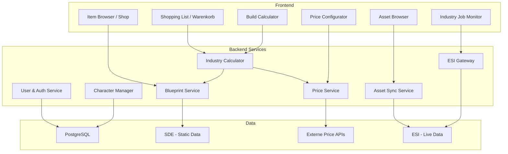
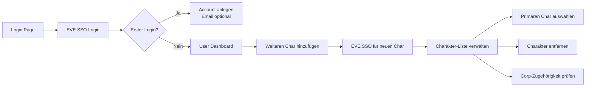
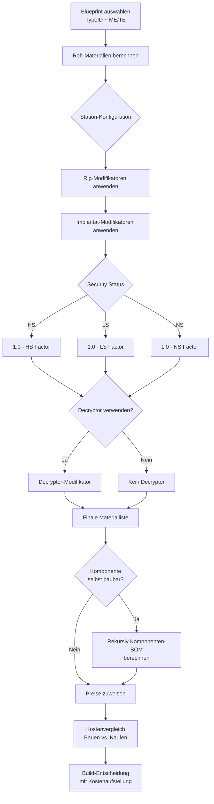
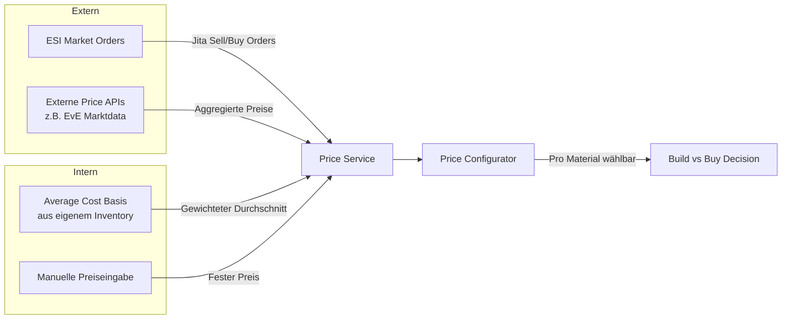
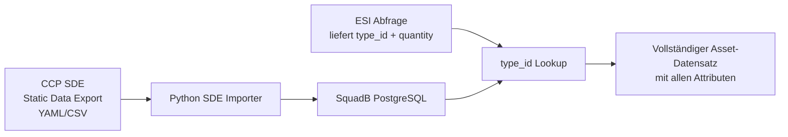
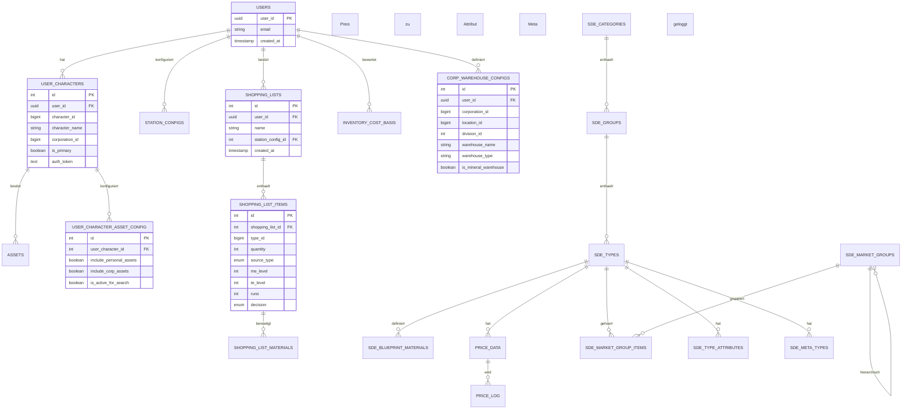

# SquadB Industry Tool - Konzept & Vision

> **Stand:** 20.06.2026  
> **Status:** Konzeptphase - noch keine Implementierung  
> **Nächster Schritt:** Review & Freigabe durch SquadB, dann Phasenweise Implementierung

---

## 1. Vision & Überblick

Ein **EVE Online Industry Planungs-Tool**, das von einer einfachen Asset-Übersicht zu einem vollständigen Industry-Workflow heranwächst:

```
Item Browser / Shop
    → Item in Einkaufsliste aufnehmen
    → System berechnet benötigte Materialien (BOM)
    → Unterscheidung: Selbst bauen vs. Kaufen
    → Preise an jeder Stelle (Jita, Average Cost Basis)
    → Build-Entscheidung: Was ist günstiger?
    → Industrie-Job Monitoring (Endgame)
```

### Kernprinzipien

1. **Shopping List Concept** - Wie im Supermarkt: Items in den Warenkorb legen, System sagt was du brauchst
2. **Duale Preislogik** - Marktpreise (Jita) vs. eigenes Inventory (Average Cost Basis)
3. **Tiefe Konfigurierbarkeit** - ME/TE, Station-Rigs, System-Implantate - alles einstellbar
4. **Multi-User** - Jeder Spieler mit eigenem Account und Character-Management
5. **SDE-Komplettdatenbank** - Alle Item-Attribute lokal in der DB, ESI liefert nur IDs + Bestände
6. **Corp Hangar-Architektur** - Station + Division = Lagerort, definierbar als Mineralien-Lager
7. **Multi-Character-Suche** - 14 Accounts, 4 Corps, Checkboxen pro Charakter
8. **Inkrementeller Aufbau** - Phase für Phase, keine Big-Bang-Implementierung

---

## 2. Gesamtarchitektur



---

## 3. Detaillierte Phasen

---

### Phase 1: Multi-User & Character Management

**Ziel:** Jeder Spieler hat einen Account und kann seine EVE-Charaktere verwalten.

#### User Flow



#### Backend-Komponenten

| Komponente | Beschreibung |
|---|---|
| `users` table | user_id (PK), email (optional), created_at, last_login, avatar_url |
| `user_characters` table | id (PK), user_id (FK), character_id (EVE), character_name, corporation_id, is_primary, auth_token (encrypted), refresh_token (encrypted), token_expires |
| `GET /api/auth/login` | EVE SSO Authorization URL generieren |
| `GET /api/auth/callback` | SSO Callback - Token speichern, User/Char erstellen |
| `GET /api/auth/characters` | Alle Chars des Users abrufen |
| `POST /api/auth/characters` | Neuen Char per SSO hinzufügen |
| `DELETE /api/auth/characters/{id}` | Charakter entfernen |
| `PUT /api/auth/characters/{id}/primary` | Primären Charakter setzen |

#### Frontend-Komponenten

- **Login Page** - "Login with EVE Online" Button
- **User Dashboard** - Nach dem Login, Charakter-Auswahl
- **Character Manager** - Übersicht aller verknüpften Chars
- **Account Settings** - Primären Char wählen, Chars entfernen

#### Datenmodell

```sql
CREATE TABLE users (
    user_id UUID PRIMARY KEY DEFAULT gen_random_uuid(),
    email VARCHAR(255),
    created_at TIMESTAMPTZ DEFAULT NOW(),
    last_login TIMESTAMPTZ,
    avatar_url TEXT
);

CREATE TABLE user_characters (
    id SERIAL PRIMARY KEY,
    user_id UUID REFERENCES users(user_id) ON DELETE CASCADE,
    character_id BIGINT NOT NULL UNIQUE,
    character_name VARCHAR(255) NOT NULL,
    corporation_id BIGINT,
    corporation_name VARCHAR(255),
    is_primary BOOLEAN DEFAULT FALSE,
    auth_token TEXT,
    refresh_token TEXT,
    token_expires TIMESTAMPTZ,
    created_at TIMESTAMPTZ DEFAULT NOW(),
    UNIQUE(user_id, character_id)
);
```

---

### Phase 2: Item Browser & Shopping List (Der Shop)

**Ziel:** Ein Item Browser wie der InGame-Markt, mit dem Unterschied, dass man Items in eine Einkaufsliste/Build-Queue aufnehmen kann.

#### Item Browser - Aufbau

```
+------------------------------------------------------------------+
| 🔍 [Suchleiste]           [Kategorie-Filter ▼]                    |
+-----------+------------------------------------------------------+
| Kategorien |  Items                                               |
| +- Ships   |  +--------------------------------------------------+|
| | +- Frigates|  | Raven                | Gruppe | Vol            ||
| | +- Cruisers|  +--------------------------------------------------+|
| | +- Battleships|  | BPO  | BPC  | Fiktiv ▼ |                    ||
| | +- ...   |  | +------------------------------------------------+||
| +- Modules  |  | | ME: [10] | TE: [20] | Runs: [1]              ||
| +- Charges  |  | | Rig-Slot: [Standard]                          ||
| +- Drones   |  | | Station: [Jita 4-4 ▼]                         ||
| +- ...     |  | +------------------------------------------------+||
|            |  | [In Einkaufsliste aufnehmen 🛒]                   ||
|            |  +--------------------------------------------------+|
|            |  | Materials:                                        ||
|            |  | ☐ Tritanium      100.000   1,50 ISK              ||
|            |  | ☐ Pyerite         50.000   4,20 ISK              ||
|            |  | ☐ Mexallon        10.000  12,00 ISK              ||
|            |  | ...                                              ||
|            |  | Total Materialkosten: 1.234.567 ISK              ||
|            +------------------------------------------------------+
+------------------------------------------------------------------+
```

#### Drei Blueprint-Modi pro Item

| Tab | Beschreibung |
|---|---|
| **BPO** | Zeigt das Original Blueprint aus deinem Asset-Bestand (falls vorhanden) mit echten ME/TE-Werten |
| **BPC** | Zeigt vorhandene Blueprint Copies mit Runs, ME, TE |
| **Fiktiv** | Erlaubt manuelle Eingabe von ME/TE/Werten - berechnet die Materialien für ein Was-wäre-wenn-Szenario |

#### Station-Konfiguration

Jeder Build hat eine konfigurierbare Station mit:
- **Struktur-Typ** (T2 Rig, Tatara, Azbel, Sotiyo, NPC-Station)
- **Rigs** (z.B. T2 Decryptor, T2 Accelerator Array)
- **System-Implantate** (z.B. Implantate für Materialreduktion)
- **Security Status** (HS/LS/NS/WH) für Materialformel

#### Shopping List (Einkaufsliste / Warenkorb)

```
+------------------------------------------------------------------+
| 🛒 Einkaufsliste                                                  |
+------------------------------------------------------------------+
| Item           | Menge | Selbst/Kauf | Kosten gesamt              |
+------------------------------------------------------------------+
| Raven          |   2   |    Bauen    | 45.000.000 ISK             |
| +- Tritanium   | 200k  |   Kaufen    |    300.000 ISK             |
| +- Pyerite     | 100k  |   Kaufen    |    420.000 ISK             |
| +- Mexallon    |  20k  |   Eigen     |  1.200.000 ISK             |
| +- Capital X   |   2   |   Bauen     |  8.000.000 ISK             |
| | +- Comp A    |  10   |   Kaufen    |    500.000 ISK             |
| | +- Comp B    |   5   |   Eigen     |  3.000.000 ISK             |
| +- ...         |       |             |                            |
+------------------------------------------------------------------+
| Total Kaufen:   1.220.000 ISK                                     |
| Total Eigen:   54.200.000 ISK                                     |
+------------------------------------------------------------------+
| Gesamt:        55.420.000 ISK                                     |
| Jita-Preis:    58.000.000 ISK                                     |
| Ersparnis:      2.580.000 ISK                                     |
+------------------------------------------------------------------+
```

#### Backend-Komponenten

| Endpoint | Beschreibung |
|---|---|
| `GET /api/blueprints/browser` | Items mit Blueprint-Daten durchsuchen (Kategorie, Gruppe, Name) |
| `GET /api/blueprints/browser/{type_id}` | Detaillierte Blueprint-Info mit BOM, Materialien |
| `GET /api/blueprints/browser/{type_id}/materials` | Materialliste mit ME/TE-Berechnung |
| `GET /api/user/{user_id}/shopping-list` | Einkaufsliste abrufen |
| `POST /api/user/{user_id}/shopping-list/items` | Item zur Liste hinzufügen |
| `PUT /api/user/{user_id}/shopping-list/items/{id}` | Menge / Selbst-Kauf-Status ändern |
| `DELETE /api/user/{user_id}/shopping-list/items/{id}` | Item entfernen |
| `GET /api/user/{user_id}/shopping-list/summary` | Zusammenfassung mit Preisen |

---

### Phase 3: Blueprint BOM & Production Calculator

**Ziel:** Vollständige Blueprint-Materialberechnung mit ME/TE, Station-Rigs, Implantaten und rekursiver Komponentenauflösung.

#### Materialberechnungs-Pipeline



#### Station-Konfigurations-Datenmodell

```sql
CREATE TABLE station_configs (
    id SERIAL PRIMARY KEY,
    user_id UUID REFERENCES users(user_id),
    name VARCHAR(255) NOT NULL,
    station_type VARCHAR(50) NOT NULL,
    security_status VARCHAR(20) NOT NULL,
    rig_1 VARCHAR(100),
    rig_2 VARCHAR(100),
    rig_3 VARCHAR(100),
    implant_slot_6 VARCHAR(100),
    implant_slot_7 VARCHAR(100),
    implant_slot_8 VARCHAR(100),
    implant_slot_9 VARCHAR(100),
    implant_slot_10 VARCHAR(100),
    is_default BOOLEAN DEFAULT FALSE,
    created_at TIMESTAMPTZ DEFAULT NOW()
);
```

---

### Phase 4: Price System (Jita + Average Cost Basis)

**Ziel:** Ein umfassendes Preissystem, das sowohl aktuelle Marktpreise (Jita) als auch die eigene Inventory-Bewertung (Average Cost Basis) abbildet.

#### Zwei Preis-Quellen



#### Average Cost Basis - Das Problem

Der User beschreibt es treffend:

> "Ich kaufe 10 Tritanium für 2 ISK, später 10 für 1 ISK. Ich habe 20 Tritanium für insgesamt 30 ISK, also 30 geteilt durch 20 gleich 1,5 ISK pro Tritanium."

**Lösung: Weighted Average Cost Basis**

```sql
CREATE TABLE inventory_cost_basis (
    id SERIAL PRIMARY KEY,
    user_id UUID REFERENCES users(user_id),
    type_id BIGINT NOT NULL,
    quantity BIGINT NOT NULL,
    total_cost NUMERIC(20,2) NOT NULL,
    avg_unit_cost NUMERIC(20,2) NOT NULL,
    updated_at TIMESTAMPTZ DEFAULT NOW(),
    UNIQUE(user_id, type_id)
);

CREATE TABLE cost_basis_transactions (
    id SERIAL PRIMARY KEY,
    user_id UUID REFERENCES users(user_id),
    type_id BIGINT NOT NULL,
    transaction_type VARCHAR(20) NOT NULL,
    quantity BIGINT NOT NULL,
    unit_price NUMERIC(20,2) NOT NULL,
    total_amount NUMERIC(20,2) NOT NULL,
    source VARCHAR(50),
    notes TEXT,
    transaction_date TIMESTAMPTZ DEFAULT NOW()
);
```

#### Price Configurator - UI Konzept

```
+------------------------------------------------------------------+
| ⚙️ Preis-Konfiguration                                            |
+------------------------------------------------------------------+
| Primäre Preis-Quelle: [Jita 4-4 ▼]                               |
| Sekundäre Preis-Quelle: [Average Cost Basis ▼]                    |
| Fallback: [ESI Market Orders ▼]                                   |
|                                                                    |
| Material          | Quelle    | Preis      | Überschreiben        |
+------------------------------------------------------------------+
| Tritanium         | Jita      | 1,50 ISK   | [✏️] [🧹]          |
| Pyerite           | ACB       | 4,20 ISK   | [✏️] [🧹]          |
| Mexallon          | Manuell   | 12,00 ISK  | [✏️] [🧹]          |
| Isogen            | Jita      | 5,80 ISK   | [✏️] [🧹]          |
+------------------------------------------------------------------+
| [Preise von ESI laden] [Preise von API laden]                     |
| [ACB aus Inventory aktualisieren]                                 |
+------------------------------------------------------------------+
```

#### Preis-Logging (Transaction History)

```sql
CREATE TABLE price_log (
    id SERIAL PRIMARY KEY,
    type_id BIGINT NOT NULL,
    source VARCHAR(50) NOT NULL,
    price NUMERIC(20,2) NOT NULL,
    quantity BIGINT,
    recorded_at TIMESTAMPTZ DEFAULT NOW()
);
```

---

### Phase 5: Build vs Buy Decision

**Ziel:** Für jedes Material in der BOM automatisch berechnen, ob es günstiger ist, es selbst zu bauen oder zu kaufen.

#### Entscheidungsmatrix

| Material-Typ | Selbst bauen | Kaufen | Empfehlung |
|---|---|---|---|
| T1 Mineralien | Nicht möglich (nur reprocess) | Jita-Kauf | Kaufen |
| T1 Komponenten | Aus Mineralien | Vom Markt | Berechnen |
| T2 Komponenten | Aus T1 + Reaktionen | Vom Markt | Berechnen |
| Reaktionen | Aus Moon Mats | Vom Markt | Berechnen |
| Datacores | Aus Forschung | Vom Markt | Berechnen |
| PI Materialien | Aus PI | Vom Markt | Berechnen |

#### UI - Build Entscheidung

```
+------------------------------------------------------------------+
| Entscheidungs-Assistent                                           |
+------------------------------------------------------------------+
| Alle Materialien automatisch optimieren? [Ja] [Nein]              |
|                                                                    |
| Material          | Selbstbau  | Kaufpreis  | Entscheidung        |
+------------------------------------------------------------------+
| Capital Sensor C. | 8.000.000  | 9.500.000  | 🔨 Bauen           |
| Capital Computer  | 12.000.000 | 11.000.000 | 🛒 Kaufen           |
| Tritanium         | --         | 300.000    | 🛒 Kaufen           |
| Pyerite           | --         | 420.000    | 🛒 Kaufen           |
+------------------------------------------------------------------+
| Selbstbau gesamt: 20.000.000 ISK                                  |
| Kaufen gesamt:    21.220.000 ISK                                  |
| Optimal:          20.000.000 ISK (Bauen wo günstiger)             |
+------------------------------------------------------------------+
```

---

## Wichtige Klarstellungen (nach Review)

### 1. Fitted Modules = Anzeige, KEIN Fitting-Tool

**Klarstellung:** Fitted Modules werden nur in der **Asset-Ansicht** als Teil der Hierarchie dargestellt. Ein Modul, das in einem Schiff eingebaut ist, wird als Untereintrag des Schiffes angezeigt. Es wird **KEIN Fitting-Tool** gebaut - das ist wenn überhaupt Endgame.

**Ziel:** Wenn ich mir ein Schiff im Asset-Browser ansehe, sehe ich welche Module, Rigs und Charges eingebaut sind. Aber ich kann keine Fittings bearbeiten, vergleichen oder optimieren. Pure Anzeige.

**Priorität:** Niedrig - kann auch später kommen. Erstmal zählen die Items in Hangars.

### 2. Automatischer Sync (Kein Sync-Button)

**Klarstellung:** Es gibt **KEINEN manuellen Sync-Button**. Das Tool synchronisiert automatisch:

| Datentyp | Intervall | Trigger |
|---|---|---|
| Character Assets | Alle 3-5 Stunden | Automatischer Timer |
| Corporation Assets | Alle 3-5 Stunden | Automatischer Timer |
| Blueprints | Alle 6 Stunden | Automatischer Timer |
| Market Preise (Jita) | Alle 3-5 Stunden | Automatischer Timer |
| Average Cost Basis | Bei jeder Sync-Berechnung | Automatisch aus Inventory |
| Industry Jobs | Alle 15 Minuten (wenn implementiert) | Automatischer Timer |

**Backend-Logik:**
```python
# Kein manueller Endpunkt! Alles automatisch.
SCHEDULED_TASKS = {
    "asset_sync": {
        "interval": 3600 * 3,  # Alle 3 Stunden
        "function": sync_all_user_assets,
    },
    "price_sync": {
        "interval": 3600 * 4,  # Alle 4 Stunden
        "function": sync_jita_prices,
    },
    "blueprint_sync": {
        "interval": 3600 * 6,  # Alle 6 Stunden
        "function": sync_character_blueprints,
    },
}

async def sync_all_user_assets():
    """Durchläuft alle User/Chars und sync't Assets."""
    users = await get_all_users()
    for user in users:
        for character in user.characters:
            if character.is_active_for_search:
                await sync_character_assets(character)
                if character.include_corp_assets:
                    await sync_corp_assets(character)
```

### 3. Player Structure Erkennung in ESI

**Wie erkennt ESI Player Structures?**

ESI selbst unterscheidet NPC-Stationen von Player-Structures durch die **ID-Größe** und den **location_type**:

```python
def classify_location(location_id: int, location_type: str) -> dict:
    """
    Bestimmt ob eine Location eine NPC-Station, Player-Structure,
    Solarsystem oder ein Item ist.
    """
    if location_id >= 1_000_000_000_000:  # >= 1 Billion
        return {
            "type": "player_structure",
            "category": "structure",
            "display": "Player Structure",
            "needs_auth": True,  # Braucht Auth um Namen aufzulösen
        }
    elif 60_000_000 <= location_id < 1_000_000_000:
        return {
            "type": "npc_station",
            "category": "station",
            "display": "NPC Station",
            "needs_auth": False,
        }
    elif 30_000_000 <= location_id < 60_000_000:
        return {
            "type": "solar_system",
            "category": "solar_system",
            "display": "Solar System",
            "needs_auth": False,
        }
    else:
        return {
            "type": "item",
            "category": "item",
            "display": "Container/Item",
            "needs_auth": False,
        }
```

**Struktur-Namen auflösen (das Problem):**

Der ESI-Endpunkt `/universe/names/` löst Player-Structure-IDs **nicht** auf!

```python
# POST /universe/names/ -> [1035467980234]
# Response: 404 - diese ID kann nicht aufgelöst werden!

# Stattdessen braucht man:
# GET /universe/structures/{structure_id}/
# Auth: Token eines Chars mit Zugriff auf die Struktur
# Response: {"name": "SquadB Fortizar", "solar_system_id": 30000142, ...}
```

**Lösung für Struktur-Namen in Assets:**

```mermaid
flowchart TD
    Asset[Asset mit location_id > 1 Billion] --> Check{Cache vorhanden?}
    Check -->|Ja| UseCache[Cache verwenden]
    Check -->|Nein| TryESI[POST /universe/names/]
    TryESI -->|404| TryStructure[GET /universe/structures/{id}/<br>für jeden verknüpften Char]
    TryStructure -->|200| SaveCache[In location_cache speichern]
    TryStructure -->|403/404 alle| Fallback["Unknown Structure [ID]"]
    SaveCache --> UseCache
```

**Corp Assets in Player Structures:**

Wenn ein Corp Items in einer Player-Structure hat:
- `location_id` = Structure ID (> 1 Billion)
- `location_type` = `"other"` (ESI sagt für Player Structures `"other"`, nicht `"station"`)
- `location_flag` = `"CorpSAG1"` bis `"CorpSAG7"` für Corp Divisionen
- Oder `"Hangar"` für persönliche Items in der Struktur

### 4. Stationen selbst benennen (Location Alias)

**Kernforderung:** "Kann man Stationen selbst benennen?"

**Ja!** Besser als sich auf ESI-Struktur-Namen zu verlassen ist ein **Location-Alias-System**:

```sql
CREATE TABLE location_aliases (
    id SERIAL PRIMARY KEY,
    user_id UUID REFERENCES users(user_id),
    location_id BIGINT NOT NULL,
    custom_name VARCHAR(255) NOT NULL,
    color VARCHAR(20),
    UNIQUE(user_id, location_id)
);
```

**User Flow:**
1. Asset-Sync findet unbekannte Location (z.B. Structure 1234567890123)
2. UI zeigt "Unknown Structure [1234567890123]"
3. User klickt auf Edit-Button und vergibt eigenen Namen (z.B. "SquadB Fortizar")
4. Name wird gespeichert und ab sofort überall verwendet

**Oder noch besser - direkt in der Corp Lager-Konfiguration:**
```
Jita 4-4, Div 1 -> "Mineralien Lager Jita"
Perimeter Tatara, Div 1 -> "T2 Fabrik Perimeter"
```

### 5. Kann man der Struktur-ID das System entnehmen?

**Nein, die ID selbst enthält keine Standort-Information.**

Player Structure IDs sind komplett willkürlich generiert (einfach hochgezählt ab 1 Billion). Man kann nicht erkennen ob eine Struktur in Jita oder sonstwo steht.

**ABER: Der ESI-Endpunkt `/universe/structures/{structure_id}/` liefert bei Erfolg auch das System:**

```json
{
    "name": "SquadB Fortizar",
    "solar_system_id": 30000142,   // <-- HIER!
    "owner_id": 987654321,
    "type_id": 35833
}
```

Das `solar_system_id` kann dann per `/universe/names/` in "Jita" aufgelöst werden.

**Praktisch für SquadB:**
- **Director-Token funktioniert:** System wird automatisch erkannt
- **Kein Zugriff (403):** System im Location-Alias hinterlegen:
  ```sql
  -- location_aliases um solar_system_id ergaenzen
  ALTER TABLE location_aliases ADD COLUMN solar_system_id BIGINT;
  ALTER TABLE location_aliases ADD COLUMN structure_type_id BIGINT;
  ```
- UI dann: "SquadB Fortizar (Jita)" wenn System bekannt ist

### 6. Was bedeutet "Zugriff auf die Struktur" in ESI?

ESI-Endpunkt `/universe/structures/{structure_id}/`:

| Situation | ESI Response |
|---|---|
| Char ist **Member der Corp**, die die Struktur besitzt | 200 - Name wird geliefert |
| Char ist in der Struktur **gedockt** | 200 - Name wird geliefert |
| Char hatte nie Zugriff (nie gedockt, nicht in der Corp) | 403 Forbidden |
| Struktur wurde **zerstört** | 404 Not Found |

**Praktikabel für SquadB:**
- **Director-Char von SquadB** kann alle SquadB-eigenen Strukturen auflösen
- Für **fremde Strukturen** (z.B. wo man nur gedockt war): Charakter-Token probieren
- Für **nicht auflösbare Strukturen**: Location-Alias-System (selbst benennen)

---

### Phase 6: Industry Job Monitoring (Endgame)

**Ziel:** ESI-Industrie-Jobs überwachen, Status anzeigen, Benachrichtigungen bei Fertigstellung.

> **Status:** Endgame - wird erst implementiert, wenn alle vorherigen Phasen stabil laufen.

#### Features

- **Job-Liste** - Alle aktiven/abgeschlossenen Industrie-Jobs anzeigen
- **Job-Details** - Blueprint, Materialien, Runs, Fertigstellungszeit
- **Notifikationen** - Browser-Benachrichtigung wenn Job fertig
- **Kosten-Tracking** - Tatsächliche Kosten vs. geplante Kosten vergleichen
- **Produktions-Statistiken** - Wie viel ISK pro Tag/Woche produziert?

---

## 4. SDE-Datenbank - Alle Item-Daten lokal

**Kernforderung:** "Wir brauchen eine FERTIGE Datenbank!! Diese muss alle Daten bereits innehaben."

### Warum?

Aktuell holen wir Item-Details (Name, Volume, Gruppe, Kategorie) einzeln per ESI `/universe/names/`. Das ist:
- **Langsam** - Netzwerk-Latenz pro Request
- **Rate-Limited** - ESI erlaubt nur ~10 Requests pro Sekunde
- **Unzuverlässig** - Bei vielen Items (z.B. Corp Assets) dauert es Minuten
- **Unvollständig** - ESI liefert nur Basis-Daten, nicht alle Attribute

### Lösung: SDE PostgreSQL Import



### Alle benötigten SDE-Tabellen

```sql
-- Basistabelle: Alle Items/Types
CREATE TABLE sde_types (
    type_id BIGINT PRIMARY KEY,
    name VARCHAR(255) NOT NULL,
    description TEXT,
    group_id BIGINT,
    category_id BIGINT,
    mass DOUBLE PRECISION,
    volume DOUBLE PRECISION,
    packaged_volume DOUBLE PRECISION,
    capacity DOUBLE PRECISION,
    portion_size INTEGER,
    race_id INTEGER,
    market_group_id BIGINT,
    icon_id TEXT,
    published BOOLEAN DEFAULT TRUE
);

-- Kategorien (Ship, Module, Charge, Blueprint, etc.)
CREATE TABLE sde_categories (
    category_id BIGINT PRIMARY KEY,
    name VARCHAR(255) NOT NULL,
    published BOOLEAN DEFAULT TRUE
);

-- Gruppen (Battleship, Shield Extender, Hybrid Charge, etc.)
CREATE TABLE sde_groups (
    group_id BIGINT PRIMARY KEY,
    category_id BIGINT REFERENCES sde_categories(category_id),
    name VARCHAR(255) NOT NULL,
    published BOOLEAN DEFAULT TRUE
);

-- Meta-Gruppen (Tech I, Tech II, Faction, Deadspace, Storyline)
CREATE TABLE sde_meta_groups (
    meta_group_id BIGINT PRIMARY KEY,
    name VARCHAR(255) NOT NULL,
    description TEXT
);

-- Meta-Types (welcher Type gehoert zu welcher Meta-Gruppe)
CREATE TABLE sde_meta_types (
    type_id BIGINT PRIMARY KEY REFERENCES sde_types(type_id),
    meta_group_id BIGINT REFERENCES sde_meta_groups(meta_group_id)
);

-- Blueprint-spezifische Daten
CREATE TABLE sde_blueprints (
    blueprint_type_id BIGINT PRIMARY KEY REFERENCES sde_types(type_id),
    product_type_id BIGINT REFERENCES sde_types(type_id),
    max_production_limit INTEGER,
    blueprint_activities JSONB
);

-- Material-Liste (BOM) fuer jede Blueprint-Aktivitaet
CREATE TABLE sde_blueprint_materials (
    id SERIAL PRIMARY KEY,
    blueprint_type_id BIGINT REFERENCES sde_blueprints(blueprint_type_id),
    activity VARCHAR(50) NOT NULL,
    material_type_id BIGINT REFERENCES sde_types(type_id),
    quantity INTEGER NOT NULL,
    is_optional BOOLEAN DEFAULT FALSE
);

-- Markt-Gruppen-Hierarchie (fuer den Item Browser Baum)
CREATE TABLE sde_market_groups (
    market_group_id BIGINT PRIMARY KEY,
    parent_group_id BIGINT REFERENCES sde_market_groups(market_group_id),
    name VARCHAR(255) NOT NULL,
    description TEXT,
    icon_id TEXT,
    has_types BOOLEAN DEFAULT TRUE
);

-- Items in Markt-Gruppen
CREATE TABLE sde_market_group_items (
    type_id BIGINT REFERENCES sde_types(type_id),
    market_group_id BIGINT REFERENCES sde_market_groups(market_group_id),
    PRIMARY KEY (type_id, market_group_id)
);

-- Typen-spezifische Attribute (z.B. CPU, PG, Shield HP, etc.)
CREATE TABLE sde_type_attributes (
    id SERIAL PRIMARY KEY,
    type_id BIGINT REFERENCES sde_types(type_id),
    attribute_id BIGINT NOT NULL,
    value DOUBLE PRECISION NOT NULL
);

-- Attribut-Definitionen (Namen fuer attribute_id)
CREATE TABLE sde_type_attribute_definitions (
    attribute_id BIGINT PRIMARY KEY,
    name VARCHAR(255) NOT NULL,
    display_name VARCHAR(255),
    description TEXT,
    unit_id INTEGER
);

-- Reaktionen (fuer Moon Materials / T2 Komponenten)
CREATE TABLE sde_reactions (
    reaction_type_id BIGINT PRIMARY KEY REFERENCES sde_types(type_id),
    product_type_id BIGINT REFERENCES sde_types(type_id),
    quantity INTEGER NOT NULL
);

CREATE TABLE sde_reaction_materials (
    reaction_type_id BIGINT REFERENCES sde_types(type_id),
    material_type_id BIGINT REFERENCES sde_types(type_id),
    quantity INTEGER NOT NULL,
    PRIMARY KEY (reaction_type_id, material_type_id)
);

-- Dogma Effects (fuer Module - welche Effekte hat ein Modul)
CREATE TABLE sde_type_effects (
    type_id BIGINT REFERENCES sde_types(type_id),
    effect_id BIGINT NOT NULL,
    is_default BOOLEAN DEFAULT FALSE
);

-- Dogma Effect Definitions
CREATE TABLE sde_type_effect_definitions (
    effect_id BIGINT PRIMARY KEY,
    effect_name VARCHAR(255) NOT NULL,
    description TEXT
);

-- Indices fuer Performance
CREATE INDEX idx_sde_types_name ON sde_types USING gin(name gin_trgm_ops);
CREATE INDEX idx_sde_types_group ON sde_types(group_id);
CREATE INDEX idx_sde_types_category ON sde_types(category_id);
CREATE INDEX idx_sde_types_market_group ON sde_types(market_group_id);
CREATE INDEX idx_sde_blueprint_product ON sde_blueprints(product_type_id);
CREATE INDEX idx_sde_blueprint_materials_activity ON sde_blueprint_materials(blueprint_type_id, activity);
CREATE INDEX idx_sde_market_group_parent ON sde_market_groups(parent_group_id);
```

### Ergebnis

```python
# Statt heute (ESI Call pro Item):
response = await esi_client.get_universe_names([type_id_1, type_id_2, ...])

# Morgen (lokaler DB-Lookup):
item = db.query(sde_types).filter(type_id=12345).first()
# item.name, item.volume, item.group.name, item.category.name
# item.blueprint.materials[...]
# item.attributes.cpu, item.attributes.powergrid
# item.market_group.parent.name
```

**Vorteile:**
- Keine ESI-Rate-Limits für Item-Daten
- Beliebig viele Items gleichzeitig abfragbar
- Alle Attribute sofort verfügbar (CPU, PG, Shield, Armor, Structure HP)
- Blueprint-Materialien immer aktuell (mit jedem SDE-Update)
- Item Browser kann aus der DB befüllt werden (Market Groups)

**SDE-Quellen:**
- Offiziell: https://developers.eveonline.com/resource/resources (YAML)
- Fuzzwork: https://www.fuzzwork.co.uk/dump/ (CSV/PostgreSQL)
- ESI: `/universe/types/{type_id}/` (langsam, einzeln)

---

## 5. Corp Hangar & Lager-Verwaltung

**Kernforderung:** "Wir müssen bei den Corp Hangar zwischen den einzelnen Stationen und einzelnen Divisionen unterscheiden. Daraus müssen wir definieren koennen was wir als Mineralien-Lager benutzen. Station A mit Division B?"

### Problem

Aktuell haben wir:
- **Per-Character Assets** - Jeder Char sieht nur seine persönlichen Items
- **Corp Assets** - Alle Items aller Corps, aber nur flach nach Division gruppiert

Was fehlt: **Station + Division = Ein konkreter Lagerort**

### Loesung: Location + Division Kombination

```sql
CREATE TABLE corp_warehouse_configs (
    id SERIAL PRIMARY KEY,
    user_id UUID REFERENCES users(user_id),
    corporation_id BIGINT NOT NULL,
    location_id BIGINT NOT NULL,
    division_id INTEGER NOT NULL,
    warehouse_name VARCHAR(255),
    warehouse_type VARCHAR(50) DEFAULT 'storage',
    is_mineral_warehouse BOOLEAN DEFAULT FALSE,
    is_default BOOLEAN DEFAULT FALSE,
    UNIQUE(user_id, corporation_id, location_id, division_id)
);
```

### UI - Lager-Konfiguration

```
+------------------------------------------------------------------+
| 🏭 Corp Lager-Verwaltung                                          |
+------------------------------------------------------------------+
| Corp: [SquadB Industrial ▼]                                       |
+------------------------------------------------------------------+
| Station           | Division | Typ           | Mineral?           |
+------------------------------------------------------------------+
| Jita 4-4          | Div 1    | Mineralien    | [Ja]              |
| Jita 4-4          | Div 2    | Komponenten   | [Nein]            |
| Perimeter Tatara  | Div 1    | Produktion    | [Nein]            |
| Amarr 8-9         | Div 3    | Fertigwaren   | [Nein]            |
+------------------------------------------------------------------+
| [Lager hinzufuegen]  [Als Standard setzen]                       |
+------------------------------------------------------------------+
```

### Auswirkung auf die Asset-Suche

```python
# Aktuell:
assets = db.query(Asset).filter(
    Asset.corporation_id == selected_corp,
    Asset.division_id == selected_division
)

# Neu (mit Lager-Konfiguration):
warehouses = db.query(CorpWarehouseConfig).filter(
    CorpWarehouseConfig.is_mineral_warehouse == True
)
for warehouse in warehouses:
    mineral_assets += db.query(Asset).filter(
        Asset.corporation_id == warehouse.corporation_id,
        Asset.location_id == warehouse.location_id,
        Asset.division_id == warehouse.division_id
    )
```

### Anwendungsfaelle

1. **Mineralien-Lager definieren** - Alles in Jita 4-4, Division 1 sind meine Mineralien
2. **Komponenten-Lager** - Perimeter Tatara, Division 2 sind T2 Komponenten
3. **Produktion** - Bestimmte Station + Division = Production Output
4. **Asset-uebergreifende Suche** - Zeig mir den Bestand von Mineralien-Lager + Komponenten-Lager

---

## 6. Multi-Character-Asset-Suche mit Checkboxen

**Kernforderung:** "Ich habe 14 Accounts mit 4 Corps. Ich brauche Checkboxen um einzelne Chars in der Asset-Suche zu aktivieren/deaktivieren."

### Problem

Aktuell sucht man entweder:
- **Ein Character** - Nur Assets dieses einen Chars
- **Ein Corp** - Alle Assets einer Corporation

Was fehlt: **Beliebige Kombination von Charakteren** aus verschiedenen Accounts und Corps.

### Loesung: Character-Selection-Panel

```
+------------------------------------------------------------------+
| 👥 Charakter-Auswahl                                              |
+------------------------------------------------------------------+
|                                                                     |
| Account: sumeragy                                                   |
|   [x] sumeragy (Minmatar)         Corp: SquadB                    |
|   [x] Alt-Miner (Amarr)           Corp: SquadB Mining             |
|   [ ] Hauler-Alt (Gallente)       Corp: SquadB Logistics          |
|                                                                     |
| Account: corp_ceo                                                   |
|   [x] CEO-Char (Caldari)          Corp: SquadB Industrial         |
|   [x] Industry-Alt (Amarr)        Corp: SquadB Industrial         |
|                                                                     |
| Account: market_pvp                                                |
|   [ ] PVP-Main (Minmatar)         Corp: PVP Corp                  |
|   [ ] Market-Alt (Caldari)        Corp: Trade Corp                 |
|                                                                     |
+------------------------------------------------------------------+
| [Alle auswaehlen]  [Nur aktive]  [Nach Corp filtern ▼]            |
|                                                                     |
| Ausgewaehlt: 4 von 8 Chars                                        |
| Aktive Corps: SquadB, SquadB Industrial                            |
+------------------------------------------------------------------+
```

### Backend

```python
@router.get("/api/assets/search")
async def search_assets(
    user_id: UUID,
    character_ids: List[int] = Query(...),
    corporation_ids: List[int] = Query(...),
    location_id: Optional[int] = None,
    division_id: Optional[int] = None,
    search: Optional[str] = None,
    category: Optional[str] = None,
    page: int = 1,
    per_page: int = 50
):
    """
    Sucht ASSET-uebergreifend ueber alle ausgewaehlten Charaktere.
    - Charaktere koennen aus verschiedenen Accounts/Corps sein
    - Corp-Assets werden nur fuer Corps der ausgewaehlten Chars geladen
    - Pro Charakter kann eingestellt sein: persoenliche Assets zeigen / Corp Assets zeigen
    """
    pass
```

### Datenmodell - Character-Einstellungen

```sql
CREATE TABLE user_character_asset_config (
    id SERIAL PRIMARY KEY,
    user_character_id INT REFERENCES user_characters(id) ON DELETE CASCADE,
    include_personal_assets BOOLEAN DEFAULT TRUE,
    include_corp_assets BOOLEAN DEFAULT TRUE,
    is_active_for_search BOOLEAN DEFAULT TRUE,
    UNIQUE(user_character_id)
);
```

---

## 7. Asset-Attribute & Fitted Modules

**Kernforderung:** "Welche Attribute sollen in den Assets angezeigt werden? Wie stellen wir eingebaute Module dar?"

### Problem

Wenn ein Schiff Module verbaut hat, zeigt ESI die Module als **separate Eintraege** mit einer `flag` wie `Rig Slot 1` oder `Medium Slot 2`. Aktuell werden diese einfach als flache Liste angezeigt.

### Loesungsansaetze (Vergleich mit anderen Tools)

| Tool | Ansatz |
|---|---|
| EVE-Net | Baumansicht: Schiff aufklappbar, Module darunter nach Slot gruppiert |
| Neocom | Filter: Show fitted modules toggle, sonst ausgeblendet |
| Pyfa | Vollstaendige Fitting-Anzeige mit Slot-Trennung |
| EVE-Workbench | Module als eigene Zeilen mit Fitted to: [Schiff] Spalte |

### Vorgeschlagener Ansatz: Hybrid

#### Option A: Gruppierte Baumansicht

```
Raven (Battleship) x 2
  +-- High Slots
  |   +-- Large Tachyon Beam x 4
  |   +-- Small Tractor Beam x 2
  +-- Med Slots
  |   +-- X-Large Shield Booster x 1
  |   +-- Shield Hardener x 2
  +-- Low Slots
  |   +-- Ballistic Control x 3
  |   +-- Power Diagnostic x 1
  +-- Rigs
      +-- Warp Core Optimizer x 1
      +-- Cargohold Optimization x 1
```

#### Option B: Tabellarisch mit Fitted To-Spalte

```
Item                    | Qty | Slot          | Fitted To
------------------------+-----+---------------+-----------
Raven                   | 2   | Ship          | -
+-- Large Tachyon Beam  | 4   | High Slot     | Raven x 1
+-- Shield Booster      | 1   | Med Slot      | Raven x 1
+-- Ballistic Control   | 3   | Low Slot      | Raven x 1
+-- Warp Core Optimizer | 2   | Rig Slot      | Raven x 1
```

### Welche Asset-Attribute sollen angezeigt werden?

```python
ASSET_DISPLAY_ATTRIBUTES = {
    # Pflichtfelder (immer anzeigen)
    "required": [
        ("name", "Item-Name"),
        ("quantity", "Menge"),
        ("volume", "Volumen m3"),
        ("total_volume", "Gesamt m3"),
    ],

    # Standardfelder (optional ein-/ausblendbar)
    "standard": [
        ("category_name", "Kategorie"),
        ("group_name", "Gruppe"),
        ("meta_group_name", "Meta-Gruppe"),
        ("location", "Standort"),
        ("division", "Division"),
        ("flag", "Slot/Flag"),
    ],

    # Technische Attribute (nur bei aktiviertem Detail-Modus)
    "technical": [
        ("mass", "Masse"),
        ("capacity", "Kapazitaet"),
        ("packaged_volume", "Verpackt Vol."),
        ("race_id", "Rasse"),
        ("market_group", "Marktgruppe"),
    ],

    # Kampfwerte (nur fuer Schiffe/Module)
    "combat": [
        ("cpu", "CPU"),
        ("powergrid", "PG"),
        ("shield_hp", "Schild HP"),
        ("armor_hp", "Panzer HP"),
        ("structure_hp", "Huelle HP"),
        ("capacitor", "Capacitor"),
    ],

    # Blueprint-spezifisch (nur fuer Blueprints)
    "blueprint": [
        ("bp_type", "BPO/BPC"),
        ("me_level", "ME"),
        ("te_level", "TE"),
        ("runs", "Runs"),
        ("product", "Produkt"),
    ],
}
```

### UI - Asset-Spalten-Konfigurator

```
+------------------------------------------------------------------+
| ⚙️ Asset-Spalten konfigurieren                                    |
+------------------------------------------------------------------+
| [x] Item-Name     | [x] Menge    | [x] Volumen m3                |
| [x] Gesamt m3     | [x] Standort | [x] Division                  |
| [x] Kategorie     | [x] Gruppe   | [ ] Meta-Gruppe               |
| [ ] Slot/Flag     | [ ] CPU      | [ ] PG                        |
| [ ] Schild HP     | [ ] Panzer   | [ ] Huelle                    |
| [x] BPO/BPC       | [x] ME       | [x] TE                        |
| [ ] Runs          | [ ] Produkt  |                                |
+------------------------------------------------------------------+
| [Fitted Modules anzeigen: Ja ▼]  [Detail-Modus: Aus ▼]          |
| [Standard] [Speichern]                                           |
+------------------------------------------------------------------+
```

---

## 8. Datenmodell - Gesamtuebersicht



---

## 9. Priorisierte Feature-Liste (MVP bis Endgame)

### Phase 0: Foundation (SDE + Auth)
- [ ] SDE PostgreSQL Import (alle Item-Daten lokal)
- [ ] EVE SSO Login mit Account-Erstellung
- [ ] Multi-Character-Management (Chars hinzufuegen/entfernen)
- [ ] Character-Selection-Panel mit Checkboxen fuer Asset-Suche
- [ ] Character-Einstellungen (persoenlich/Corp-Assets, aktiv/inaktiv)

### Phase 1: Asset-Browser verbessert
- [ ] Corp Lager-Verwaltung (Station + Division = Lagerort)
- [ ] Mineralien-Lager definierbar
- [ ] Asset-Spalten-Konfigurator (welche Attribute werden angezeigt)
- [ ] Fitted Modules: Gruppierte Baumansicht oder Fitted To-Spalte
- [ ] Asset-Suche ueber mehrere Chars/Corps hinweg

### Phase 2: Item Browser & Shopping List
- [ ] Item Browser mit Kategorienbaum (aus SDE Market Groups)
- [ ] BPO / BPC / Fiktiv-Tabs pro Item
- [ ] Grundlegende Einkaufsliste (Items hinzufuegen, Menge aendern)
- [ ] Station-Konfiguration (Grundwerte: Type, Rigs, Implants, Security)

### Phase 3: Blueprint BOM & Calculator
- [ ] Vollstaendige BOM-Berechnung mit ME/TE
- [ ] Rekursive Komponenten-Aufloesung (T2, Reaktionen)
- [ ] Station-Modifikatoren (Rigs, Implants, Security) in Berechnung

### Phase 4: Price System
- [ ] Jita-Preis-Integration (ESI Market Orders)
- [ ] Average Cost Basis fuer Inventory
- [ ] Preis-Konfigurator pro Material (Jita/ACB/Manuell)
- [ ] Transaction Log fuer Preis-Aenderungen

### Phase 5: Build vs Buy Decision
- [ ] Build vs Buy Entscheidungs-Assistent
- [ ] Automatische Optimierung der gesamten BOM
- [ ] Manuelle Ueberschreibung pro Material

### Phase 6: Endgame
- [ ] Industry Job Monitoring via ESI
- [ ] Benachrichtigungen bei Job-Fertigstellung
- [ ] Produktionsstatistiken und Reports

---

## 10. Offene Fragen & Risiken

| Thema | Frage | Risiko |
|---|---|---|
| **SDE Daten** | Haben wir Zugriff auf aktuelle SDE-Daten fuer Blueprint-Materialien? | Ohne SDE keine BOM-Berechnung moeglich |
| **ESI Raten-Limit** | ESI hat Calls/Minute Limits - wie umgehen wir das bei vielen gleichzeitigen Usern? | Caching-Strategie notwendig |
| **Externe Price APIs** | Welche APIs sind verfuegbar und zuverlaessig? | Muessen recherchiert und getestet werden |
| **T2 Rekursionstiefe** | Wie tief rekursiv soll die BOM-Aufloesung gehen? (T2 -> Komponenten -> Reaktionen -> Moon Mats) | Performance-Risiko bei zu tiefer Rekursion |
| **Fiktive Blueprints** | Woher bekommen wir Materialdaten fuer Items, die der User nicht besitzt? | SDE-Datenbank muss alle Blueprints enthalten |
| **Session-Management** | Wie handhaben wir Token-Refresh fuer mehrere Chars eines Users? | Komplexitaet im Token-Management |
| **Fitted Modules** | Wie granular muessen wir Fitted Modules darstellen? | Baumanzeige ist komplex im UI |
| **Corp Hangar Divisionen** | Wie viele Divisionen haben Corps? Nur 1-7? | Mapping muss korrekt sein |

---

## 11. Technologie-Stack (Vorschlag)

| Komponente | Technologie | Status |
|---|---|---|
| Frontend | Bootstrap 5 + Vanilla JS, spaeter ggf. Vue/React | Bestehend |
| Backend | FastAPI (Python 3.12) | Bestehend |
| Datenbank | PostgreSQL 15 | Bestehend |
| Auth | EVE SSO (OAuth2) | Neu |
| SDE Import | Python Script + PostgreSQL pg_bulkload | Neu |
| Caching | Redis (fuer ESI-Responses, Preise) | Optional |
| Container | Docker Compose | Bestehend |

---

## 12. Naechste Schritte

1. ✅ Konzept erstellt
2. ⬜ **Review durch SquadB** - Bitte pruefen und Feedback geben
3. ⬜ Phase 0: SDE Import + Auth System implementieren
4. ⬜ Phase 1: Asset-Browser verbessern
5. ⬜ Phase 2: Item Browser & Shopping List
6. ⬜ Phase 3: Blueprint BOM & Calculator
7. ⬜ Phase 4: Price System
8. ⬜ Phase 5: Build vs Buy Decision
9. ⬜ Phase 6: Industry Job Monitoring (Endgame)

---

*Dieses Dokument ist ein Live-Konzept und wird waehrend der Entwicklung kontinuierlich aktualisiert.*
