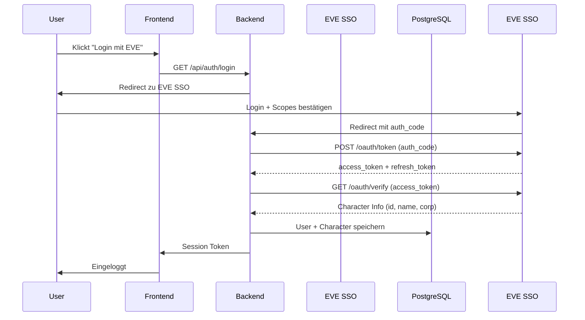

# ESI API Referenz - SquadB Industry Tool

> **Stand:** 20.06.2026  
> **Zweck:** Nachschlagewerk für alle ESI-Endpunkte, die in SquadB verwendet werden.  
> **Ziel:** Korrekte Verwendung der Endpunkte, inklusive Auth-Anforderungen, Parameter, Return-Werte und Rate-Limits.

---

## Inhaltsverzeichnis

1. [Übersicht & Grundlagen](#1-uebersicht--grundlagen)
2. [Authentication (EVE SSO)](#2-authentication-eve-sso)
3. [Assets](#3-assets)
4. [Blueprints](#4-blueprints)
5. [Market](#5-market)
6. [Universe / Static Data](#6-universe--static-data)
7. [Corporations](#7-corporations)
8. [Industry](#8-industry)
9. [Character](#9-character)
10. [Skills](#10-skills)
11. [Bookmarks / Location Names](#11-bookmarks--location-names)
12. [Dogma / Attributes](#12-dogma--attributes)
13. [Rate-Limits & Best Practices](#13-rate-limits--best-practices)
14. [ESI Fehlerbehandlung](#14-esi-fehlerbehandlung)

---

## 1. Übersicht & Grundlagen

### Base URL

```
https://esi.evetech.net
```

### Versionierung

Alle Endpunkte werden mit `latest` oder einer spezifischen Version verwendet:
```
https://esi.evetech.net/latest/...
https://esi.evetech.net/v4/...
```

### Datasource

Immer `tranquility` (TQ) für den Live-Server:
```
?datasource=tranquility
```

### Authentication (Endpoints die Auth benötigen)

Endpunkte, die `evesso` benötigen, müssen einen gültigen **Access Token** als Bearer Token im Header mitsenden:
```
Authorization: Bearer {access_token}
```

### Player Structure Erkennung - Das Wichtigste

**Wie erkennt man eine Player Structure in den ESI Asset-Daten?**

```python
# ESI Assets Response enthaelt location_type, aber Vorsicht:
# Player Structures zeigen oft "other" als location_type, NICHT "station"!

def is_player_structure(location_id: int) -> bool:
    """Erkennt ob eine Location eine Player-Structure ist (UPWELL)."""
    return location_id >= 1_000_000_000_000  # > 1 Billion

# Wichtig: /universe/names/ kann Player Structure IDs NICHT aufloesen!
# Stattdessen muss man /universe/structures/{structure_id}/ mit Auth-Token verwenden
```

### location_id Bereiche - Referenz

| Bereich | Typ | location_type | Aufloesbar mit |
|---|---|---|---|
| 1.000.000.000.000+ | Player Structure (UPWELL) | `other` | `/universe/structures/{id}/` mit Auth |
| 60.000.000 - 999.999.999 | NPC Station | `station` | `/universe/names/` |
| 30.000.000 - 59.999.999 | Solar System | `solar_system` | `/universe/names/` |
| < 30.000.000 | Item / Container | `item` | Nicht sinnvoll aufloesbar |

### HTTP Methods

| Methode | Verwendung |
|---|---|
| GET | Daten abrufen |
| POST | Daten erstellen / Aktionen ausführen |
| PUT | Daten aktualisieren |
| DELETE | Daten löschen |

### Response Headers (Rate-Limits)

Jede Response enthält:
```
X-Esi-Error-Limit-Remain: 100    # Verbleibende Fehler-Limits
X-Esi-Error-Limit-Reset: 60      # Sekunden bis Reset
X-Pages: 10                      # Bei paginierten Endpunkten: Gesamtseiten
```

---

## 2. Authentication (EVE SSO)

### 2.1 OAuth2 Flow



### 2.2 EVE SSO Endpunkte

#### Authorization URL (User Redirect)

```
GET https://login.eveonline.com/v2/oauth/authorize
```

| Parameter | Wert |
|---|---|
| response_type | `code` |
| client_id | `{SquadB_CLIENT_ID}` |
| redirect_uri | `{SquadB_CALLBACK_URL}/api/auth/callback` |
| scope | `{benötigte Scopes, space-separated}` |
| state | `{CSRF-Token}` |

#### Token Exchange (Backend -> EVE SSO)

```
POST https://login.eveonline.com/v2/oauth/token
```

**Header:**
```
Content-Type: application/x-www-form-urlencoded
Authorization: Basic {base64(client_id:secret_key)}
```

**Body:**
```
grant_type=authorization_code&code={auth_code}
```

**Response (200):**
```json
{
    "access_token": "eyJhbGciOiJSUzI1NiIsImtpZCI6IjEi...",
    "token_type": "Bearer",
    "expires_in": 1200,
    "refresh_token": "eyJhbGciOiJSUzI1NiIsImtpZCI6IjEi...",
    "character_id": 1234567890
}
```

**Info:** `expires_in` ist **1200 Sekunden (20 Minuten)** - Access Tokens sind sehr kurzlebig!

#### Token Refresh (Backend -> EVE SSO)

```
POST https://login.eveonline.com/v2/oauth/token
```

**Header:**
```
Content-Type: application/x-www-form-urlencoded
Authorization: Basic {base64(client_id:secret_key)}
```

**Body:**
```
grant_type=refresh_token&refresh_token={refresh_token}
```

**Response (200):**
```json
{
    "access_token": "eyJhbGciOiJSUzI1NiIsImtpZCI6IjEi...",
    "token_type": "Bearer",
    "expires_in": 1200,
    "refresh_token": "eyJhbGciOiJSUzI1NiIsImtpZCI6IjEi..."
}
```

**Wichtig:** Ein Refresh Token kann sich bei jeder Refresh-Operation ändern! Immer den neuen Refresh-Token speichern.

#### Verify Token (Backend -> EVE SSO)

```
GET https://login.eveonline.com/oauth/verify
```

**Header:**
```
Authorization: Bearer {access_token}
```

**Response (200):**
```json
{
    "CharacterID": 1234567890,
    "CharacterName": "SquadB User",
    "ExpiresOn": "2026-06-20T01:30:00",
    "Scopes": "esi-assets.read_assets.v1 esi-industry.read_character_jobs.v1 ...",
    "TokenType": "Character",
    "CharacterOwnerHash": "abc123def456"
}
```

### 2.3 Scopes (nach Funktion)

```python
SCOPES = {
    "assets": [
        "esi-assets.read_assets.v1",           # Charakter-Assets lesen
        "esi-corporations.read_corporation_assets.v1",  # Corp-Assets lesen  (Director+)
    ],
    "blueprints": [
        "esi-characters.read_blueprints.v1",   # Charakter-Blueprints
        "esi-corporations.read_blueprints.v1",  # Corp-Blueprints (Director+)
    ],
    "industry": [
        "esi-industry.read_character_jobs.v1", # Industrie-Jobs lesen
        "esi-industry.read_character_orders.v1", # Industrie-Orders
    ],
    "market": [
        "esi-markets.read_character_orders.v1", # Eigene Market Orders
    ],
    "corporation": [
        "esi-corporations.read_corporation_membership.v1",  # Mitgliedschaft prüfen
        "esi-corporations.read_divisions.v1",               # Divisionen lesen (Director+)
        "esi-corporations.read_structure_service_info.v1",  # Struktur-Infos (Director+)
    ],
    "skills": [
        "esi-skills.read_skills.v1",           # Skills lesen
        "esi-skills.read_skillqueue.v1",       # Skillqueue lesen
    ],
    "universe": [
        # Öffentliche Endpunkte - kein Scope nötig
    ],
    "bookmarks": [
        "esi-bookmarks.read_character_bookmarks.v1",  # Bookmarks lesen
    ],
}
```

### 2.4 Python Token-Manager (Beispiel)

```python
import time
import httpx
from httpx import AsyncClient

class EveSSOClient:
    """Verwaltet EVE SSO Tokens mit automatischem Refresh."""

    def __init__(self, client_id: str, secret_key: str, user_agent: str):
        self.client_id = client_id
        self.secret_key = secret_key
        self.user_agent = user_agent
        self.base_url = "https://login.eveonline.com"

    async def refresh_token(self, refresh_token: str) -> dict:
        """Refresh einen abgelaufenen Access Token."""
        auth = httpx.BasicAuth(self.client_id, self.secret_key)
        data = {
            "grant_type": "refresh_token",
            "refresh_token": refresh_token,
        }
        async with AsyncClient() as client:
            resp = await client.post(
                f"{self.base_url}/v2/oauth/token",
                auth=auth,
                data=data,
            )
        resp.raise_for_status()
        return resp.json()

    async def get_valid_token(self, db_token: dict) -> dict:
        """
        Prüft ob der Access Token noch gültig ist und refresht wenn nötig.
        db_token = { access_token, refresh_token, expires_at }
        """
        if time.time() >= db_token["expires_at"] - 60:
            # Token abgelaufen oder läuft in <60s ab -> refresh
            new_token = await self.refresh_token(db_token["refresh_token"])
            return {
                "access_token": new_token["access_token"],
                "refresh_token": new_token.get("refresh_token", db_token["refresh_token"]),
                "expires_at": time.time() + new_token["expires_in"],
            }
        return db_token
```

---

## 3. Assets

### 3.1 Charakter-Assets

```
GET /latest/characters/{character_id}/assets/
```

**Auth:** `esi-assets.read_assets.v1`  
**Pagination:** Ja (1000 Items pro Seite)

**Wichtigste Parameter:**
| Parameter | Typ | Beschreibung |
|---|---|---|
| character_id | path | EVE Character ID |
| page | query | Seitenzahl (default: 1) |
| datasource | query | `tranquility` |

**Response (200) - Array:**
```json
[
    {
        "is_blueprint_copy": false,
        "is_singleton": false,
        "item_id": 1234567890,
        "location_flag": "Hangar",
        "location_id": 60003760,
        "location_type": "station",
        "quantity": 100,
        "type_id": 34
    },
    {
        "is_blueprint_copy": true,
        "is_singleton": true,
        "item_id": 1234567891,
        "location_flag": "Hangar",
        "location_id": 60003760,
        "location_type": "station",
        "quantity": -1,
        "type_id": 691,  --> Blueprint Type ID (nicht das Produkt!)
        "blueprint_id": 1234567891
    }
]
```

**Wichtige Felder:**
| Feld | Typ | Bedeutung |
|---|---|---|
| type_id | int | Item Type ID. **Bei Blueprints:** Das Blueprint-Item, nicht das Produkt! |
| item_id | int | Eindeutige Item-ID für dieses konkrete Item im Spiel |
| quantity | int | **Normal:** Anzahl. **Bei Singleton (Blueprint):** -1 = BPO, >1 = BPC mit Runs |
| is_blueprint_copy | bool | True = BPC, False = BPO |
| is_singleton | bool | True = Das Item existiert als einzigartiges Objekt (Schiff, Blueprint) |
| location_flag | string | Wo im Inventar (Hangar, Cargo, CorpSAG1, etc.) |
| location_id | int | ID des Containers (Station, Struktur, Solarsystem) |
| location_type | string | `station`, `solar_system`, `item`, `other` |

**Blueprint Quantity-Regel (kritisch!):**
```python
if item["is_singleton"] and item["quantity"] == -1:
    # BPO (Original Blueprint) - unendlich Runs
    blueprint_type = "BPO"
    runs = None
elif item["is_singleton"] and item["quantity"] > -1:
    # BPC (Blueprint Copy) - quantity = runs
    blueprint_type = "BPC"
    runs = item["quantity"]
else:
    # Normales Item (kein Blueprint)
    blueprint_type = None
    quantity = item["quantity"]
```

**location_id Bedeutung (wichtig für Location-Auflösung!):**
```python
# EVE verwendet verschiedene ID-Bereiche für verschiedene Location-Typen
if location_id >= 1_000_000_000_000:   # 1 Billion+
    location_type = "structure"         # Player-owned structure
elif location_id >= 60_000_000:         # 60 Millionen+
    location_type = "station"           # NPC Station
elif location_id >= 30_000_000:         # 30 Millionen+
    location_type = "solar_system"      # Alles im Cargo/Inventar eines Chars
else:
    location_type = "other"
```

**Kritisch - Singleton Items mit Quantity:**
- Ein Singleton Item (z.B. Schiff) kann andere Items enthalten (Module)
- Die Module haben dann `location_id` = Schiff-`item_id` und `location_type` = `item`
- Um Fitted Modules zu finden: Assets wo `location_id` in den `item_id`s der Schiffe ist

### 3.2 Corporation Assets

```
GET /latest/corporations/{corporation_id}/assets/
```

**Auth:** `esi-corporations.read_corporation_assets.v1`  
**Rolle:** Director+  
**Pagination:** Ja (1000 Items pro Seite)

**Response - identisch zu Character Assets**

**Zusätzliches Feld:**
| Feld | Typ | Bedeutung |
|---|---|---|
| is_singleton | bool | Bei Corps: `is_singleton` zeigt ob es ein einzigartiges Item ist |

**Wichtig für Corp Assets:**
```python
# Corp Division aus location_flag extrazieren
# Format: "CorpSAG1", "CorpSAG2", ..., "CorpSAG7"
# Oder: "Hangar" (persönlich), "CorpDeliveries"
if location_flag.startswith("CorpSAG"):
    division_id = int(location_flag.replace("CorpSAG", ""))
else:
    division_id = 0  # Persönlich oder Andere
```

### 3.3 Asset Location Names (Batch - WICHTIG!)

```
POST /latest/universe/names/
```

**Auth:** Keine (öffentlich)  
**Body:** `[item_id_1, item_id_2, ...]` (max 1000 IDs)

**Response (200):**
```json
[
    {"id": 60003760, "name": "Jita IV - Moon 4 - Caldari Naval Assembly Plant", "category": "station"},
    {"id": 1234567890, "name": "CCP Development Center", "category": "structure"}
]
```

**Wichtig:** Strukturen (Player-owned) haben `category: "structure"` und brauchen einen speziellen Endpunkt für den Namen (siehe Section 11.1). Große Struktur-IDs (>1 Billion) werden von `/universe/names/` nicht aufgelöst!

### 3.4 Asset Items (für Container)

```
GET /latest/characters/{character_id}/assets/{item_id}/
```

**Auth:** `esi-assets.read_assets.v1`

Holt den Inhalt eines Containers (z.B. ein Jet Can, ein Ship Cargo).

---

## 4. Blueprints

### 4.1 Character Blueprints

```
GET /latest/characters/{character_id}/blueprints/
```

**Auth:** `esi-characters.read_blueprints.v1`  
**Pagination:** Ja

**Response (200):**
```json
[
    {
        "item_id": 1234567890,
        "location_flag": "Hangar",
        "location_id": 60003760,
        "material_efficiency": 10,
        "quantity": -1,
        "runs": -1,
        "time_efficiency": 20,
        "type_id": 691
    }
]
```

**Wichtige Felder:**
| Feld | Typ | Bedeutung |
|---|---|---|
| type_id | int | Blueprint Type ID (z.B. 691 = Raven Blueprint) |
| item_id | int | Eindeutige Item-ID |
| quantity | int | -1 = BPO (unendlich), positive Zahl = BPC |
| material_efficiency | int | ME Level (0-10 bei T1, 0 bei T2 meist) |
| time_efficiency | int | TE Level (0-20 bei T1, 0 bei T2 meist) |
| runs | int | Verbleibende Runs (-1 bei BPO) |

**Unterschied zu Assets:**
- `/blueprints/` gibt **ME/TE Werte** - das hat `/assets/` NICHT!
- Bei `/assets/` sieht man nur ob BPO/BPC, aber nicht den ME/TE Level
- **Regel:** Blueprint ME/TE kommt von `/blueprints/`, nicht von `/assets/`

### 4.2 Corporation Blueprints

```
GET /latest/corporations/{corporation_id}/blueprints/
```

**Auth:** `esi-corporations.read_blueprints.v1`  
**Rolle:** Director+  
**Pagination:** Ja

**Response - identisch zu Character Blueprints**

---

## 5. Market

### 5.1 Markt-Orders für eine Region

```
GET /latest/markets/{region_id}/orders/
```

**Auth:** Keine (öffentlich)  
**Pagination:** Ja

**Parameter:**
| Parameter | Typ | Beschreibung |
|---|---|---|
| region_id | path | EVE Region ID (10000002 = The Forge = Jita) |
| order_type | query | `buy`, `sell`, `all` |
| type_id | query | Optional: Nur Orders für dieses Item |
| page | query | Seitenzahl |

**Response (200):**
```json
[
    {
        "duration": 90,
        "is_buy_order": false,
        "issued": "2026-06-19T10:00:00Z",
        "location_id": 60003760,
        "min_volume": 1,
        "order_id": 1234567890,
        "price": 4.50,
        "range": "region",
        "system_id": 30000142,
        "type_id": 34,
        "volume_remain": 100000,
        "volume_total": 1000000
    }
]
```

**Wichtige Felder:**
| Feld | Bedeutung |
|---|---|
| price | Preis pro Einheit in ISK |
| volume_remain | Noch verfügbare Menge |
| volume_total | Ursprüngliche Menge |
| is_buy_order | false = Sell Order (will verkaufen), true = Buy Order (will kaufen) |
| location_id | Wo die Order platziert ist (Station oder Struktur) |

**Jita-Preis-Berechnung:**
```python
# Beste (niedrigste) Sell Order:
sell_price = min(
    order.price for order in orders
    if not order.is_buy_order
)

# Beste (höchste) Buy Order:
buy_price = max(
    order.price for order in orders
    if order.is_buy_order
)

# 5% Percentile (robuster Durchschnitt):
sorted_sells = sorted(
    order.price for order in orders
    if not order.is_buy_order
)
five_percentile = sorted_sells[len(sorted_sells) // 20]
```

### 5.2 Historische Marktpreise

```
GET /latest/markets/{region_id}/history/
```

**Auth:** Keine (öffentlich)

**Parameter:**
| Parameter | Typ | Beschreibung |
|---|---|---|
| region_id | path | EVE Region ID |
| type_id | query | Item Type ID |

**Response (200):**
```json
[
    {
        "average": 4.52,
        "date": "2026-06-19",
        "highest": 4.80,
        "lowest": 4.20,
        "order_count": 15000,
        "volume": 50000000
    }
]
```

### 5.3 Region-ID für Jita

```python
REGION_IDS = {
    "The Forge": 10000002,       # Jita
    "Domain": 10000043,          # Amarr
    "Lonetrek": 10000016,        # Dodixie (Gallente)
    "Essence": 10000064,         # Rens (Minmatar)
    "Sinq Laison": 10000032,     # Hek
}
```

---

## 6. Universe / Static Data

> **Hinweis:** Diese Endpunkte werden nach SDE-Import obsolet. Vor SDE-Import sind sie die einzige Quelle für Item-Daten.

### 6.1 Universe Names (Batch - 1000 IDs)

```
POST /latest/universe/names/
```

**Auth:** Keine  
**Body:** Array von IDs

**Response (200):**
```json
[
    {"category": "inventory_type", "id": 34, "name": "Tritanium"},
    {"category": "character", "id": 123456789, "name": "SquadB User"},
    {"category": "corporation", "id": 987654321, "name": "SquadB Industrial"},
    {"category": "station", "id": 60003760, "name": "Jita IV - Moon 4 - Caldari Naval Assembly Plant"},
    {"category": "solar_system", "id": 30000142, "name": "Jita"}
]
```

**Kategorien:**
| category | Bedeutung |
|---|---|
| inventory_type | Item (Type ID) |
| character | EVE Character |
| corporation | EVE Corporation |
| alliance | EVE Alliance |
| station | NPC Station |
| solar_system | Solarsystem |
| faction | EVE Faction |
| constellation | Constellation |
| region | EVE Region |

**Limitation:**
- Max **1000 IDs** pro Request
- Player Structures (category: "structure") werden **NICHT** aufgelöst!
- Für Strukturen siehe Section 11.1

### 6.2 Universe Type (Einzelnes Item)

```
GET /latest/universe/types/{type_id}/
```

**Auth:** Keine

**Response (200):**
```json
{
    "capacity": 0.0,
    "description": "The most common mineral in New Eden...",
    "dogma_attributes": [
        {"attribute_id": 4, "value": 0.01}
    ],
    "dogma_effects": [],
    "group_id": 18,
    "icon_id": 24,
    "market_group_id": 17,
    "mass": 1.0,
    "name": "Tritanium",
    "packaged_volume": 0.01,
    "portion_size": 100,
    "published": true,
    "radius": 1.0,
    "type_id": 34,
    "volume": 0.01
}
```

**Wichtige Felder:**
| Feld | Bedeutung |
|---|---|
| group_id | Gruppe (z.B. 18 = Mineral) |
| market_group_id | Marktgruppe (für Item Browser Hierarchie) |
| portion_size | Wie viele Einheiten werden auf einmal produziert |
| dogma_attributes | Array von {attribute_id, value} - hier stecken CPU, PG, Schild etc. drin |

### 6.3 Universe Groups

```
GET /latest/universe/groups/{group_id}/
```

**Auth:** Keine

**Response (200):**
```json
{
    "category_id": 4,
    "group_id": 18,
    "name": "Mineral",
    "published": true,
    "types": [34, 35, 36, 37, 38, 39, 40]
}
```

### 6.4 Universe Categories

```
GET /latest/universe/categories/{category_id}/
```

**Auth:** Keine

**Response (200):**
```json
{
    "category_id": 6,
    "groups": [18, 25, 363, 364, 365, ...],
    "name": "Material",
    "published": true
}
```

**Wichtige Kategorie-IDs:**
| category_id | Name |
|---|---|
| 6 | Material |
| 7 | Ship |
| 8 | Module |
| 9 | Charge |
| 16 | Skill |
| 18 | Drone |
| 22 | Deployable |
| 23 | Structure |
| 24 | Starbase |
| 25 | Reaction |
| 32 | Planetary |
| 35 | Blueprint |
| 41 | Industry |
| 42 | Implant |
| 65 | Fighter |
| 87 | Component |
| 91 | Ancient Relic |
| 350 | Decryptor |

### 6.5 Universe Structures (Player Structures)

```
GET /latest/universe/structures/{structure_id}/
```

**Auth:** `esi-universe.read_structures.v1`  
**Wichtig:** Erfordert ein gültiges Token für einen Charakter der Zugriff auf die Struktur hat!

**Response (200):**
```json
{
    "name": "SquadB Fortizar",
    "owner_id": 987654321,
    "solar_system_id": 30000142,
    "type_id": 35833,
    "position": {"x": ..., "y": ..., "z": ...}
}
```

**Fallback:** Wenn dieser Endpunkt 403 oder 404 gibt:
- Struktur existiert nicht mehr (destroyed/reinforced)
- Der Charakter hat keinen Zugriff
- **Alternative:** `name` auf `"Unknown Structure {structure_id}"` setzen

---

## 7. Corporations

### 7.1 Corporation Information

```
GET /latest/corporations/{corporation_id}/
```

**Auth:** Keine

**Response (200):**
```json
{
    "name": "SquadB Industrial",
    "ticker": "SQUAD",
    "member_count": 42,
    "ceo_id": 123456789,
    "creator_id": 123456789,
    "alliance_id": 123456,
    "faction_id": 500001,
    "date_founded": "2020-01-01T00:00:00Z",
    "home_station_id": 60003760,
    "shares": 1000
}
```

### 7.2 Corporation Divisions

```
GET /latest/corporations/{corporation_id}/divisions/
```

**Auth:** `esi-corporations.read_divisions.v1`  
**Rolle:** Director+

**Response (200):**
```json
{
    "hangar": [
        {"division": 1, "name": "Mineralien"},
        {"division": 2, "name": "Komponenten"},
        {"division": 3, "name": "Ships"},
        {"division": 4, "name": "Blueprints"},
        {"division": 5, "name": "Produktion"},
        {"division": 6, "name": "Handel"},
        {"division": 7, "name": "Sonstiges"}
    ],
    "wallet": [
        {"division": 1, "name": "Hauptkasse"},
        {"division": 2, "name": "Produktion"},
        {"division": 5, "name": "Investitionen"}
    ]
}
```

**Wichtig:** Division-Namen sind vom Corp Director konfigurierbar. Die Division-IDs sind **fix (1-7)**, aber die **Namen sind benutzerdefiniert**.

### 7.3 Corporation Members

```
GET /latest/corporations/{corporation_id}/members/
```

**Auth:** `esi-corporations.read_corporation_membership.v1`

**Response (200):**
```json
[123456789, 987654321, ...]
```

### 7.4 Corporation Member Roles

```
GET /latest/corporations/{corporation_id}/roles/
```

**Auth:** `esi-corporations.read_corporation_membership.v1`

**Response (200):**
```json
[
    {
        "character_id": 123456789,
        "roles": ["Director", "Accountant"]
    }
]
```

**Wichtig für Division-Zugriff:**
- `roles` = Corp-weite Rollen
- `roles_at_hq`, `roles_at_base`, `roles_other` = Rollen für spezifische Stationen
- `Director` Rolle erbt ALLE Corp-Endpunkt-Berechtigungen

### 7.5 Corporation Members (mit Details) - NICHT VON ESI

ESI hat **KEINEN** Endpunkt für Member-Details (Location, Ship) als Batch.  
Man muss `/characters/{character_id}/` für jeden Member einzeln aufrufen.

**Lösung:** Jeden Member individuell per `GET /latest/characters/{character_id}/` abfragen.

---

## 8. Industry

### 8.1 Character Industry Jobs

```
GET /latest/characters/{character_id}/industry/jobs/
```

**Auth:** `esi-industry.read_character_jobs.v1`  
**Pagination:** Ja

**Response (200):**
```json
[
    {
        "activity_id": 1,
        "blueprint_id": 1234567890,
        "blueprint_location_id": 60003760,
        "blueprint_type_id": 691,
        "completed_character_id": 123456789,
        "completed_date": "2026-06-19T15:00:00Z",
        "cost": 500000,
        "duration": 86400,
        "end_date": "2026-06-20T12:00:00Z",
        "facility_id": 60003760,
        "installer_id": 123456789,
        "job_id": 1234567890,
        "licensed_runs": 1,
        "output_location_id": 60003760,
        "pause_date": null,
        "probability": 1.0,
        "product_type_id": 24692,
        "runs": 10,
        "start_date": "2026-06-19T12:00:00Z",
        "station_id": 60003760,
        "status": "active"
    }
]
```

**Activity IDs:**
| activity_id | Name |
|---|---|
| 1 | Manufacturing |
| 3 | Researching Time Efficiency |
| 4 | Researching Material Efficiency |
| 5 | Copying |
| 7 | Invention |
| 8 | Reactions |

**Status Werte:**
| status | Bedeutung |
|---|---|
| active | Job läuft |
| cancelled | Abgebrochen |
| delivered | Fertig, im Output Hangar |
| paused | Pausiert |
| ready | Fertig, wartet auf Abholung |

### 8.2 Facility Info

```
GET /latest/industry/facilities/
```

**Auth:** Keine

**Response (200):**
```json
[
    {
        "facility_id": 60003760,
        "type_id": 2502,
        "solar_system_id": 30000142,
        "region_id": 10000002,
        "tax": 0.05
    }
]
```

### 8.3 System Cost Indices

```
GET /latest/industry/systems/
```

**Auth:** Keine

**Response (200):**
```json
[
    {
        "cost_indices": [
            {"activity": "invention", "cost_index": 0.002},
            {"activity": "manufacturing", "cost_index": 0.003},
            {"activity": "researching_material_efficiency", "cost_index": 0.001},
            {"activity": "researching_time_efficiency", "cost_index": 0.001},
            {"activity": "copying", "cost_index": 0.0005},
            {"activity": "reactions", "cost_index": 0.001}
        ],
        "solar_system_id": 30000142
    }
]
```

---

## 9. Character

### 9.1 Character Public Info

```
GET /latest/characters/{character_id}/
```

**Auth:** Keine

**Response (200):**
```json
{
    "name": "SquadB User",
    "birthday": "2015-06-15T00:00:00Z",
    "bloodline_id": 4,
    "corporation_id": 987654321,
    "alliance_id": 123456,
    "race_id": 2,
    "security_status": 5.0,
    "title": "CEO"
}
```

### 9.2 Character Corporation History

```
GET /latest/characters/{character_id}/corporationhistory/
```

**Auth:** Keine

**Response (200):**
```json
[
    {"corporation_id": 987654321, "record_id": 1, "start_date": "2020-01-01T00:00:00Z"},
    {"corporation_id": 123456789, "record_id": 2, "start_date": "2019-01-01T00:00:00Z"}
]
```

### 9.3 Character Affiliations (Batch)

```
POST /latest/characters/affiliations/
```

**Auth:** Keine  
**Body:** `[character_id_1, character_id_2, ...]` (max 1000)

**Response (200):**
```json
[
    {"character_id": 123456789, "corporation_id": 987654321, "alliance_id": 123456},
    {"character_id": 987654321, "corporation_id": 987654321, "alliance_id": null}
]
```

---

## 10. Skills

### 10.1 Character Skills

```
GET /latest/characters/{character_id}/skills/
```

**Auth:** `esi-skills.read_skills.v1`

**Response (200):**
```json
{
    "skills": [
        {"skill_id": 3386, "skillpoints_in_skill": 548000, "trained_skill_level": 5, "active_skill_level": 5}
    ],
    "total_sp": 50000000,
    "unallocated_sp": 0
}
```

**Wichtige Skill IDs für Industry:**
| skill_id | Name | Max Level |
|---|---|---|
| 3386 | Production Efficiency | 5 |
| 3387 | Industry | 5 |
| 3388 | Advanced Industry | 5 |
| 3392 | Mass Production | 5 |
| 3393 | Advanced Mass Production | 5 |
| 24624 | Supply Chain Management | 5 |
| 24625 | Scientific Networking | 5 |
| 3402 | Metallurgy | 5 |
| 3403 | Research | 5 |
| 23167 | Drug Manufacturing | 5 |
| 24613 | Reverse Engineering | 5 |
| 3409 | Laboratory Operations | 5 |
| 3410 | Advanced Laboratory Operations | 5 |

---

## 11. Bookmarks / Location Names

### 11.1 Player Structure Names - Das Problem

Player Structures (UPWELL-Strukturen wie Fortizar, Tatara, Azbel) haben IDs im Bereich > 1.000.000.000.000 (1 Billion).

**Diese können NICHT mit `/universe/names/` aufgelöst werden!**

**Lösung:**

#### Option A: ESI Universe Structures (erfordert Auth)

```
GET /latest/universe/structures/{structure_id}/
```

**Auth:** `esi-universe.read_structures.v1`  
**Erfordert:** Charakter muss Zugriff auf die Struktur haben (Member der Corp, der die Struktur besitzt)

**Problem:** Gibt 403/404 wenn der Charakter keinen Zugriff hat.

#### Option B: Character Bookmarks

```
GET /latest/characters/{character_id}/bookmarks/
```

**Auth:** `esi-bookmarks.read_character_bookmarks.v1`

**Response (200):**
```json
[
    {
        "bookmark_id": 12345,
        "created": "2026-01-15T12:00:00Z",
        "creator_id": 123456789,
        "folder_id": 1,
        "item_id": 60003760,
        "label": "Jita 4-4",
        "location_id": 30000142,
        "notes": "My trading hub"
    }
]
```

**Nicht ideal** - Bookmarks sind unvollständig.

#### Option C: Character Assets als Location-Name Quelle

```python
# Assets enthalten alle location_ids
# Manche location_ids sind Struktur-IDs
# Für diese brauchen wir den Namen per /universe/structures/{id}/

async def resolve_structure_name(structure_id: int, character_tokens: List[dict]) -> str:
    """
    Versucht Struktur-Namen über alle verfügbaren Charakter-Tokens.
    """
    for token in character_tokens:
        try:
            async with AsyncClient() as client:
                resp = await client.get(
                    f"https://esi.evetech.net/latest/universe/structures/{structure_id}/",
                    headers={"Authorization": f"Bearer {token['access_token']}"},
                    params={"datasource": "tranquility"},
                )
                if resp.status_code == 200:
                    data = resp.json()
                    return data["name"]
        except:
            continue
    # Fallback: Struktur-Name von Bookmarks durchsuchen
    return f"Unknown Structure [{structure_id}]"
```

**Besserer Ansatz:** Struktur-Namen einmalig auflösen und in einer `location_cache` Tabelle speichern.

### 11.2 Location Cache

```python
# Nachdem Namen aufgelöst wurden, für spätere Requests cachen
location_cache = {
    "60003760": {
        "name": "Jita IV - Moon 4 - Caldari Naval Assembly Plant",
        "category": "station"
    },
    "1035467980234": {
        "name": "SquadB Fortizar",
        "category": "structure"
    }
}

# In der Datenbank:
# CREATE TABLE location_cache (
#     location_id BIGINT PRIMARY KEY,
#     name VARCHAR(255) NOT NULL,
#     category VARCHAR(50) NOT NULL,
#     resolved_at TIMESTAMPTZ DEFAULT NOW(),
#     expires_at TIMESTAMPTZ
# );
```

---

## 12. Dogma / Attributes

### 12.1 Dogma Attribute (für Modul/Schiff-Eigenschaften)

```
GET /latest/dogma/attributes/{attribute_id}/
```

**Auth:** Keine

**Response (200):**
```json
{
    "attribute_id": 4,
    "default_value": 0.0,
    "description": "The volume of an item...",
    "display_name": "Volume",
    "high_is_good": true,
    "icon_id": 67,
    "name": "volume",
    "published": true,
    "unit_id": 1
}
```

### 12.2 Wichtige Dogma Attribute IDs

```python
DOGMA_ATTRIBUTE_IDS = {
    "volume": 4,
    "capacity": 38,
    "mass": 2,
    "powergrid_output": 11,
    "cpu_output": 12,
    "powergrid_need": 15,
    "cpu_need": 50,
    "high_slots": 14,
    "med_slots": 13,
    "low_slots": 12,
    "rig_slots": 1137,
    "shield_hp": 263,
    "armor_hp": 265,
    "structure_hp": 9,
    "max_velocity": 37,
    "warp_speed": 600,
    "max_locked_targets": 192,
    "capacitor_capacity": 482,
    "capacitor_recharge_time": 55,
    "drone_bandwidth": 1271,
    "drone_capacity": 283,
    "tech_level": 422,
    "meta_level": 633,
}
```

---

## 13. Rate-Limits & Best Practices

### 13.1 ESI Rate Limits

| Limit | Wert | Erklärung |
|---|---|---|
| **Error Limit** | 100 Fehler / 60 Sekunden | Pro IP-Adresse. Bei Überschreitung 403 (Rate Limited) |
| **Burst Limit** | Variabel | 10-20 Requests pro Sekunde pro IP |
| **Pagination** | Max 1000 Items pro Seite | Assets: max ~100 Seiten (100k Items) |

### 13.2 Best Practices

```python
class ESIClient:
    """ESI Client mit Rate-Limiting, Retry und Auth-Management."""

    def __init__(self, user_agent: str):
        self.user_agent = user_agent
        self.session = self._create_session()
        self.request_times = deque()

    def _create_session(self) -> AsyncClient:
        headers = {
            "User-Agent": self.user_agent,  # !!! MUSS gesetzt sein !!!
            "Accept": "application/json",
            "Cache-Control": "no-cache",
        }
        return AsyncClient(headers=headers, timeout=30)

    async def _rate_limit_wait(self):
        """Wartet ggf. um das Rate-Limit einzuhalten."""
        now = time.time()
        # Max 10 Requests pro Sekunde erlaubt
        while len(self.request_times) >= 10:
            oldest = self.request_times.popleft()
            if now - oldest < 1.0:
                await asyncio.sleep(now - oldest + 0.1)
                break
        self.request_times.append(now)
        # Max 1000 Einträge im Log behalten
        while len(self.request_times) > 1000:
            self.request_times.popleft()

    async def request(
        self,
        method: str,
        endpoint: str,
        token: Optional[str] = None,
        params: Optional[dict] = None,
        body: Optional[list] = None,
        max_retries: int = 3,
    ) -> dict:
        """Generischer ESI Request mit Retry und Auth."""
        url = f"https://esi.evetech.net{endpoint}"
        headers = {}
        if token:
            headers["Authorization"] = f"Bearer {token}"
        if body is not None:
            headers["Content-Type"] = "application/json"

        for attempt in range(max_retries):
            await self._rate_limit_wait()
            try:
                resp = await self.session.request(
                    method=method,
                    url=url,
                    headers=headers,
                    params={**params, "datasource": "tranquility"} if params else {"datasource": "tranquility"},
                    json=body,
                )
                if resp.status_code == 420:
                    # Rate Limited - warten und wiederholen
                    wait = int(resp.headers.get("Retry-After", 30))
                    await asyncio.sleep(wait)
                    continue
                resp.raise_for_status()
                return resp.json()
            except httpx.HTTPStatusError as e:
                if e.response.status_code in {502, 503, 504}:
                    # ESI Server Error - retry
                    await asyncio.sleep(2 ** attempt)
                    continue
                raise
        raise Exception(f"Max retries exceeded for {endpoint}")

    async def get_paginated(
        self, endpoint: str, token: Optional[str] = None, params: Optional[dict] = None
    ) -> List[dict]:
        """Holt paginierte Endpunkte (wie Assets)."""
        all_items = []
        page = 1
        total_pages = 1  # Wird nach erstem Request aktualisiert

        while page <= total_pages:
            page_params = {**(params or {}), "page": page}
            data = await self.request("GET", endpoint, token=token, params=page_params)

            if isinstance(data, list):
                all_items.extend(data)
            elif isinstance(data, dict):
                all_items.append(data)

            page += 1

        return all_items
```

### 13.3 Cache-Strategie

```python
CACHE_TTL = {
    "universe_names": 3600 * 24 * 7,        # 7 Tage - selten ändern sich Item-Namen
    "universe_types": 3600 * 24 * 7,         # 7 Tage
    "universe_groups": 3600 * 24 * 7,        # 7 Tage
    "universe_categories": 3600 * 24 * 7,    # 7 Tage
    "market_orders": 60 * 15,                # 15 Minuten - Marktpreise ändern sich schnell
    "market_history": 60 * 60 * 24,          # 24 Stunden - historisch langsam
    "character_assets": 60 * 5,              # 5 Minuten (oder manuell per Sync)
    "corporation_assets": 60 * 5,            # 5 Minuten
    "industry_jobs": 60 * 5,                 # 5 Minuten
    "blueprints": 60 * 10,                   # 10 Minuten
    "corporation_info": 3600,                # 1 Stunde
    "structure_info": 3600 * 24,             # 24 Stunden
}
```

---

## 14. ESI Fehlerbehandlung

### 14.1 HTTP Status Codes

| Status | Bedeutung | Aktion |
|---|---|---|
| 200 | Erfolg | Response verarbeiten |
| 304 | Not Modified (ETag) | Cache verwenden |
| 400 | Bad Request | Request überprüfen (falsche Parameter) |
| 401 | Unauthorized | Token abgelaufen -> Refresh |
| 403 | Forbidden | Keine Berechtigung (falscher Scope, falsche Rolle) |
| 404 | Not Found | Resource existiert nicht |
| 420 | Error Limited | Rate-Limit erreicht -> warten (Retry-After Header) |
| 422 | Unprocessable Entity | Falsche Parameter (z.B. ungültige character_id) |
| 500 | Internal Server Error | ESI-Problem -> Retry |
| 502 | Bad Gateway | ESI-Problem -> Retry |
| 503 | Service Unavailable | ESI-Problem -> Retry |
| 504 | Gateway Timeout | ESI-Problem -> Retry |

### 14.2 Error Response Format

```json
{
    "error": "Character does not exist",
    "error_description": "The requested character could not be found...",
    "sso_status": 200
}
```

### 14.3 Typische Fehler & Lösungen

| Fehler | Ursache | Lösung |
|---|---|---|
| `Character does not exist` | character_id falsch | Prüfen ob character_id stimmt |
| `Token is expired` | Access Token >20 Min alt | Refresh Token verwenden |
| `Forbidden. Must have director role` | Corp-Endpunkt ohne Director-Rolle | Nur Director-Chars verwenden |
| `Requested page does not exist` | Seite > maximale Seiten | Pagination korrekt handhaben |
| `Error limited` | Zu viele Requests | Rate-Limiter einhalten |
| `The datasource tranquility is not available` | ESI Wartung | Warten und später wiederholen |

### 14.4 Token-Expiry-Handling

```python
async def with_token_refresh(
    esi_client: ESIClient,
    sso_client: EveSSOClient,
    db_token: dict,
    endpoint: str,
    **kwargs,
) -> dict:
    """
    Führt einen ESI-Request aus und handled Token-Refresh automatisch.
    """
    # Prüfen ob Token noch gültig ist
    if time.time() >= db_token["expires_at"]:
        new_token = await sso_client.refresh_token(db_token["refresh_token"])
        db_token.update(new_token)
        db_token["expires_at"] = time.time() + new_token["expires_in"]

    try:
        return await esi_client.request(
            "GET", endpoint, token=db_token["access_token"], **kwargs
        )
    except httpx.HTTPStatusError as e:
        if e.response.status_code == 401:
            # Token ungültig - Refresh und Wiederholung
            new_token = await sso_client.refresh_token(db_token["refresh_token"])
            db_token.update(new_token)
            db_token["expires_at"] = time.time() + new_token["expires_in"]
            return await esi_client.request(
                "GET", endpoint, token=db_token["access_token"], **kwargs
            )
        raise
```

---

## Anhang: Wichtige ID-Listen

### Jita-Region

| Name | ID |
|---|---|
| The Forge (Region) | 10000002 |
| Jita (System) | 30000142 |
| Jita 4-4 (Station) | 60003760 |

### Corp Division IDs (fix)

| Division | Flag-Name | Nutzung |
|---|---|---|
| 1 | CorpSAG1 | Hangar 1 |
| 2 | CorpSAG2 | Hangar 2 |
| 3 | CorpSAG3 | Hangar 3 |
| 4 | CorpSAG4 | Hangar 4 |
| 5 | CorpSAG5 | Hangar 5 |
| 6 | CorpSAG6 | Hangar 6 |
| 7 | CorpSAG7 | Hangar 7 |

### ID-Bereiche für Location-Typen

| Bereich | Typ | Beispiel |
|---|---|---|
| 1.000.000.000.000+ | Player Structure | 1035467980234 (UPWELL) |
| 60.000.000 - 100.000.000 | NPC Station | 60003760 (Jita 4-4) |
| 30.000.000 - 60.000.000 | Solar System | 30000142 (Jita) |
| < 30.000.000 | Item | 1234567890 (ein konkretes Schiff/Item) |

---
*Dokument erstellt am 20.06.2026 - Bei Änderungen der ESI-Spezifikation aktualisieren.*
