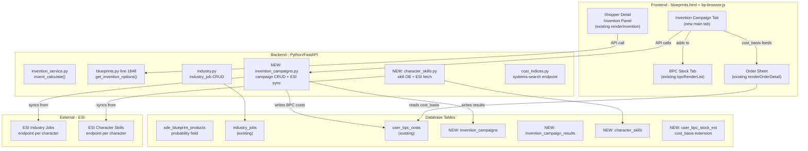

# Invention Campaign & BPC Cost Tracking — Comprehensive Overhaul Plan

## Overview

This plan covers the **Invention tab overhaul** (Option B — separate tab parallel to Shopper/Orders/BPC Stock), the **Invention Campaign system** for tracking 140 parallel jobs across 14 characters, **BPC cost basis tracking via ESI sync**, and the **missing BPO investigation** (1MN Afterburner etc.).

---

## Architecture Diagram



---

## Phase A: Missing BPO Investigation & Fix

### Problem
Items like `1MN Afterburner` and other manufacturable items are **not appearing** in the blueprint tree/catalog.

### Root Cause
In [`blueprints.py:634`](/home/sumeragy/smarthome/eve-industrial-tool/backend/app/routers/blueprints.py:634), the catalog SQL query includes:
```sql
AND si.market_group_id IS NOT NULL
```
This filters out any product that has `NULL` in `sde_items.market_group_id`. Many manufacturable items (especially modules with multiple meta variants, or items where the product itself has no market group) will be excluded.

### Fix Options

| Option | Description | Impact |
|--------|-------------|--------|
| **A1** — Remove the filter entirely | Remove `AND si.market_group_id IS NOT NULL` | Shows ALL manufacturable items, including some that aren't actually tradeable on market. Could show more entries than expected. |
| **A2** — Use blueprint's own market_group | Change to `WHERE sb.type_id IN (SELECT type_id FROM sde_items WHERE market_group_id IS NOT NULL)` | More accurate — filters by blueprint market presence, not product. |
| **A3** — Keep filter but add fallback | `AND (si.market_group_id IS NOT NULL OR sb.tech_level = 1)` | Shows T1 items even without market group. |

**Recommended: Option A2** — Because the blueprint itself (e.g. `1MN Afterburner Blueprint`) has a market group, but the product (`1MN Afterburner`) may inherit a NULL market_group depending on SDE data quality. Using the blueprint's `type_id` to check market group is more reliable.

### Affected Components
- [`blueprints.py:634`](/home/sumeragy/smarthome/eve-industrial-tool/backend/app/routers/blueprints.py:634) — the SQL `WHERE` clause
- [`bp-browser.js:689-756`](/home/sumeragy/smarthome/eve-industrial-tool/backend/app/templates/static/js/bp-browser.js:689) — `_expandTreeForSearch()` — client-side filtering is NOT affected, but the catalog JSON won't include the missing items
- **No other components** are affected — this is a pure data inclusion change

### Action Items (Phase A)
1. Modify the `WHERE` clause in catalog SQL to use `sde_items.type_id` (blueprint) instead of `sde_items.type_id` (product) for market_group_id check
2. Alternatively: test with `AND si.market_group_id IS NOT NULL` removed, run a query to see how many more items appear
3. Verify: search for "1MN Afterburner" and confirm it appears
4. Verify: search for other known-missing items the user has mentioned

---

## Phase B: Invention Tab Overhaul — Feature Breakdown

### B1: Fix 3x Bug in T2 Results & Skills

**Current bug in [`renderInvention()`](/home/sumeragy/smarthome/eve-industrial-tool/backend/app/templates/static/js/bp-browser.js:1544):**
- The `data.products[]` may contain duplicate entries because the SDE has multiple rows per product, causing the same T2 result to appear 3 times
- Similarly, `data.skills[]` may show duplicate skills

**Fix:**
1. **Backend** ([`blueprints.py:1958-1973`](/home/sumeragy/smarthome/eve-industrial-tool/backend/app/routers/blueprints.py:1958)): De-duplicate products by `product_type_id` in the `get_invention_options()` response. Use a dict keyed by `product_type_id` before building the products list.
2. **Backend** ([`blueprints.py:1983-1990`](/home/sumeragy/smarthome/eve-industrial-tool/backend/app/routers/blueprints.py:1983)): De-duplicate skills by `skill_type_id` using a dict, keeping the highest level for duplicate entries.
3. **Verify**: T2 outcomes table should show unique rows, and skills should show unique entries.

### B2: Decryptor Prices — 3-Column Display (Buy/Sell/Custom)

**Current state:** [`get_invention_options()`](/home/sumeragy/smarthome/eve-industrial-tool/backend/app/routers/blueprints.py:1999) uses:
```python
dec_price_map = {p.type_id: (p.sell_price_min or p.average_price or p.adjusted_price) ...}
```
This returns only a **single price** per decryptor. No buy price, no custom override.

**Required change:**

**Backend** ([`blueprints.py:1996-2013`](/home/sumeragy/smarthome/eve-industrial-tool/backend/app/routers/blueprints.py:1996)):
- Return `sell_price`, `buy_price`, and allow a `custom_price` field from `UserItemPrice` table
- Change decryptor response to include:
  ```python
  {
      "type_id": 34201,
      "name": "Accelerant Decryptor",
      "prob": 1.1, "runs": 1, "me": 0, "te": 0,
      "sell_price": 1234567.89,
      "buy_price": 1000000.00,
      "custom_price": None,  # from UserItemPrice
      "effective_price": 1234567.89  # cascade: custom > sell > buy
  }
  ```

**Frontend** ([`renderInvention()`](/home/sumeragy/smarthome/eve-industrial-tool/backend/app/templates/static/js/bp-browser.js:1610-1643)):
- Replace single price column with 3 columns: Buy / Sell / Custom
- Add an input field for custom price override per decryptor
- Style: buy = green, sell = yellow/orange, custom = blue

### B3: Datacore Prices — 3-Column Display + Agent/LP Calculation

**Current state:** [`get_invention_options()`](/home/sumeragy/smarthome/eve-industrial-tool/backend/app/routers/blueprints.py:1898-1908) returns:
```python
{
    "material_type_id": 20414,
    "name": "Datacore - Amarr Starship Engineering",
    "quantity": 1,
    "unit_price": 123456.78,  # single price only!
    "total_cost": 123456.78,
}
```

**Required change:**

**Backend** ([`blueprints.py:1891-1908`](/home/sumeragy/smarthome/eve-industrial-tool/backend/app/routers/blueprints.py:1891)):
- Add `buy_price`, `sell_price`, `custom_price`, `effective_price` fields
- Add optional `lp_cost` and `agent_name` fields for LP store sourcing
- Also return `is_lp_store_item: bool` (datacores are often bought via LP)

**Frontend** ([`renderInvention()`](/home/sumeragy/smarthome/eve-industrial-tool/backend/app/templates/static/js/bp-browser.js:1586-1604)):
- Materials table gets 3 price columns: Buy / Sell / Custom (LP)
- Add a small "LP" badge or tooltip for datacores showing LP cost estimate
- The "Unit Price" column becomes 3 sub-columns

### B4: Installation Cost with Station Selector

**Current state:** [`renderInvention()`](/home/sumeragy/smarthome/eve-industrial-tool/backend/app/templates/static/js/bp-browser.js:1647-1657) has a basic `System Cost Index` input but no station selector. Hardcoded base fee of 250,000 ISK.

**Required change:**

**Frontend** ([`renderInvention()`](/home/sumeragy/smarthome/eve-industrial-tool/backend/app/templates/static/js/bp-browser.js:1647) rework):
- Add a **"Select Station"** button that opens the existing [`bpStationSelectorModal`](/home/sumeragy/smarthome/eve-industrial-tool/backend/app/templates/blueprints.html:1401)
- The station selector already has:
  - Facility type dropdown (already exists)
  - Rig selection (already exists)
  - System autocomplete (already added in prior session — [`searchSolarSystems()`](/home/sumeragy/smarthome/eve-industrial-tool/backend/app/templates/static/js/bp-browser.js:4370))
- Save the selected station config per invention session
- Cost index is automatically looked up via [`lookupSystemCostIndex()`](/home/sumeragy/smarthome/eve-industrial-tool/backend/app/templates/static/js/bp-browser.js:4448) (already exists)
- Display: "Station: Jita 4-4 (The Forge) | Cost Index: 0.042" etc.

### B5: Character Selection with Skill-Based Probability

**Current state:** `_buildInventionSummary()` hardcodes skill levels at **5/5/5**:
```javascript
var skillMod = (1 + 5 * 0.02) * (1 + 5 * 0.02) * (1 + 5 * 0.02);
```

**Required change:**

**Backend — new endpoint** ([`new: /api/character-skills/{character_id}`](/home/sumeragy/smarthome/eve-industrial-tool/backend/app/routers/character_skills.py)):
- `GET /api/character-skills/{character_id}` — returns skills for a character from DB (or triggers ESI sync if not cached)
- Requires ESI scope `esi-skills.read_skills.v1`
- Must fetch: `Encryption` skill type_id, both datacore skill type_ids
- Cache in DB table `character_skills`

**Frontend:**
- Add a **character dropdown** above the invention tab (reuse existing [`renderCharacterList()`](/home/sumeragy/smarthome/eve-industrial-tool/backend/app/templates/static/js/bp-browser.js:4172))
- On character select, fetch their invention skills from the API
- Pass real skill levels into probability calculation:
  ```javascript
  var skillMod = (1 + skillEnc * 0.02) * (1 + skillDc1 * 0.02) * (1 + skillDc2 * 0.02);
  ```
- Show per-character skill levels: "Encryption V (+10%), Datacore 1 V (+10%), Datacore 2 V (+10%)"

### B6: Character Skills Database Table

**New model:** `CharacterSkill`
```python
class CharacterSkill(Base):
    __tablename__ = "character_skills"
    
    id = Column(Integer, primary_key=True)
    character_id = Column(BigInteger, nullable=False, index=True)
    skill_type_id = Column(Integer, nullable=False)
    skill_name = Column(String(128))
    active_skill_level = Column(Integer, nullable=False)  # 0-5
    trained_skill_level = Column(Integer, nullable=False)
    skillpoints_in_skill = Column(BigInteger, nullable=True)
    
    # Sync metadata
    last_synced = Column(DateTime(timezone=True), server_default=func.now())
```
- Unique constraint on `(character_id, skill_type_id)`
- Part of the existing `init_db()` table creation

**New router:** `character_skills.py`
- `GET /api/character-skills/{character_id}` — returns cached skills, fetches from ESI if stale (>1h) or not cached
- Uses existing ESI auth tokens from [`Character`](/home/sumeragy/smarthome/eve-industrial-tool/backend/app/models/character.py) model (access_token/refresh_token)
- Only fetches `esi-skills.read_skills.v1` scope

---

## Phase C: Invention Campaign System — ESI Sync & BPC Cost Tracking

### C1: Campaign Data Model

This is the core of the system. An "invention campaign" is a batch of invention attempts for a single T1 blueprint, using the same decryptor and configuration.

**New model:** `InventionCampaign`
```python
class InventionCampaign(Base):
    """An invention campaign: a batch of invention attempts for one T1 blueprint."""
    __tablename__ = "invention_campaigns"
    
    id = Column(Integer, primary_key=True, autoincrement=True)
    user_id = Column(Integer, ForeignKey("users.id"), nullable=False, index=True)
    
    # T1 Blueprint
    t1_blueprint_type_id = Column(Integer, nullable=False)
    t1_blueprint_name = Column(String(256))
    
    # Campaign config
    decryptor_type_id = Column(Integer, nullable=True)
    decryptor_name = Column(String(128), nullable=True)
    datacore_1_type_id = Column(Integer, nullable=False)
    datacore_2_type_id = Column(Integer, nullable=False)
    datacore_1_price = Column(Float, default=0)
    datacore_2_price = Column(Float, default=0)
    decryptor_price = Column(Float, default=0)
    
    # Station/facility config
    facility_type = Column(String(32), default="structure")
    rigs = Column(String(32), default="none")
    system_name = Column(String(128), nullable=True)
    system_cost_index = Column(Float, default=0.01)
    installation_fee = Column(Float, default=250000)
    
    # Characters assigned to this campaign
    character_ids = Column(Text, nullable=True)  # comma-separated JSON or just CSV
    
    # Total attempts / results
    total_attempts = Column(Integer, default=0)
    successful_attempts = Column(Integer, default=0)
    failed_attempts = Column(Integer, default=0)
    
    # Costs
    total_cost = Column(Float, default=0)  # total ISK spent (datacores + decryptors + install)
    cost_per_success = Column(Float, nullable=True)  # total_cost / successful_attempts
    
    # Status
    status = Column(String(32), default="active")  # active, completed, archived
    campaign_name = Column(String(256), nullable=True)  # user-given name
    
    created_at = Column(DateTime(timezone=True), server_default=func.now())
    updated_at = Column(DateTime(timezone=True), server_default=func.now(), onupdate=func.now())
```

**New model:** `InventionCampaignResult` (individual invention job results)
```python
class InventionCampaignResult(Base):
    """Individual invention job results linked to a campaign."""
    __tablename__ = "invention_campaign_results"
    
    id = Column(Integer, primary_key=True, autoincrement=True)
    campaign_id = Column(Integer, ForeignKey("invention_campaigns.id"), nullable=False, index=True)
    
    # ESI job reference
    job_id = Column(BigInteger, nullable=False, unique=True)
    character_id = Column(BigInteger, nullable=False)
    
    # What was attempted
    t2_bpc_type_id = Column(Integer, nullable=True)  # the T2 BPC that was produced
    t2_bpc_name = Column(String(256), nullable=True)
    t2_product_type_id = Column(Integer, nullable=True)  # what the T2 BPC manufactures
    t2_product_name = Column(String(256), nullable=True)
    
    # Result
    success = Column(Boolean, default=False)
    bpc_runs = Column(Integer, nullable=True)  # runs on the resulting BPC
    bpc_me = Column(Integer, nullable=True)
    bpc_te = Column(Integer, nullable=True)
    
    # Timing
    start_date = Column(DateTime(timezone=True), nullable=True)
    end_date = Column(DateTime(timezone=True), nullable=True)
    
    created_at = Column(DateTime(timezone=True), server_default=func.now())
```

### C2: ESI Sync Process

**Process flow:**

```
1. User configures campaign → saves to `invention_campaigns`
2. User starts jobs in EVE (manually, in-game)
3. User clicks "Sync Results from ESI" in the campaign UI
4. Backend iterates all characters linked to the campaign:
   a. For each character, fetch industry jobs from ESI
   b. Filter jobs where activity_id=3 (invention)
   c. Match blueprint_type_id to this campaign's t1_blueprint_type_id
   d. For matched jobs with status="delivered":
      - Check successful_runs > 0 → success
      - Record product_type_id, runs, dates
      - Add to `invention_campaign_results`
5. After sync, recalculate:
   - successful_attempts = COUNT where success=true
   - failed_attempts = COUNT where success=false
   - total_cost = (total_attempts * sum of per-attempt costs)
   - cost_per_success = total_cost / successful_attempts
6. Auto-generate BPC Stock entries with cost_basis
```

**Important:** The sync does NOT start jobs in EVE — it only reads results. Users start the actual invention jobs in the EVE client.

**Note about `industry_jobs` existing table:** The existing [`industry_jobs`](/home/sumeragy/smarthome/eve-industrial-tool/backend/app/models/industry_job.py) table already syncs all industry jobs from ESI. The campaign system should **reference** this existing table rather than duplicate it. The `InventionCampaignResult` table can be populated by querying `industry_jobs` with `activity_id=3` and filtering by campaign's `t1_blueprint_type_id`.

### C3: BPC Stock Integration — Cost Basis

**User's confirmed formula:**
> `cost_per_bpc = total_batch_cost / successful_attempts`

**Example:** 10 attempts, 1M ISK total cost, 3 successful → 333,333 ISK per BPC

**Integration with existing BPC Stock ([`_bpcEntries[]`](/home/sumeragy/smarthome/eve-industrial-tool/backend/app/templates/static/js/bp-browser.js)):**

The existing [`UserBPCCost`](/home/sumeragy/smarthome/eve-industrial-tool/backend/app/models/bpc_cost.py) model already supports:
- `cost_source = "invention"`
- `total_cost` and `runs` and `cost_per_run`
- `invention_attempts`, `invention_probability`

**Action:**
1. After ESI sync calculates `cost_per_success`, create a `UserBPCCost` entry for each successful BPC
2. The BPC Stock tab should show `cost_basis` for invention-sourced BPCs
3. The Order Sheet material pricing should read `cost_basis` from BPC Stock entries for T2 production items

**Frontend changes:**
- [`bpcRenderList()`](/home/sumeragy/smarthome/eve-industrial-tool/backend/app/templates/static/js/bp-browser.js:5412): Add `cost_basis` column showing what the BPC cost (from invention)
- [`bpcAddEntry()`](/home/sumeragy/smarthome/eve-industrial-tool/backend/app/templates/static/js/bp-browser.js:5195): If sourced from campaign, auto-fill cost fields
- Order Sheet: When pricing T2 production materials, check if any BPC stock entry exists for this T2 blueprint, and if so, use its `cost_per_run` as the material unit price

### C4: Campaign UI — Invention Campaign Tab

**New main tab:** "Invention Campaigns" tab (4th tab in [`bpShopperTabs`](/home/sumeragy/smarthome/eve-industrial-tool/backend/app/templates/blueprints.html:403))

**Tab structure:**
```
┌─────────────────────────────────────────────────────────────┐
│ [Campaign List] ← left sidebar → [Campaign Detail]          │
│                                                             │
│ Campaign List:                                              │
│ ┌─────────────────┐  ┌─────────────────────────────────────┐│
│ │ + New Campaign   │  │ Campaign: "Hammerhead II Batch #3" ││
│ │─────────────────│  │─────────────────────────────────────││
│ │ Hammerhead II   │  │ T1 Blueprint: Hammerhead I Blueprint││
│ │   Batch #3      │  │ Decryptor: None                     ││
│ │   Active · 10/3  │  │ Datacores: Mech×1 + Elec×1         ││
│ │─────────────────│  │ Station: Perimeter - Tatara         ││
│ │ Warrior II      │  │ Characters: Char1, Char2, Char3     ││
│ │   Batch #2      │  │ Cost Index: 0.042                   ││
│ │   Completed · 20 │  │                                     ││
│ │─────────────────│  │ ┌─── Cost Breakdown ──────────────┐ ││
│ │ ...             │  │ │ Datacores: 2× 125,000 = 250,000 │ ││
│ └─────────────────┘  │ │ Decryptor: —                    │ ││
│                       │ │ Install: 250,000 × 1.42 = 355K │ ││
│                       │ │ Total/attempt: 605,000 ISK     │ ││
│                       │ └────────────────────────────────┘ ││
│                       │                                     ││
│                       │ ┌─── Results ────────────────────┐ ││
│                       │ │ Attempts: 10                    │ ││
│                       │ │ Success: 3 (30%)               │ ││
│                       │ │ Fail: 7                        │ ││
│                       │ │ Total Cost: 6,050,000 ISK      │ ││
│                       │ │ Cost/BPC: 2,016,667 ISK        │ ││
│                       │ │ BPC Runs: 10 each              │ ││
│                       │ │ Cost/Run: 201,667 ISK          │ ││
│                       │ └────────────────────────────────┘ ││
│                       │                                     ││
│                       │ [Sync from ESI] [Add to BPC Stock]  ││
│                       │ [Delete Campaign] [Export CSV]      ││
│                       └─────────────────────────────────────┘│
└─────────────────────────────────────────────────────────────┘
```

### C5: Campaign Creation Flow

1. User clicks "+ New Campaign" → opens modal
2. Modal fields:
   - **Campaign name** (optional, auto-generated: "Hammerhead II #4")
   - **T1 Blueprint** — autocomplete search (reuse existing [`bpcSearchProduct()`](/home/sumeragy/smarthome/eve-industrial-tool/backend/app/templates/static/js/bp-browser.js:5254) pattern)
   - **Decryptor** — dropdown with 3-column pricing (from B2)
   - **Datacores** — auto-detected from SDE (existing backend logic), show with 3-column pricing (from B3)
   - **System/Station** — reuse station selector modal (from B4)
   - **Characters** — multi-select from existing characters (reuse [`renderCharacterList()`](/home/sumeragy/smarthome/eve-industrial-tool/backend/app/templates/static/js/bp-browser.js:4172))
   - **Attempts** — number of runs (what was started in EVE)
3. On save → POST to `/api/invention/campaigns` → creates campaign
4. Campaign appears in list with status "active"

### C6: ESI Sync Implementation

**New backend endpoint:** `POST /api/invention/campaigns/{id}/sync`

```python
@router.post("/campaigns/{campaign_id}/sync")
async def sync_campaign_results(
    campaign_id: int,
    user_id: int = Depends(require_account),
    db: AsyncSession = Depends(get_session),
):
    """Sync invention job results from ESI for all characters in this campaign."""
    # 1. Load campaign, verify ownership
    # 2. For each character_id in campaign.character_ids:
    #    a. Call sync_character_industry_jobs(db, character) from industry_job_sync
    #    b. Query industry_jobs WHERE activity_id=3 AND status='delivered'
    #       AND blueprint_type_id = campaign.t1_blueprint_type_id
    #    c. For each matching job NOT already in invention_campaign_results:
    #       - Create InventionCampaignResult with success/fail data
    # 3. Recalculate campaign totals
    # 4. Return updated campaign data
```

**Note about ESI token scopes:** Each character needs `esi-industry.read_character_jobs.v1` scope. The existing [`Character`](/home/sumeragy/smarthome/eve-industrial-tool/backend/app/models/character.py) model already stores `access_token`/`refresh_token` — use these for ESI calls.

### C7: Campaign → BPC Stock Integration

**New endpoint:** `POST /api/invention/campaigns/{id}/save-to-stock`

This creates `UserBPCCost` entries + `_bpcEntries` for each successful BPC.

**Process:**
1. For each successful `InventionCampaignResult`:
   - Calculate `cost_per_bpc = campaign.total_cost / campaign.successful_attempts`
   - Create `UserBPCCost` entry with:
     - `bp_type_id` = t2_bpc_type_id
     - `product_type_id` = t2_product_type_id
     - `cost_source = "invention"`
     - `total_cost = cost_per_bpc`
     - `runs = bpc_runs`
     - `cost_per_run = cost_per_bpc / bpc_runs`
     - `invention_attempts = campaign.total_attempts`
     - `invention_probability` from campaign
   - Optionally: Add to frontend `_bpcEntries` so it appears immediately in BPC Stock tab
2. Return success with count of saved BPCs

---

## Phase D: Remaining Phases from Original Plan

These tasks are still pending from the [`comprehensive_feature_plan.md`](/home/sumeragy/smarthome/eve-industrial-tool/plans/comprehensive_feature_plan.md) but are **not** in scope for this Invention Campaign phase. They should be tracked separately.

| Phase | Task | Priority | Notes |
|-------|------|----------|-------|
| 2.3 | Jita Sell price card in Shopper detail panel | Medium | Show sell price below product header. Use existing `market_price_per_unit` from build-cost. |
| 2.4 | Hierarchical BUY/Build tree in Shopper | Medium | Click "Build" on sub-component shows its materials |
| 3.2 | Expandable BUY/Build tree in Order detail | Medium | Same as 2.4 but for Order Sheet |
| 3.4 | Profit/ROI in Order summary | ✅ DONE | Completed in prior session |
| 4.1 | Backend: Per-step ME/PE in build-steps endpoint | Low | Not yet needed |
| 4.2 | Frontend: Expandable build steps tree | Low | Depends on 4.1 |
| 0.3/5.x | BPC stock: fix "1 run", all locations, refresh | Medium | See existing analysis in comprehensive_feature_plan.md |

---

## Phase E: Affected Components — Impact Analysis

### Files That WILL Change

| File | Changes | Phase |
|------|---------|-------|
| [`blueprints.py:634`](/home/sumeragy/smarthome/eve-industrial-tool/backend/app/routers/blueprints.py:634) | Fix `market_group_id IS NOT NULL` filter | A |
| [`blueprints.py:1891-2013`](/home/sumeragy/smarthome/eve-industrial-tool/backend/app/routers/blueprints.py:1891) | Add buy_price/sell_price/custom_price to decryptors + materials | B2, B3 |
| [`blueprints.py:1958-1990`](/home/sumeragy/smarthome/eve-industrial-tool/backend/app/routers/blueprints.py:1958) | De-duplicate products and skills | B1 |
| [`bp-browser.js:1544-1683`](/home/sumeragy/smarthome/eve-industrial-tool/backend/app/templates/static/js/bp-browser.js:1544) | Rework `renderInvention()` — 3-column pricing, station selector, character skills | B1-B6 |
| [`bp-browser.js:1688-1768`](/home/sumeragy/smarthome/eve-industrial-tool/backend/app/templates/static/js/bp-browser.js:1688) | Rework `_buildInventionSummary()` — character-specific skills | B5 |
| [`bp-browser.js:5839-5932`](/home/sumeragy/smarthome/eve-industrial-tool/backend/app/templates/static/js/bp-browser.js:5839) | Add new `window.BP.*` exports for campaign functions | C |
| [`blueprints.html:403-421`](/home/sumeragy/smarthome/eve-industrial-tool/backend/app/templates/blueprints.html:403) | Add 4th tab "Invention Campaigns" | C |
| [`blueprints.html:949-1045`](/home/sumeragy/smarthome/eve-industrial-tool/backend/app/templates/blueprints.html:949) | Add campaign UI HTML (after BPC Stock tab) | C |

### Files That MUST Be Created

| File | Purpose | Phase |
|------|---------|-------|
| `backend/app/routers/invention_campaigns.py` | Campaign CRUD, ESI sync, save-to-stock endpoints | C |
| `backend/app/models/invention_campaign.py` | `InventionCampaign` + `InventionCampaignResult` models | C1 |
| `backend/app/routers/character_skills.py` | Character skill fetch/cache endpoints | B6 |
| `backend/app/models/character_skill.py` | `CharacterSkill` model | B6 |
| `backend/migrations/013_invention_campaigns.sql` | Migration for new tables (if not using auto-create) | C |

### Files NOT Affected

| File | Reason |
|------|--------|
| [`invention_service.py`](/home/sumeragy/smarthome/eve-industrial-tool/backend/app/services/invention_service.py) | Not directly used by new endpoints; `invent_calculate()` is separate from the campaign system |
| [`cost_indices.py`](/home/sumeragy/smarthome/eve-industrial-tool/backend/app/routers/cost_indices.py) | Already has `systems-search` — no changes needed |
| [`industry.py`](/home/sumeragy/smarthome/eve-industrial-tool/backend/app/routers/industry.py) | Existing job sync is reused by campaigns |
| [`industry_job_sync.py`](/home/sumeragy/smarthome/eve-industrial-tool/backend/app/services/industry_job_sync.py) | Reused by campaign sync — no changes needed |
| [`style.css`](/home/sumeragy/smarthome/eve-industrial-tool/backend/app/templates/static/css/style.css) | May need additions for campaign UI styling, but minimal |
| [`database.py`](/home/sumeragy/smarthome/eve-industrial-tool/backend/app/database.py) | Add new model imports to `init_db()` |

---

## Implementation Order

The phases should be implemented in this order because each depends on the previous:

```
Phase A (Missing BPOs) → Phase B1 (Fix 3x bug) → B2/B3 (Pricing)
→ B4 (Station selector) → B5/B6 (Character skills)
→ C1/C2 (Campaign models + ESI sync) → C3/C4 (Campaign UI + BPC integration)
→ D (Remaining phases)
```

### Task Breakdown

```
Phase A:
[x] A.1 — Modify catalog SQL to show all manufacturable blueprints
[ ] A.2 — Verify 1MN Afterburner and other missing items appear

Phase B:
[ ] B.1 — De-duplicate products and skills in get_invention_options()
[ ] B.2 — Add buy_price/sell_price/custom_price to decryptor response + UI
[ ] B.3 — Add buy_price/sell_price/custom_price to material response + UI
[ ] B.4 — Integrate station selector modal into invention tab
[ ] B.5 — Add character dropdown and skill-based probability calculation
[ ] B.6 — Create character_skills table, router, and ESI fetch

Phase C:
[ ] C.1 — Create InventionCampaign + InventionCampaignResult models
[ ] C.2 — Create invention_campaigns.py router (CRUD endpoints)
[ ] C.3 — Create campaign list UI (new main tab + left sidebar)
[ ] C.4 — Create campaign creation modal
[ ] C.5 — Implement ESI sync endpoint (reuse industry_job_sync)
[ ] C.6 — Implement save-to-stock endpoint (UserBPCCost creation)
[ ] C.7 — Add cost_basis display in BPC Stock tab
[ ] C.8 — Add cost_basis reading in Order Sheet material pricing

Phase D (separate from invention campaign — tracked in original plan):
[ ] D.1 — Jita Sell price card in Shopper detail panel (Phase 2.3)
[ ] D.2 — Hierarchical BUY/Build tree in Shopper (Phase 2.4)
[ ] D.3 — Expandable BUY/Build tree in Order detail (Phase 3.2)
[ ] D.4 — BPC stock fixes: "1 run", all locations, refresh (Phase 0.3/5.x)
```
