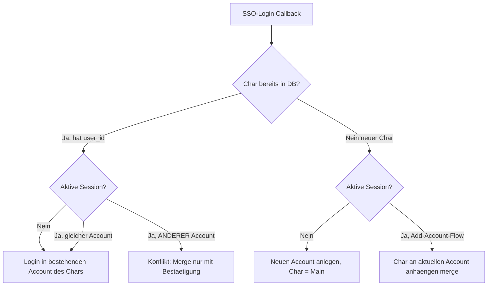

# Security-Fix: Multi-Character-Accounts + Datentrennung

> **Status:** Plan (Architect). Umsetzung nach Freigabe im Code-Mode.
> **Schweregrad:** KRITISCH – Cross-Account-Datenleck (Assets, Blueprints,
> Industry-Jobs, Tokens) zwischen fremden EVE-Spielern.

---

## 1. Problem (verifiziert)

Die App wurde als **Single-Tenant-Tool** gebaut (eine Person verwaltet ihre EVE-
Chars). Es gibt **kein User-/Account-Konzept**:

| Stelle | Befund |
|---|---|
| [`models/character.py`](../backend/app/models/character.py:8) | Kein `user_id`/Owner – Chars gehören niemandem. |
| [`auth.py:236`](../backend/app/routers/auth.py:236) | Session speichert nur ein einzelnes `character_id`. |
| [`auth.py:31`](../backend/app/routers/auth.py:31) `require_auth` | Prüft nur „irgendein Char eingeloggt", **keine** Eigentümer-Prüfung. |
| [`auth.py:243`](../backend/app/routers/auth.py:243) `/auth/characters` | Listet **ALLE** aktiven Chars global. |
| [`login.html:98`](../backend/app/templates/login.html:98) | Ruft `/auth/characters` **unauthentifiziert** → leakt alle Char-Namen auf der Login-Seite. |
| Daten-Router (assets/blueprints/industry/corp/selling …) | Nehmen `character_id`/`corporation_id` als **Query-Param ohne Owner-Check** → jede Session kann fremde Daten abrufen. |

**Folge:** Loggt sich ein neuer Spieler per SSO ein, landet er im selben globalen
Datenpool und sieht die Chars/Assets des bisherigen Nutzers.

**EVE-Einschränkung:** SSO liefert keine Spieler-Account-ID (nur
`CharacterOwnerHash`, wechselt bei Char-Transfer). Mehrere Chars zu einem Konto
zu gruppieren geht daher **nur manuell** (Login im eingeloggten Zustand) – genau
das gewünschte Modell.

---

## 2. Zielmodell (bestätigt)



**Regeln:**
1. Login **ohne** Session → neuer Account (Char = Main).
2. Regel 1 gilt **nicht**, wenn der Char bereits zu einem (ggf. gemergten)
   Account gehört → Login in **genau diesen** Account.
3. Login **mit** Session (Button **„Account hinzufügen"**) → Char wird dem
   aktuellen Account zugeordnet (merge). Gehört der Char bereits einem *anderen*
   Account, wird **nicht** stillschweigend übernommen → explizite Bestätigung.
4. Char-Switcher + alle Daten zeigen **nur** die Chars des eigenen Accounts.

---

## 3. Datenbank-Änderungen (Migration `011_add_users.sql`)

```sql
-- Neue Account-Tabelle
CREATE TABLE users (
    id            SERIAL PRIMARY KEY,
    display_name  VARCHAR(128),
    created_at    TIMESTAMPTZ NOT NULL DEFAULT now()
);

-- Charaktere bekommen einen Besitzer
ALTER TABLE characters ADD COLUMN user_id INTEGER REFERENCES users(id);

-- Optional fuer spaetere Diagnose (Owner-Hash aus SSO speichern)
ALTER TABLE characters ADD COLUMN owner_hash VARCHAR(64);

CREATE INDEX ix_characters_user_id ON characters(user_id);
```

### Migration der bereits vermischten Bestandsdaten – ENTSCHIEDEN: **Variante A**
Da SSO keine Account-Identität liefert, kann der Bestand nicht automatisch
korrekt getrennt werden. **Freigegebene Strategie (Variante A):** Alle
bestehenden Chars → **ein** Operator-Account (`users.id = 1`). Den gestern fremd
hinzugefügten Char anschließend **deaktivieren**; der fremde Spieler loggt sich
neu ein → bekommt durch den neuen Callback-Flow einen **eigenen, frischen**
Account.

```sql
-- Variante A (freigegeben):
INSERT INTO users (id, display_name) VALUES (1, 'Operator');
UPDATE characters SET user_id = 1 WHERE user_id IS NULL;
-- danach manuell (separat, sobald die fremde character_id bekannt ist):
-- UPDATE characters SET is_active = false WHERE character_id = <fremd>;
```

> ⚠️ Die `character_id` des fremden Chars muss vor dem Deaktivieren bestätigt
> werden (z. B. über `SELECT character_id, character_name, created_at FROM
> characters ORDER BY created_at DESC` → der zuletzt angelegte ist der Verdächtige).

---

## 4. Backend-Änderungen

### 4.1 Modelle
- [`models/character.py`](../backend/app/models/character.py): Spalten `user_id`, `owner_hash`.
- Neues `models/user.py`: `User` (id, display_name, created_at) + Relationship.

### 4.2 Session & Dependencies ([`auth.py`](../backend/app/routers/auth.py))
- Session speichert künftig **`user_id`** (plus aktive `character_id` für UI).
- Neue Dependency `get_current_user_id(request) -> int` (statt nur char_id).
- Neue Helper `get_owned_character_ids(db, user_id) -> list[int]` und
  `assert_owns_character(db, user_id, character_id)` (→ 403 bei Fremdzugriff).
- `require_auth` bleibt, liefert aber zusätzlich Owner-Kontext.

### 4.3 Login-/Add-/Callback-Flow ([`auth.py`](../backend/app/routers/auth.py))
- Neue Route `GET /auth/login/add`: setzt `session["add_intent"]=True`, dann
  SSO-Redirect (= „Account hinzufügen"-Button).
- [`callback`](../backend/app/routers/auth.py:130) implementiert die Regeln aus §2:
  Char suchen → user_id ermitteln/anlegen, `add_intent` berücksichtigen,
  Konfliktfall (fremder Account) → Redirect mit Bestätigungs-Flag.
- `owner_hash` aus dem `/oauth/verify`-Response (`CharacterOwnerHash`) mitspeichern.

### 4.4 `/auth/characters` & `/auth/me`
- [`/auth/characters`](../backend/app/routers/auth.py:243): **nur** Chars des
  Session-`user_id` (`require_auth` erzwingen, nicht mehr global).
- [`/auth/me`](../backend/app/routers/auth.py:104): zusätzlich `user_id` zurückgeben.

### 4.5 Ownership-Enforcement in ALLEN Daten-Routern
Jeder Endpoint, der `character_id`/`corporation_id` als Query-Param nimmt, muss
gegen den Besitz des Session-Users prüfen (sonst 403). Betroffen u. a.:
[`assets.py`](../backend/app/routers/assets.py), [`blueprints.py`](../backend/app/routers/blueprints.py),
[`industry.py`](../backend/app/routers/industry.py), [`corp.py`](../backend/app/routers/corp.py),
[`selling.py`](../backend/app/routers/selling.py), [`restock.py`](../backend/app/routers/restock.py),
[`character_restock.py`](../backend/app/routers/character_restock.py),
[`corp_warehouses.py`](../backend/app/routers/corp_warehouses.py),
[`sync_all.py`](../backend/app/routers/sync_all.py), [`market.py`](../backend/app/routers/market.py),
[`build_calculator.py`](../backend/app/routers/build_calculator.py),
[`invention.py`](../backend/app/routers/invention.py), [`bpc_costs.py`](../backend/app/routers/bpc_costs.py),
[`bpc_stock_thresholds.py`](../backend/app/routers/bpc_stock_thresholds.py),
[`user_prices.py`](../backend/app/routers/user_prices.py).
- Corp-Endpunkte: Zugriff nur, wenn der User einen Char **mit dieser Corp**
  besitzt (und ggf. Director-Rolle).
- `admin.py`/`sde.py`: bewusst entscheiden (Admin-Gate vs. global lesbar).

### 4.6 Merge-Endpoint
- `POST /auth/merge` (Bestätigung): hängt einen Char/Account an den aktuellen
  Account; aktualisiert `characters.user_id` der betroffenen Chars transaktional.

---

## 5. Frontend-Änderungen
- [`login.html:98`](../backend/app/templates/login.html:98): den **unauthentifizierten**
  `/auth/characters`-Fetch **entfernen** (Leak). „Already logged in as" nur nach Auth.
- „**Account hinzufügen**"-Button → `GET /auth/login/add`.
- [`app.js`](../backend/app/templates/static/js/app.js) `loadCharacters()` zeigt nur
  eigene Chars (kommt automatisch über die gefilterte API).
- Merge-Bestätigungs-UI (Modal) für den Konfliktfall aus §2.3.

---

## 6. Tests & Verifikation
- Playwright/Cookie-Auth (Sicht-Paket) für 2 Sessions: Session A darf
  `character_id` von Session B **nicht** abrufen (erwartet 403).
- Backend-Test: `/auth/characters` liefert pro User disjunkte Listen.
- Login-Seite leakt keine fremden Namen mehr (unauth → leere/keine Liste).
- Regressionscheck: bestehender Single-User-Flow funktioniert weiter.

---

## 7. Offene Entscheidung (vor Umsetzung)
**Bestandsdaten-Migration: Variante A (alle → Operator-Account, Fremd-Char
deaktivieren) oder Variante B (jeder Char eigener Account, danach manuell mergen)?**
→ **ENTSCHIEDEN: Variante A** (siehe §3).

---

## 8. Account-/Char-Entfernung (geplant, noch NICHT umgesetzt)

> **Status:** dokumentiert, Umsetzung steht aus. Bewusst aus dem ersten
> Security-Fix herausgehalten – der akute Vorfall (Variante A) braucht nur das
> manuelle `is_active = false` des Fremd-Chars, kein Self-Service-Löschen.

### 8.1 Ist-Stand
- Es existiert nur [`remove_character`](../backend/app/routers/auth.py:495)
  (`DELETE /auth/characters/{character_id}`): ownership-geprüft
  (`require_account` + `assert_owns_character`), setzt aber nur
  `is_active = false` (Soft-Disable, kein Hard-Delete).
- **Kein UI** ruft diesen Endpoint auf (kein Button, keine JS-Funktion).
- **Kein** Endpoint zum Entfernen eines **ganzen Accounts** (`users`-Zeile +
  alle zugehörigen Chars/Tokens).

### 8.2 Geplanter Umfang
**A) Einzelnen Char aus dem eigenen Account entfernen**
- Backend: vorhandenes [`remove_character`](../backend/app/routers/auth.py:495)
  beibehalten (Soft-Disable). Optional: Tokens beim Entfernen nullen
  (`access_token`/`refresh_token`/`token_expires_at = NULL`), damit kein
  ungenutztes Refresh-Token verbleibt.
- Frontend: „Entfernen"-Aktion je Char im Char-Switcher (`#characterList`),
  mit Bestätigungs-Dialog (`#confirmModal`), danach `loadCharacters()`-Refresh.
- Guard: Entfernen des **letzten aktiven Chars** eines Accounts behandeln
  (Hinweis „letzter Char" oder gleichzeitiges Account-Löschen anbieten).

**B) Kompletten eigenen Account löschen (Self-Service)**
- Neuer Endpoint `DELETE /auth/account` (`require_account`):
  1. alle eigenen Chars deaktivieren bzw. löschen + Tokens nullen,
  2. `users`-Zeile des Session-Users entfernen,
  3. Session leeren (`request.session.clear()`),
  4. Redirect/Hinweis auf Login.
- Transaktional; nur der **eigene** Account (kein Fremdzugriff möglich, da über
  Session-`user_id` gebunden).
- Frontend: „Account löschen"-Button (z. B. im Add-Account-/Profil-Bereich der
  Navbar) mit doppelter Bestätigung.

### 8.3 Soft- vs. Hard-Delete (zu entscheiden bei Umsetzung)
- **Soft (empfohlen):** `is_active = false` + Tokens nullen. Bewahrt
  Historie/Referenzen (Restock-Listen, Industry-Jobs) und vermeidet
  FK-Kaskaden-Risiken. Reaktivierung bei erneutem SSO-Login möglich.
- **Hard:** echte `DELETE`s inkl. abhängiger Daten (Assets, Blueprints,
  Industry-Jobs, Restock-Listen …). Nur mit sauberen FK-/Kaskaden-Regeln,
  sonst Integritätsfehler.

### 8.4 Tests (ergänzend zu §6)
- Char entfernen → erscheint nicht mehr in `/auth/characters`; dessen
  `character_id` liefert in Daten-Routern weiterhin 403/leer.
- Account löschen → Session beendet, `/auth/me` → 401, Re-Login legt **frischen**
  Account an (kein Zugriff auf alte Daten).
- Fremder darf weder fremden Char noch fremden Account löschen (403).
