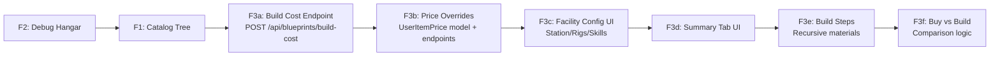

# Blueprint Shopper — Feature Enhancement Plan v2

## Overview

Three major feature requests for the Blueprint Shopper at [`/blueprints`](smarthome/eve-industrial-tool/backend/app/main.py:94):

1. **Catalog View** — Show all blueprints in an in-game-market-style tree with BPO/BPC/T2/Custom sub-filters
2. **Hangar Selection Debug** — Verify the already-implemented dropdown works correctly
3. **Production Cost Calculator** — Full EVE Cookbook-style calculator with material prices, facility selection, tax, build/buy comparison, and summary tab

---

## Existing Infrastructure ✅

| Component | Location | Status |
|-----------|----------|--------|
| [`CachedPrice`](smarthome/eve-industrial-tool/backend/app/models/cached_price.py:7) model | `cached_prices` table with `average_price`, `adjusted_price`, `sell_price_min`, `buy_price_max` | ✅ |
| [`MarketOrder`](smarthome/eve-industrial-tool/backend/app/models/market_order.py:7) model | `market_orders` table with individual orders (price, volume, location, region) | ✅ |
| [`SDESolarSystem`](smarthome/eve-industrial-tool/backend/app/models/sde_solar_system.py:12) | System name, region, security status | ✅ |
| [`SDEStation`](smarthome/eve-industrial-tool/backend/app/models/sde_solar_system.py:39) | Station name → system mapping | ✅ |
| [`SDEBlueprint`](smarthome/eve-industrial-tool/backend/app/models/sde_blueprint.py:16) | 5,081 rows (type_id, product, activity_id, time, max runs) | ✅ |
| [`SDEBlueprintMaterial`](smarthome/eve-industrial-tool/backend/app/models/sde_blueprint.py:48) | Material requirements per blueprint/activity | ✅ |
| [`SDEBlueprintProduct`](smarthome/eve-industrial-tool/backend/app/models/sde_blueprint.py:78) | Product output (4,847 rows act=1) | ✅ |
| [`SDEBlueprintSkill`](smarthome/eve-industrial-tool/backend/app/models/sde_blueprint.py:101) | Skill requirements | ✅ |
| [`SDEItem`](smarthome/eve-industrial-tool/backend/app/models/sde_item.py:7) | 50,235 items with group/category/race/volume | ✅ |
| [`GET /api/blueprints/{bp_id}/detail`](smarthome/eve-industrial-tool/backend/app/routers/blueprints.py:438) | Materials with ME applied + skills + time | ✅ |
| [`POST /api/blueprints/materials-check`](smarthome/eve-industrial-tool/backend/app/routers/blueprints.py:565) | Checks materials against owned assets by location | ✅ |
| [`GET /api/blueprints/locations`](smarthome/eve-industrial-tool/backend/app/routers/blueprints.py:413) | Distinct location names from assets | ✅ |
| [`GET /api/market/prices`](smarthome/eve-industrial-tool/backend/app/routers/market.py:49) | Batch price lookup from cache | ✅ |
| [`POST /api/market/refresh`](smarthome/eve-industrial-tool/backend/app/routers/market.py:82) | Trigger price refresh from ESI (Jita/Rens/Amarr/Dodixie) | ✅ |
| [`GET /api/industry/systems`](smarthome/eve-industrial-tool/backend/app/routers/cost_indices.py:17) | System cost indices from ESI | ✅ |
| [`GET /api/build/bom/{bp_id}`](smarthome/eve-industrial-tool/backend/app/routers/build_calculator.py:156) | BOM with ME-adjusted quantities | ✅ |
| [`POST /api/build/calculate`](smarthome/eve-industrial-tool/backend/app/routers/build_calculator.py:225) | Build cost calculation | ✅ |
| [`refresh_all_prices()`](smarthome/eve-industrial-tool/backend/app/services/market_service.py:47) | Fetches Jita/The Forge sell orders → caches min sell prices | ✅ |
| [`sync_market_orders()`](smarthome/eve-industrial-tool/backend/app/services/market_service.py:148) | Full order sync (buy + sell, all pages) for all key regions | ✅ |
| [`get_industry_systems()`](smarthome/eve-industrial-tool/backend/app/services/esi_client.py:316) | ESI endpoint for system cost indices | ✅ |
| [`bp_shopper_cart`](smarthome/eve-industrial-tool/backend/app/templates/static/js/bp-browser.js:720) | localStorage cart persistence | ✅ |
| Window [`BP`](smarthome/eve-industrial-tool/backend/app/templates/static/js/bp-browser.js:1003) namespace | All JS functions exposed for onclick handlers | ✅ |

---

## Feature 1: In-Game-Market-Style Catalog Tree

### User's Requirements
1. **Tree structure** like the in-game EVE market (Category → Group → [Race →] Product)
2. **Sub-filter categories**: BPO / BPC / T2 / Custom
   - "Custom" (meta groups like Storyline, Faction, Officer) → **always visible**
   - Other filter modes → only show products you actually own blueprints for
3. **Default view**: Show all, with owned items highlighted and unowned items dimmed
4. **Search** continues to filter across all products

### Implementation

#### New Backend Endpoint: [`GET /api/blueprints/catalog`](smarthome/eve-industrial-tool/backend/app/routers/blueprints.py)

**SQL approach** — query SDE for ALL manufacturable products, LEFT JOIN to assets:

```sql
SELECT
    si.category_id, si.category_name,
    si.group_id, si.group_name,
    si.race_id, si.race_name,
    sbp.product_type_id, sbp.product_name,
    sb.max_production_limit, sb.manufacturing_time,
    sb.tech_level, si.meta_group_name,
    -- Owned counts
    COUNT(DISTINCT CASE WHEN a.is_blueprint_copy = false AND a.id IS NOT NULL THEN a.id END) AS bpo_count,
    COUNT(DISTINCT CASE WHEN a.is_blueprint_copy = true AND a.id IS NOT NULL THEN a.id END) AS bpc_count,
    -- Best ME/TE from owned copies
    MAX(a.blueprint_me) AS best_me,
    MAX(a.blueprint_te) AS best_te
FROM sde_blueprints sb
JOIN sde_blueprint_products sbp ON sbp.type_id = sb.type_id AND sbp.activity_id = 1
LEFT JOIN sde_items si ON si.type_id = sbp.product_type_id
LEFT JOIN assets a ON a.type_id = sb.type_id AND a.is_blueprint = true
WHERE sb.activity_id = 1
GROUP BY si.category_id, si.category_name, si.group_id, si.group_name,
         si.race_id, si.race_name, sbp.product_type_id, sbp.product_name,
         sb.max_production_limit, sb.manufacturing_time, sb.tech_level, si.meta_group_name
ORDER BY ...
```

**Query params**: `?search=&filter=bpo|bpc|t2|custom|all`

| Filter | Behavior |
|--------|----------|
| `all` (default) | Show every product, owned ones highlighted |
| `bpo` | Show only products with `bpo_count > 0` |
| `bpc` | Show only products with `bpc_count > 0` |
| `t2` | Show only Tech 2 products (`tech_level=2`) with owned BPC |
| `custom` | Show all meta-group items (Faction, Storyline, Officer) regardless of ownership |

#### Frontend Changes

**In [`blueprints.html`](smarthome/eve-industrial-tool/backend/app/templates/blueprints.html) toolbar** (lines 318-326):
- Replace existing "All / BPOs / BPCs" radio buttons with: **All | BPOs | BPCs | T2 | Custom**
- Default to "All"

**In [`bp-browser.js`](smarthome/eve-industrial-tool/backend/app/templates/static/js/bp-browser.js)**:
- [`init()`](smarthome/eve-industrial-tool/backend/app/templates/static/js/bp-browser.js:80): Load catalog by default instead of owned tree
- New function [`loadBlueprintCatalog()`](smarthome/eve-industrial-tool/backend/app/templates/static/js/bp-browser.js:289): Calls `/api/blueprints/catalog?filter=...`
- [`renderProductList()`](smarthome/eve-industrial-tool/backend/app/templates/static/js/bp-browser.js:450): 
  - Dim unowned products (opacity, gray text)
  - Show "(not owned)" label or icon
  - Owned products show BPO/BPC badges as before
  - All products remain clickable (detail works for any product)

**Tree navigation** — same Category → Group → [Race] → Product structure as current owned tree.

---

## Feature 2: Hangar Selection Dropdown Debug

### Current Implementation
Already changed from `<input type="text">` to `<select id="bpCheckLocation">`:
- [`loadLocations()`](smarthome/eve-industrial-tool/backend/app/templates/static/js/bp-browser.js:125) fetches from `/api/blueprints/locations`
- [`checkMaterials()`](smarthome/eve-industrial-tool/backend/app/templates/static/js/bp-browser.js:898) reads `select.value`

### Debug Steps
1. Verify the endpoint returns data: `curl http://localhost:8082/api/blueprints/locations`
2. Add user-visible error message in [`loadLocations()`](smarthome/eve-industrial-tool/backend/app/templates/static/js/bp-browser.js:125) if API fails
3. Check the select element exists in DOM before `init()` runs (it's inside `bp-cart-footer`, should be fine)
4. Ensure no browser caching issues (add cache-busting query param to JS includes if needed)

---

## Feature 3: Production Cost Calculator

### User's Requirements Summary

| # | Requirement | Detail |
|---|-------------|--------|
| 3a | **Material costs from Jita 4-4** | Use Jita/The Forge market data from `cached_prices` (sell_price_min) |
| 3b | **User-overridable prices** | User can manually set any material price |
| 3c | **Median asset pricing** | If user bought 10 Trit at 1 ISK and 10 at 2 ISK → median = 1.5 ISK/unit |
| 3d | **Facility selection** | Configurable like EVE Cookbook: NPC station vs Citadel, T1 vs T2 rigs |
| 3e | **System cost index** | From ESI `/industry/systems/` API (already implemented) |
| 3f | **Skill configuration** | Industry skill level, Advanced Industry, etc. → affects tax/base time |
| 3g | **Save config** | Save facility/skill configuration per user |
| 3h | **Buy vs Build suggestion** | Compare market price of finished product vs material costs |
| 3i | **Detailed build steps** | Show intermediate components that can be manufactured |
| 3j | **Summary tab** | Dedicated tab/page with full cost breakdown |

### 3a. New Endpoint: [`POST /api/blueprints/build-cost`](smarthome/eve-industrial-tool/backend/app/routers/blueprints.py)

**Request:**
```json
{
    "cart_items": [
        { "blueprint_type_id": 123, "runs": 10, "me": 10, "te": 20 }
    ],
    "facility": {
        "type": "npc_station",     // or "citadel"
        "station_id": 60003760,     // Jita 4-4
        "system_id": 30000142,      // Jita
        "rigs": "t2",              // "none", "t1", "t2"
        "tax_rate": 5.0            // user override %
    },
    "skills": {
        "industry": 5,
        "advanced_industry": 5,
        "supply_chain_management": 4
    },
    "pricing": {
        "source": "jita",          // "jita", "manual", "weighted"
        "overrides": {
            "34": 5.5              // Tritanium override price
        }
    }
}
```

**Response:**
```json
{
    "items": [
        {
            "product_type_id": 456,
            "product_name": "Rifter",
            "blueprint_type_id": 123,
            "runs": 10,
            "materials": [
                {
                    "material_type_id": 34,
                    "material_name": "Tritanium",
                    "quantity": 10000,
                    "unit_price": 5.2,
                    "total_cost": 52000,
                    "price_source": "jita_sell",
                    "override": false
                }
            ],
            "total_material_cost": 520000,
            "facility_cost": 2652,
            "job_cost": 5200,
            "total_cost": 527852,
            "cost_per_unit": 52785,
            "market_price": 550000,
            "buy_vs_build": "build"  // or "buy" if market_price < total_cost
        }
    ],
    "grand_total_material_cost": 520000,
    "grand_total_facility_cost": 2652,
    "grand_total_job_cost": 5200,
    "grand_total": 527852,
    "facility": {
        "name": "Jita IV - Moon 4 - Caldari Navy Assembly Plant",
        "system": "Jita",
        "region": "The Forge",
        "security": 0.9,
        "cost_index": 0.051
    },
    "pricing_summary": {
        "source": "jita",
        "from_cache": true,
        "overrides_applied": 0
    }
}
```

### 3b. Cost Calculation Logic

```
For each material:
  unit_price = override_price ?? cached_price.sell_price_min ?? average_price
  
  // Weighted median (if user bought at different prices)
  If purchase_history exists for this type_id:
    weighted_price = sum(qty_i * price_i) / sum(qty_i)
    unit_price = min(unit_price, weighted_price) // or user choice

  total_cost = adjusted_quantity * unit_price

Facility cost:
  system_cost_index = ESI industry/systems manufacturing cost_index
  // TE reduces time, which reduces job cost proportionally
  time_multiplier = (1 - 0.02 * te_level) * (1 - 0.04 * industry_skill) * (1 - 0.03 * advanced_industry_skill)
  
  // Rig bonus
  rig_multiplier = {
    "t2": 0.798,  // T2 rig: -20.2% time
    "t1": 0.90,   // T1 rig: -10% time
    "none": 1.0
  }[rigs]
  
  facility_cost = total_material_cost * system_cost_index * time_multiplier * rig_multiplier * (tax_rate / 100)

Buy vs Build:
  If product_market_price exists AND product_market_price < total_cost:
    suggest = "buy" (cheaper to buy from Jita)
  Else:
    suggest = "build" (cheaper or no market data)
```

### 3c. User Price Overrides & Median Pricing

**New model:** [`UserItemPrice`](smarthome/eve-industrial-tool/backend/app/models/user_item_price.py) (new file)
```python
class UserItemPrice(Base):
    """User-defined item prices with median calculation from purchase history."""
    __tablename__ = "user_item_prices"
    
    id = Column(Integer, primary_key=True)
    character_id = Column(Integer, nullable=False, index=True)
    type_id = Column(Integer, nullable=False)
    override_price = Column(Float, nullable=True)  # Manual override
    # Purchase history for median calculation
    last_purchase_price = Column(Float, nullable=True)
    last_purchase_qty = Column(Integer, nullable=True)
    cumulative_qty = Column(BigInteger, default=0)
    cumulative_cost = Column(Float, default=0.0)  # sum(qty * price)
    median_price = Column(Float, nullable=True)  # cumulative_cost / cumulative_qty
    updated_at = Column(DateTime, server_default=func.now())
```

**New endpoints:**
- `PUT /api/user/prices/{type_id}` — Set override price
- `POST /api/user/prices/{type_id}/purchase` — Record a purchase (qty, price) to update median
- `GET /api/user/prices/batch?type_ids=1,2,3` — Get all user prices for materials
- `GET /api/user/prices/missing?material_type_ids=...` — Get materials without prices set

### 3d. Facility Selection Configuration

**Reuse existing data:**
- NPC stations from [`SDEStation`](smarthome/eve-industrial-tool/backend/app/models/sde_solar_system.py:39)
- System cost indices from [`GET /api/industry/systems`](smarthome/eve-industrial-tool/backend/app/routers/cost_indices.py:17)
- Asset locations for personal/corp structures from [`GET /api/blueprints/locations`](smarthome/eve-industrial-tool/backend/app/routers/blueprints.py:413)

**UI component in Summary tab:**
```
┌─ Facility Configuration ──────────────────────────────┐
│ Facility Type: [NPC Station ▼] [Citadel ▼]            │
│ Station:       [Jita IV - Moon 4 - Caldari Navy ▼]   │
│ System:        Jita (The Forge)  sec: 0.9            │
│ Cost Index:    0.051                                  │
│ Rigs:          [None ▼] [T1 ▼] [T2 ▼]               │
│ Tax Rate:      [═══════●═══════] 5.0%                │
│                                                       │
│ Skills:                                               │
│   Industry:           [5 ▼]                           │
│   Advanced Industry:  [5 ▼]                           │
│   Supply Chain Mgmt:  [4 ▼]                           │
│                                                       │
│ [Save Configuration]                                  │
└───────────────────────────────────────────────────────┘
```

### 3e. Build Steps (Recursive Materials)

**New endpoint:** [`GET /api/blueprints/{bp_id}/build-steps`](smarthome/eve-industrial-tool/backend/app/routers/blueprints.py)

Recursively resolves materials that are themselves blueprint products:

```
Level 0: Rifter blueprint
  Level 1: Tritanium (raw material)
  Level 1: Pyerite (raw material)
  Level 1: 150mm Railgun I → CAN BE BUILT from:
    Level 2: Tritanium
    Level 2: Pyerite
    Level 2: Ion Thruster → CAN BE BUILT from:
      Level 3: Tritanium
      Level 3: Mexallon
```

**Implementation:** Query `sde_blueprint_products` for each material type_id:
```sql
-- Check if a material is itself producible
SELECT 1 FROM sde_blueprint_products sbp
JOIN sde_blueprints sb ON sb.type_id = sbp.type_id AND sb.activity_id = 1
WHERE sbp.product_type_id = :material_type_id
LIMIT 1
```

**Recursion depth:** 2 levels (configurable, capped at 3 to prevent infinite loops)

### 3f. Summary Tab UI

**Add to bottom of cart panel** in [`blueprints.html`](smarthome/eve-industrial-tool/backend/app/templates/blueprints.html) (after line 566):

```
- New button: "Build Summary" (toggles between materials view and summary view)
- New container: #bpBuildSummary
  - Facility config section
  - Per-item breakdown (collapsible)
  - Grand total row
  - Buy vs Build badges per item
```

**In [`bp-browser.js`](smarthome/eve-industrial-tool/backend/app/templates/static/js/bp-browser.js):**
- `calculateBuildCost()` — calls `POST /api/blueprints/build-cost`
- `renderBuildSummary(data)` — renders the full summary
- `renderBuildSteps(item, depth)` — renders recursive build steps
- `openBuildSummary()` — toggle function

### 3g. Configuration Persistence

**Approach:** Save facility/skill config in `localStorage` under key `bp_build_config`.

```json
{
    "facility_type": "npc_station",
    "station_id": 60003760,
    "system_id": 30000142,
    "rigs": "t2",
    "tax_rate": 5.0,
    "skills": {
        "industry": 5,
        "advanced_industry": 5,
        "supply_chain_management": 4
    },
    "price_source": "jita"
}
```

Auto-load on page init. User can save changes via "Save Configuration" button.

---

## Implementation Order



### Step-by-step Plan

| Step | Feature | Backend Files | Frontend Files | Complexity |
|------|---------|---------------|----------------|------------|
| 1 | F2: Debug hangar dropdown | — | [`bp-browser.js`](smarthome/eve-industrial-tool/backend/app/templates/static/js/bp-browser.js) `loadLocations()` | 🟢 Easy |
| 2 | F1: Catalog endpoint | [`blueprints.py`](smarthome/eve-industrial-tool/backend/app/routers/blueprints.py) `GET /catalog` | — | 🟡 Medium |
| 3 | F1: Catalog UI + sub-filters | — | [`blueprints.html`](smarthome/eve-industrial-tool/backend/app/templates/blueprints.html), [`bp-browser.js`](smarthome/eve-industrial-tool/backend/app/templates/static/js/bp-browser.js) | 🟡 Medium |
| 4 | F3a: Build cost endpoint | [`blueprints.py`](smarthome/eve-industrial-tool/backend/app/routers/blueprints.py) `POST /build-cost`, market price lookup | — | 🔴 Complex |
| 5 | F3b: User price overrides | [`user_item_price.py`](smarthome/eve-industrial-tool/backend/app/models/user_item_price.py) (new), price router | — | 🟡 Medium |
| 6 | F3c: Facility config + cost index | — | [`blueprints.html`](smarthome/eve-industrial-tool/backend/app/templates/blueprints.html), [`bp-browser.js`](smarthome/eve-industrial-tool/backend/app/templates/static/js/bp-browser.js) | 🟡 Medium |
| 7 | F3d: Summary tab UI | — | [`blueprints.html`](smarthome/eve-industrial-tool/backend/app/templates/blueprints.html), [`bp-browser.js`](smarthome/eve-industrial-tool/backend/app/templates/static/js/bp-browser.js) | 🟡 Medium |
| 8 | F3e: Build steps endpoint | [`blueprints.py`](smarthome/eve-industrial-tool/backend/app/routers/blueprints.py) `GET /build-steps` | — | 🟡 Medium |
| 9 | F3f: Build steps UI + Buy/Build | — | [`bp-browser.js`](smarthome/eve-industrial-tool/backend/app/templates/static/js/bp-browser.js) | 🟡 Medium |

---

## Summary of All Files to Create/Modify

### New Files
| File | Purpose |
|------|---------|
| [`backend/app/models/user_item_price.py`](smarthome/eve-industrial-tool/backend/app/models/user_item_price.py) | User price overrides & median pricing model |

### Modified Files
| File | Changes |
|------|---------|
| [`backend/app/routers/blueprints.py`](smarthome/eve-industrial-tool/backend/app/routers/blueprints.py) | Add `GET /catalog`, `POST /build-cost`, `GET /{bp_id}/build-steps` |
| [`backend/app/templates/blueprints.html`](smarthome/eve-industrial-tool/backend/app/templates/blueprints.html) | Update toolbar filters (All/BPO/BPC/T2/Custom), add Summary tab section |
| [`backend/app/templates/static/js/bp-browser.js`](smarthome/eve-industrial-tool/backend/app/templates/static/js/bp-browser.js) | Add catalog loading, build cost calculation, facility config, summary tab, build steps, buy/build logic |
| [`backend/app/database.py`](smarthome/eve-industrial-tool/backend/app/database.py) | Add import for `UserItemPrice` model |
| [`backend/app/services/market_service.py`](smarthome/eve-industrial-tool/backend/app/services/market_service.py) | Maybe add helper for weighted median price lookup |
